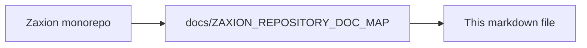

# Zaxion Incremental Analysis Design

## Goal

Define a Zaxion-specific architecture for:
- deterministic node-level Merkle hashes,
- multi-layer cache schemas,
- policy routing between fast structural checks and selective deep AST analysis.

This design is optimized for governance simulation, exact-line remediation, and PR-scale performance.

## Scope and Non-Goals

- **In scope**
  - JS/TS and Python first.
  - Pull request and policy simulation pipelines.
  - Deterministic evidence for audit/replay.
- **Out of scope (initial phase)**
  - Full interprocedural dataflow across entire repositories.
  - Full language parity for all supported ecosystems in v1.

## Core Principles

- **Incremental by default**: re-analyze only changed files/subtrees.
- **Deterministic outputs**: same input -> same hash IDs -> same policy evidence.
- **Selective depth**: expensive semantic analysis only for policy-relevant nodes.
- **Graceful fallback**: if parser/cache fails, use existing full-file analyzer path.

## Data Model: Canonical Node Hashes

Zaxion will represent parsed code as canonical nodes regardless of parser backend.

### Entity Definitions

- **FileUnit**
  - `repo_id`: string
  - `commit_sha`: string
  - `file_path`: string
  - `language`: enum (`js`, `ts`, `tsx`, `jsx`, `py`, `unknown`)
  - `file_hash`: sha256(raw_file_content)
  - `root_node_id`: string
  - `parser_engine`: enum (`tree-sitter`, `babel`, `python-regex`, `python-ast`)
  - `parser_version`: string
  - `created_at`: timestamp

- **CanonicalNode**
  - `node_id`: stable ID = `sha256(file_path + ":" + start_byte + ":" + end_byte + ":" + node_kind + ":" + normalized_text_hash)`
  - `file_path`: string
  - `parent_node_id`: nullable string
  - `node_kind`: string (Tree-sitter type or normalized alias)
  - `start_byte`, `end_byte`: int
  - `start_line`, `start_col`, `end_line`, `end_col`: int
  - `text_hash`: sha256(raw_slice)
  - `normalized_text_hash`: sha256(language-normalized slice)
  - `subtree_hash`: Merkle hash of node and children
  - `child_count`: int
  - `depth`: int
  - `semantic_tags`: string[] (e.g., `["network_sink", "auth_check_candidate"]`)

- **MerkleEdge**
  - `parent_node_id`: string
  - `child_node_id`: string
  - `position_index`: int (child order preserved for determinism)

### Canonicalization Rules

- Use UTF-8 bytes for byte offsets and hashing input.
- Normalize line endings to `\n` before hashing normalized forms.
- For `normalized_text_hash`:
  - strip trailing whitespace,
  - collapse consecutive blank lines,
  - preserve string literals and identifiers (do not alpha-rename in v1),
  - remove comments only for languages where comment stripping is safe and deterministic.
- `subtree_hash` formula:
  - `H(node_kind | normalized_text_hash | start_byte | end_byte | H(child1) | H(child2) | ... )`

### Why This Works for Zaxion

- Exact-line remediation maps directly to node ranges.
- Policy outcomes can cite `node_id` and `subtree_hash` as immutable evidence anchors.
- Re-running simulation on same commit reproduces identical evidence artifacts.

## Cache Schema

Use layered caches to avoid redundant work while preserving correctness.

## Layer 0: Parse Cache (File AST Root)

- **Key**
  - `parse:{parser_engine}:{parser_version}:{language}:{file_hash}`
- **Value**
  - compact serialized syntax tree root
  - root `subtree_hash`
  - parser diagnostics
- **TTL**
  - 7 days (configurable) for local memory
  - 30 days for Redis/disk

## Layer 1: Node Fact Cache (Structural + Shallow Facts)

- **Key**
  - `nodefacts:{policy_schema_version}:{node_id}:{subtree_hash}`
- **Value**
  - extracted facts:
    - declarations
    - call-site names
    - imports/exports
    - primitive risk tags (`console_log`, `debugger`, `test_skip`, etc.)
  - extraction metadata (`extractor_version`, latency)
- **TTL**
  - 30 days

## Layer 2: Deep Semantic Cache

- **Key**
  - `deepast:{deep_engine}:{deep_engine_version}:{node_id}:{subtree_hash}:{rule_family}`
- **Value**
  - deep facts (symbol resolution, sink/source confidence, richer control context)
  - confidence score and trace metadata
- **TTL**
  - 14 days (shorter because deep logic evolves quickly)

## Layer 3: Policy Evaluation Cache

- **Key**
  - `policyeval:{policy_id}:{policy_version}:{node_id}:{subtree_hash}:{context_hash}`
- **Value**
  - decision (`pass`/`warn`/`block`)
  - evidence spans
  - remediation hints
- **TTL**
  - 30 days

### `context_hash` Definition

`context_hash = sha256(repo_id + commit_sha + policy_pack_version + simulation_mode + environment_flags)`

This avoids cross-context contamination between governance modes.

## Cache Invalidation Rules

- Invalidate by version bump:
  - parser version bump -> invalidate Layer 0+
  - extractor/policy schema bump -> invalidate Layer 1+
  - deep engine bump -> invalidate Layer 2+
  - policy version bump -> invalidate Layer 3 only
- Hard invalidation conditions:
  - file rename/move without path mapping,
  - grammar mismatch parse failures above threshold,
  - corrupted serialized tree payload.

## Policy Routing Rules

Routing determines where each policy executes:
- **Tier A (Shallow Structural)**: Tree-sitter facts only.
- **Tier B (Selective Deep)**: escalate specific candidate nodes to deep AST.
- **Tier C (Legacy Full-File Fallback)**: current analyzer path for safety.

### Routing Inputs

- file extension/language
- changed node kinds and semantic tags
- policy requirements metadata
- confidence score from shallow pass
- risk level (critical/high/medium/low)

### Policy Metadata Contract

Each policy declares:
- `required_depth`: `shallow` | `selective_deep` | `full_fallback`
- `supported_languages`: string[]
- `escalation_triggers`: string[]
- `fallback_behavior`: `warn_only` | `run_legacy` | `block_on_unknown`

### Example Routing Matrix

- `console_log_in_production`:
  - depth: shallow
  - trigger: `CallExpression(console.log)` from Tree-sitter facts
- `unsafe_command_execution`:
  - depth: selective_deep
  - trigger: candidate call to child process APIs, then deep AST verifies source/sink confidence
- `complex_legacy_python_rule`:
  - depth: full_fallback
  - trigger: unsupported node mapping in Tree-sitter v1

### Escalation Heuristics (v1)

Escalate to deep AST when any condition matches:
- node tag in `{network_sink, command_exec, sql_build, authz_guard, secret_material}`
- rule risk level is `critical`
- shallow confidence `< 0.75`
- changed node is in high-value directories (configurable):
  - `backend/src/controllers/`
  - `backend/src/services/`
  - auth/security modules

## Integration with Existing Zaxion Pipeline

Current components such as `astAnalyzer`, `patternMatcher`, and policy simulation can be adapted without replacement:

1. Insert `Incremental Analyzer` before policy evaluation.
2. Attach `metadata.incremental` payload into existing fact snapshot.
3. Keep existing evaluator interfaces unchanged in phase 1 by transforming incremental facts into current expected fact shape.
4. Route unsupported languages/rules to current analyzer path.

## Audit and Explainability Artifacts

Each policy decision should persist:
- `policy_id`, `policy_version`
- `file_path`
- `node_id`, `subtree_hash`
- `decision`, `confidence`
- `evidence_ranges` (line/col spans)
- `routing_path` (`shallow`, `selective_deep`, or `fallback`)

This gives Zaxion deterministic replay and regulator/auditor-friendly traces.

## Success Metrics

- p95 policy simulation latency reduced by >= 40% on medium PRs.
- cache hit rate >= 70% for unchanged files in active repos.
- decision parity >= 95% against current full analyzer baseline in shadow mode.
- parse timeout/error rate <= current baseline.

## Open Design Decisions

- whether to store serialized tree payloads in Redis vs disk-backed object store,
- whether Python deep path should use CPython AST service or richer static analyzer,
- whether node ID should include file path in long-term (for move/rename resilience we may prefer path-independent content IDs plus mapping table).

---

<!-- zaxion-doc-map-footer -->

## Repository documentation map

How this file fits in the Zaxion repo: see **[Zaxion repository documentation map](../docs/ZAXION_REPOSITORY_DOC_MAP.md)** (`docs/ZAXION_REPOSITORY_DOC_MAP.md`) for folder roles and links to system architecture.

**Text view** (works in any viewer):

```text
Zaxion/
├── docs/                    ← phase specs, governance, doc map
├── Incremental Architecture/ ← incremental plans, OPS-001
├── frontend/                ← UI (and frontend/src/Docs)
├── backend/                 ← API, policy engine, evaluation
├── PITCH/                   ← pitch materials
├── README.md                ← entry point
└── docs/ZAXION_REPOSITORY_DOC_MAP.md  ← canonical doc index
```

**Diagram** (Mermaid — quoted labels for compatibility):


