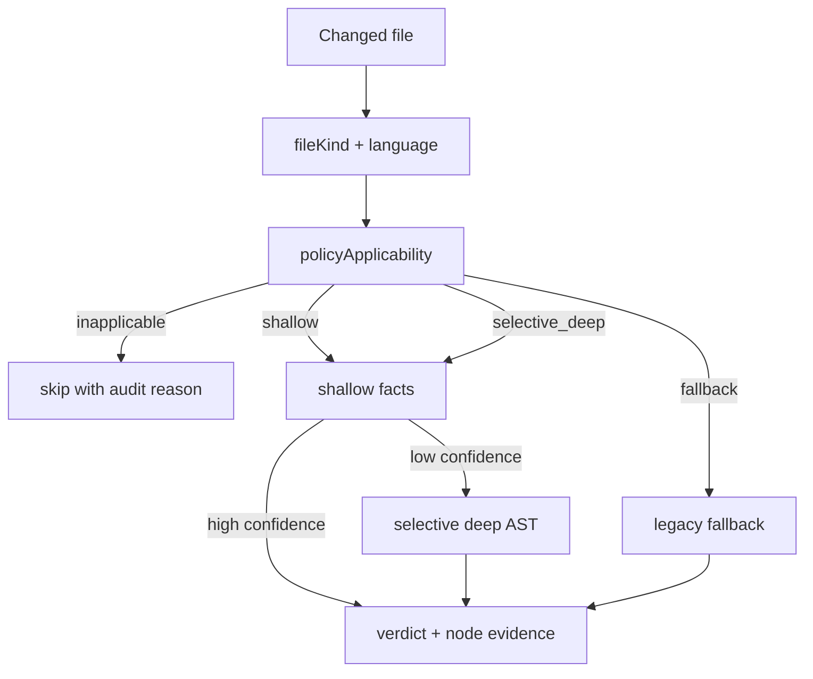
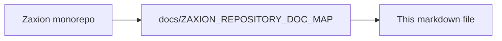

# Zaxion Incremental Analysis Design

## Goal

Define a Zaxion-specific architecture for:
- deterministic node-level Merkle hashes,
- multi-layer cache schemas,
- policy routing between fast structural checks and selective deep AST analysis,
- **structural false positive reduction** via language- and file-kind-aware evaluation,
- **sectioned PR scan progress and report UI** (GitHub checklist + app polling) driven by the same evaluation pipeline.

This design is optimized for governance simulation, exact-line remediation, PR-scale performance, **precision** (policies fire only on applicable artifacts), and **transparent PR feedback** (users see Security / Architecture / … rows complete in real time).

## Scope and Non-Goals

- **In scope**
  - JS/TS and Python first.
  - Pull request and policy simulation pipelines.
  - Deterministic evidence for audit/replay.
- **Out of scope (initial phase)**
  - Full interprocedural dataflow across entire repositories.
  - Full language parity for all supported ecosystems in v1.
  - Replacing every legacy regex with AST rules in v1 (hybrid period expected).
- **Explicitly in scope for precision**
  - File-kind classification (`manifest`, `workflow`, `source`, etc.).
  - Policy applicability gates before checker execution.
  - Two-tier shallow→deep confirmation for noisy security/style rules.

## Core Principles

- **Incremental by default**: re-analyze only changed files/subtrees.
- **Deterministic outputs**: same input -> same hash IDs -> same policy evidence.
- **Selective depth**: expensive semantic analysis only for policy-relevant nodes.
- **Graceful fallback**: if parser/cache fails, use existing full-file analyzer path.
- **Applicability before execution**: if language or file-kind does not match policy metadata, skip with audit trail — do not regex-scan and guess.
- **Confirmation over alarm**: low-confidence shallow hits escalate to deep AST or downgrade to `OBSERVE`, not `BLOCK`.

## False Positives and Precision

The legacy pipeline applies regex and JavaScript-centric heuristics across all fetched file content. That produces predictable false positives in multi-language repos and config-heavy PRs:

| Failure mode | Legacy behavior | Incremental behavior |
|--------------|-----------------|----------------------|
| `console.log` in npm script string | Regex match in `package.json` content | File-kind `manifest` → skip `code_quality`; OPS-001 uses structured diff only |
| `await` in Rust | JS reliability regex on `.rs` | `supported_languages` excludes rust until adapter exists → `skip` |
| `print()` in Python | Sometimes confused with console rules if strings overlap | `console_log` requires Tree-sitter `CallExpression` in JS/TS only |
| `hashlib.md5(` in Python | `md5(` regex in `security_patterns` | Language gate + selective deep confirmation |
| Scripts-only `package.json` | Lockfile WARN without dep churn | Patch-aware manifest diff (OPS-001 model) |

The incremental architecture reduces false positives by design:

1. **Applicability before execution** — router checks `supported_languages` and `supported_file_kinds` before any checker runs.
2. **Syntax-aware detection** — e.g. `console.log` is a `CallExpression` in JS/TS AST facts, not a substring in JSON.
3. **Structured config evaluation** — manifests and workflows use field-level or schema-aware rules (same model as OPS-001 lockfile hygiene), not `security_patterns` regex.
4. **Confirmation for noisy rules** — shallow tag → deep validation → verdict; low confidence defaults to `OBSERVE` or skip.
5. **Explicit unsupported paths** — Rust/Go files do not inherit JavaScript reliability rules; they skip or use a dedicated adapter.

Short-term YAML `include_extensions` patches in the legacy engine are **complementary stopgaps only**; they are documented in [ZAXION_INCREMENTAL_IMPLEMENTATION_PLAN.md](ZAXION_INCREMENTAL_IMPLEMENTATION_PLAN.md) as out of scope for the long-term solution.

### Precision evaluation flow

```text
changed file → file_kind + language → policy applicability → skip | shallow | selective_deep | fallback
                                              ↓
                         shallow facts (Tree-sitter) → optional deep AST → verdict + node_id evidence
```



## PR scan progress and sectioned report UI

Background PR scans should surface **actionable, categorized progress** on GitHub and in the Zaxion app — not a single opaque “Analyzing…” state.

### User-facing model

- **Overall header:** Passed / Warning / Blocked / Analyzing…
- **Sections:** Security, Architecture, Reliability, Code quality, Testing, Governance, Operations (mapped from `corePolicies.js` `category` + synthetic Governance group).
- **Rows per section:** 6–8 collapsed checks (e.g. “Hardcoded secrets scan”, “Risky SQL patterns scan”) — not raw `rule_id` strings.
- **Row states:** `pending` | `running` | `passed` | `warn` | `failed` | `skipped` (router N/A).

### `ScanProgress` artifact

Emitted during evaluation and stored in `pr_decisions.raw_data.scan_progress`. Built by `policyReportMapper.service.js` from checker results + router skip reasons. Consumed by:

- `githubReporter.reportProgress` (in-progress check updates),
- `githubReporter.reportStatus` (final checklist),
- `DecisionResolutionConsole` / `GovernanceScanProgress.tsx` (poll while `PENDING`).

Full UX, API, and rollout phases: [ZAXION_PR_SCAN_PROGRESS_AND_REPORT_UI.md](ZAXION_PR_SCAN_PROGRESS_AND_REPORT_UI.md).

### Coupling to incremental evaluation

Section-ordered evaluation enables both **progress callbacks** and **fail-fast** on Security:

```text
for each report section:
  mark rows running → onSectionComplete(ScanProgress) → run checkers → mark terminal states
```

When `policyApplicability` returns `skip`, the corresponding report row shows **Not applicable** — aligning UI with false-positive reduction (no false green check on Rust for JS-only rules).

## Data Model: Canonical Node Hashes

Zaxion will represent parsed code as canonical nodes regardless of parser backend.

### Entity Definitions

- **FileUnit**
  - `repo_id`: string
  - `commit_sha`: string
  - `file_path`: string
  - `language`: enum (`js`, `ts`, `tsx`, `jsx`, `py`, `rs`, `go`, `unknown`)
  - `file_kind`: enum (`source`, `test`, `manifest`, `workflow`, `lockfile`, `infrastructure`, `unknown`)
  - `file_hash`: sha256(raw_file_content)
  - `root_node_id`: string
  - `parser_engine`: enum (`tree-sitter`, `babel`, `python-regex`, `python-ast`)
  - `parser_version`: string
  - `created_at`: timestamp

- **CanonicalNode**
  - `node_id`: stable ID = `sha256(file_path + ":" + start_byte + ":" + end_byte + ":" + node_kind + ":" + normalized_text_hash)`
  - `file_path`: string
  - `parent_node_id`: nullable string
  - `node_kind`: string (Tree-sitter type or normalized alias)
  - `start_byte`, `end_byte`: int
  - `start_line`, `start_col`, `end_line`, `end_col`: int
  - `text_hash`: sha256(raw_slice)
  - `normalized_text_hash`: sha256(language-normalized slice)
  - `subtree_hash`: Merkle hash of node and children
  - `child_count`: int
  - `depth`: int
  - `semantic_tags`: string[] (e.g., `["network_sink", "auth_check_candidate"]`)

- **MerkleEdge**
  - `parent_node_id`: string
  - `child_node_id`: string
  - `position_index`: int (child order preserved for determinism)

### Canonicalization Rules

- Use UTF-8 bytes for byte offsets and hashing input.
- Normalize line endings to `\n` before hashing normalized forms.
- For `normalized_text_hash`:
  - strip trailing whitespace,
  - collapse consecutive blank lines,
  - preserve string literals and identifiers (do not alpha-rename in v1),
  - remove comments only for languages where comment stripping is safe and deterministic.
- `subtree_hash` formula:
  - `H(node_kind | normalized_text_hash | start_byte | end_byte | H(child1) | H(child2) | ... )`

### Why This Works for Zaxion

- Exact-line remediation maps directly to node ranges.
- Policy outcomes can cite `node_id` and `subtree_hash` as immutable evidence anchors.
- Re-running simulation on same commit reproduces identical evidence artifacts.

## Cache Schema

Use layered caches to avoid redundant work while preserving correctness.

## Layer 0: Parse Cache (File AST Root)

- **Key**
  - `parse:{parser_engine}:{parser_version}:{language}:{file_hash}`
- **Value**
  - compact serialized syntax tree root
  - root `subtree_hash`
  - parser diagnostics
- **TTL**
  - 7 days (configurable) for local memory
  - 30 days for Redis/disk

## Layer 1: Node Fact Cache (Structural + Shallow Facts)

- **Key**
  - `nodefacts:{policy_schema_version}:{node_id}:{subtree_hash}`
- **Value**
  - extracted facts:
    - declarations
    - call-site names
    - imports/exports
    - primitive risk tags (`console_log`, `debugger`, `test_skip`, etc.)
  - extraction metadata (`extractor_version`, latency)
- **TTL**
  - 30 days

## Layer 2: Deep Semantic Cache

- **Key**
  - `deepast:{deep_engine}:{deep_engine_version}:{node_id}:{subtree_hash}:{rule_family}`
- **Value**
  - deep facts (symbol resolution, sink/source confidence, richer control context)
  - confidence score and trace metadata
- **TTL**
  - 14 days (shorter because deep logic evolves quickly)

## Layer 3: Policy Evaluation Cache

- **Key**
  - `policyeval:{policy_id}:{policy_version}:{node_id}:{subtree_hash}:{context_hash}`
- **Value**
  - decision (`pass`/`warn`/`block`)
  - evidence spans
  - remediation hints
- **TTL**
  - 30 days

### `context_hash` Definition

`context_hash = sha256(repo_id + commit_sha + policy_pack_version + simulation_mode + environment_flags)`

This avoids cross-context contamination between governance modes.

## Cache Invalidation Rules

- Invalidate by version bump:
  - parser version bump -> invalidate Layer 0+
  - extractor/policy schema bump -> invalidate Layer 1+
  - deep engine bump -> invalidate Layer 2+
  - policy version bump -> invalidate Layer 3 only
- Hard invalidation conditions:
  - file rename/move without path mapping,
  - grammar mismatch parse failures above threshold,
  - corrupted serialized tree payload.

## Policy Routing Rules

Routing determines where each policy executes:
- **Tier A (Shallow Structural)**: Tree-sitter facts only.
- **Tier B (Selective Deep)**: escalate specific candidate nodes to deep AST.
- **Tier C (Legacy Full-File Fallback)**: current analyzer path for safety.

### Routing Inputs

- file extension/language
- **`file_kind`** (manifest, workflow, source, test, etc.)
- changed node kinds and semantic tags
- policy requirements metadata (`supported_languages`, `supported_file_kinds`)
- confidence score from shallow pass
- risk level (critical/high/medium/low)

### Policy Metadata Contract

Each policy declares:
- `required_depth`: `shallow` | `selective_deep` | `full_fallback`
- `supported_languages`: string[] (e.g. `["javascript", "typescript"]`; use `["*"]` only with documented justification)
- `supported_file_kinds`: string[] (e.g. `["source"]` for style rules; `["manifest", "workflow"]` for OPS-001 only)
- `escalation_triggers`: string[]
- `fallback_behavior`: `warn_only` | `run_legacy` | `skip` | `block_on_unknown`

**Skip semantics:** when language or file-kind is out of scope, the router returns `skip` with `skip_reason` (`inapplicable_language`, `inapplicable_file_kind`). This is a first-class outcome, not an error.

### Example Routing Matrix

- `console_log_in_production` / `code_quality`:
  - depth: shallow
  - languages: `javascript`, `typescript`
  - file_kinds: `source` only (not `manifest`, `workflow`, `test` unless policy explicitly includes test)
  - trigger: `CallExpression(console.*)` from Tree-sitter facts — never regex on raw file text for enforcement
- `reliability` (REL-001 async error handling):
  - depth: `full_fallback` initially
  - languages: `javascript`, `typescript` only until per-language adapters ship
  - file_kinds: `source`
  - **never** run JS `await`/try-catch heuristic on `rust`, `python`, `go`
- `supply_chain_integrity` (OPS-001):
  - depth: shallow + structured diff
  - file_kinds: `manifest`, `workflow`, `infrastructure`
  - **never** route through `security_patterns` or `code_quality`
- `unsafe_command_execution`:
  - depth: selective_deep
  - trigger: candidate call to child process APIs, then deep AST verifies source/sink confidence
- `no_hardcoded_secrets`:
  - depth: selective_deep
  - shallow candidate from regex or tag → deep validation required before `BLOCK`
- `complex_legacy_python_rule`:
  - depth: full_fallback
  - trigger: unsupported node mapping in Tree-sitter v1

### Escalation Heuristics (v1)

Escalate to deep AST when any condition matches:
- node tag in `{network_sink, command_exec, sql_build, authz_guard, secret_material}`
- rule risk level is `critical`
- shallow confidence `< 0.75`
- changed node is in high-value directories (configurable):
  - `backend/src/controllers/`
  - `backend/src/services/`
  - auth/security modules

## Integration with Existing Zaxion Pipeline

Current components such as `astAnalyzer`, `patternMatcher`, and policy simulation can be adapted without replacement:

1. Insert `Incremental Analyzer` before policy evaluation.
2. Classify each file (`file_kind` + `language`) before routing.
3. Attach `metadata.incremental` payload into existing fact snapshot.
4. Keep existing evaluator interfaces unchanged in phase 1 by transforming incremental facts into current expected fact shape.
5. Route unsupported languages/rules to `skip` or current analyzer path — **never** apply JS heuristics as a substitute for missing adapters.

## Audit and Explainability Artifacts

Each policy decision should persist:
- `policy_id`, `policy_version`
- `file_path`
- `node_id`, `subtree_hash`
- `decision`, `confidence`
- `evidence_ranges` (line/col spans)
- `routing_path` (`shallow`, `selective_deep`, `fallback`, or `skip`)
- `file_kind`, `language`
- `skip_reason` (when applicable)
- `confidence` (shallow and deep tiers)
- `scan_progress` snapshot id (link PR report row to evidence nodes when drill-down expanded)

This gives Zaxion deterministic replay and regulator/auditor-friendly traces.

### Report row ↔ policy evidence linkage

Each `ReportCheckRow` in `ScanProgress` references backing `rule_types[]`. On “View full report”, expanding a row filters `violations` and `node_id` evidence to that check family — same anchors as incremental audit artifacts.

## Success Metrics

- p95 policy simulation latency reduced by >= 40% on medium PRs.
- cache hit rate >= 70% for unchanged files in active repos.
- decision parity >= 95% against current full analyzer baseline in shadow mode.
- parse timeout/error rate <= current baseline.
- **false-positive count on `backend/tests/fixtures/incremental-fp/` reduced by >= 30% vs legacy** (Phase 4 shadow target).
- **zero critical-policy false negatives** introduced (parity gate).
- **override rate stable or decreasing** during canary (Phase 5).
- **GitHub checklist rendered** on 100% of PR scans (final report minimum by Phase 2; progressive rows by Phase 3).
- **app UI poll latency** p95 &lt; 3s behind backend `scan_progress.updated_at`.

## Open Design Decisions

- whether to store serialized tree payloads in Redis vs disk-backed object store,
- whether Python deep path should use CPython AST service or richer static analyzer,
- whether node ID should include file path in long-term (for move/rename resilience we may prefer path-independent content IDs plus mapping table).
- whether `test` file_kind should default to relaxed enforcement or full skip per policy family.
- minimum confidence threshold for `BLOCK` vs `OBSERVE` on two-tier security rules (recommend starting conservative: 0.85 for BLOCK).
- whether Operations (OPS-001) appears as its own section or only under Security “Supply chain” row.
- WebSocket vs polling for app UI (recommend polling for v1).

---

<!-- zaxion-doc-map-footer -->

## Repository documentation map

How this file fits in the Zaxion repo: see **[Zaxion repository documentation map](../docs/ZAXION_REPOSITORY_DOC_MAP.md)** (`docs/ZAXION_REPOSITORY_DOC_MAP.md`) for folder roles and links to system architecture.

**Text view** (works in any viewer):

```text
Zaxion/
├── docs/                    ← phase specs, governance, doc map
├── Incremental Architecture/ ← incremental plans, OPS-001
├── frontend/                ← UI (and frontend/src/Docs)
├── backend/                 ← API, policy engine, evaluation
├── PITCH/                   ← pitch materials
├── README.md                ← entry point
└── docs/ZAXION_REPOSITORY_DOC_MAP.md  ← canonical doc index
```

**Diagram** (Mermaid — quoted labels for compatibility):


