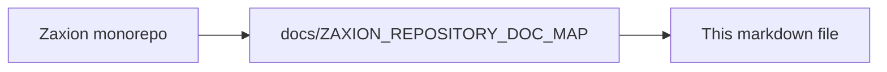

# Zaxion Incremental Architecture: File-by-File Execution Map

## Purpose

Translate the incremental architecture into concrete, low-risk changes mapped to current Zaxion services and files.

This document complements:
- `Incremental Architecture/ZAXION_INCREMENTAL_ANALYSIS_DESIGN.md`
- `Incremental Architecture/ZAXION_INCREMENTAL_IMPLEMENTATION_PLAN.md`

It includes concrete file-level work for **structural false positive reduction** (language gates, file-kind classification, fixture suite), **sectioned PR scan progress UI** (GitHub checklist + app polling), and Merkle rollout.

Full PR report UI spec: [ZAXION_PR_SCAN_PROGRESS_AND_REPORT_UI.md](ZAXION_PR_SCAN_PROGRESS_AND_REPORT_UI.md).

## Current System Touchpoints (Observed)

- `backend/src/services/astAnalyzer.service.js`
  - central AST enrichment (`enrichSnapshotWithAstAsync`, `analyzeFileAsync`)
  - currently Babel-first for JS/TS
- `backend/src/services/patternMatcher.service.js`
  - regex policy matching + optional AST helper for magic numbers
- `backend/src/services/evaluationEngine.service.js`
  - policy check orchestration and `getRequiredDataDepth`
  - consumes `facts.metadata.ast_by_path`, `f.ast.semanticFacts`
- `backend/src/services/policySimulation.service.js`
  - simulation replay flow
  - calls `evaluationEngine.getRequiredDataDepth` and on-demand enrichment
- `backend/src/services/prAnalysis.service.js`
  - PR webhook pipeline: `PENDING` → batch evaluate → `reportStatus`
- `backend/src/services/githubReporter.service.js`
  - GitHub Checks API + sticky PR comment (today: final status only)
- `frontend/src/pages/DecisionResolutionConsole.tsx`
  - PR governance UI; consumes decision API

These are the primary seams to introduce incremental parsing/routing and **sectioned scan progress** without breaking API contracts.

## New Modules to Add

Create these modules first (additive only):

- `backend/src/services/incremental/incrementalFeatureFlags.service.js`
  - centralized environment flag reads
  - exposes `isEnabled(flagName)` and `isForcedLegacy()`

- `backend/src/services/incremental/treeSitterParser.service.js`
  - parse file content with Tree-sitter by language
  - returns canonical syntax root and parser diagnostics

- `backend/src/services/incremental/nodeCanonicalizer.service.js`
  - converts parser-specific node to `CanonicalNode`
  - computes stable range metadata and normalized text hash

- `backend/src/services/incremental/merkleHash.service.js`
  - computes deterministic subtree hashes
  - returns root hash + node hash map

- `backend/src/services/incremental/incrementalCache.service.js`
  - layer abstractions:
    - parse cache
    - node fact cache
    - deep AST cache
    - policy eval cache

- `backend/src/services/incremental/policyRouter.service.js`
  - determines routing: `shallow`, `selective_deep`, `fallback`
  - consumes policy metadata + node tags + confidence/risk

- `backend/src/services/incremental/incrementalAnalyzer.service.js`
  - orchestrator called by AST enrichment path
  - produces `metadata.incremental` payload and transformed legacy-compatible facts

- `backend/src/services/incremental/shadowComparator.service.js`
  - compares legacy vs incremental decisions
  - emits parity metrics and mismatch diagnostics
  - classifies deltas: `true_improvement`, `regression`, `acceptable_drift`, `intentional_fp_fix`

- `backend/src/services/incremental/fileKindClassifier.service.js`
  - maps `path` + extension + basename heuristics → `source` | `test` | `manifest` | `workflow` | `lockfile` | `infrastructure` | `unknown`
  - examples: `package.json` → `manifest`; `.github/workflows/deploy.yml` → `workflow`; `Dockerfile` → `infrastructure`; `*.test.ts` → `test`

- `backend/src/services/incremental/policyApplicability.service.js`
  - given policy metadata + `file_kind` + `language` → `run` | `skip` | `fallback`
  - emits structured `skip_reason`: `inapplicable_language`, `inapplicable_file_kind`, `no_adapter`
  - consumed by `policyRouter.service.js` before checker invocation

- `backend/src/services/incremental/policyReportMapper.service.js`
  - maps `rule_id` / `policy_type` → report section + user-facing label
  - aggregates checker verdicts into `ReportCheckRow` states
  - renders GitHub markdown + React JSON from `ScanProgress`
  - config: `backend/src/config/policyReportSections.js` (or YAML) — display label table

- `backend/src/services/incremental/scanProgressBuilder.service.js`
  - builds and merges `ScanProgress` from partial section results
  - invoked on `onSectionComplete` callbacks during evaluation

## Data Contract (Backward-Compatible)

Preserve existing fields. Add only:

- `factSnapshot.metadata.incremental = { ... }`
  - `enabled`
  - `analysis_mode` (`legacy` | `hybrid` | `incremental`)
  - `changed_node_count`
  - `root_subtree_hashes_by_file`
  - `routing_stats`
  - `cache_hit_rates`
  - `parity` (if shadow mode)
  - `fp_delta` (if shadow mode: `legacy_only_count`, `incremental_only_count`, `true_improvement_count`)
  - `scan_progress` (sectioned checklist — see [PR scan progress spec](ZAXION_PR_SCAN_PROGRESS_AND_REPORT_UI.md#data-contract-scanprogress))

- `pr_decisions.raw_data` (additive while `PENDING`):
  - `scan_progress` updated on each section complete when `INCR_SCAN_PROGRESS_UI_ENABLED=true`

- Optional per-file additive field:
  - `facts.changes.files[i].incremental = { file_kind, language, node_ids, subtree_hashes, routed_policies, skipped_policies }`

Never remove or rename:
- `metadata.ast_by_path`
- `metadata.parser_success_rate`
- existing checker-consumed fields in `evaluationEngine.service.js`

## File-by-File Change Plan

## 1) `backend/src/services/astAnalyzer.service.js` (Primary integration)

### Change Intent
- Keep existing Babel path intact.
- Introduce incremental branch before/around `analyzeFileAsync`.

### Specific Changes
- Add optional dependency injection or local import for `incrementalAnalyzer.service`.
- In `enrichSnapshotWithAstAsync`:
  - if `INCR_FORCE_LEGACY=true`: current behavior unchanged.
  - if incremental flags enabled:
    - call incremental analyzer for each supported file.
    - transform incremental output into legacy-compatible `ast_by_path` shape.
  - unsupported language or parser errors -> fallback to current `analyzeFileAsync`.
- Preserve parser success calculation semantics.

### Safety Guard
- Any incremental error must return to existing `parse_error`/legacy behavior, never throw pipeline-breaking error.

## 2) `backend/src/services/evaluationEngine.service.js` (Routing consumer)

### Change Intent
- Keep checker API and final verdict logic unchanged.
- Add routing metadata usage and selective deep escalation hooks.

### Specific Changes
- Add router initialization:
  - `this.policyRouter = new PolicyRouterService(...)`
- Extend `getRequiredDataDepth(appliedPolicies)`:
  - continue returning `{ requiresContent, requiresAst }` for compatibility
  - add optional additive fields like `requiresIncremental`, `requiresDeepAst`
- Before executing checker:
  - classify file via `fileKindClassifier.service.js`
  - call `policyApplicability.service.js` — if `skip`, do not invoke checker; record `skip_reason` in metadata
  - obtain routing decision for policy + file/node context
  - if `selective_deep`: request deep facts for candidate nodes (through incremental analyzer/deep adapter)
  - if `fallback`: run checker against current facts as-is
- **False positive guards (incremental authority phases):**
  - `_checkCodeQuality` / `_checkSecurityPatterns`: do not scan `manifest`, `workflow`, `lockfile` file kinds
  - `_checkReliability`: only `javascript`/`typescript` `source` files unless language adapter exists
  - `_checkSupplyChainIntegrity`: only `manifest`, `workflow`, `infrastructure` — never share regex path with code quality
- Emit routing metadata into logs and result metadata (additive only).

### Safety Guard
- If router unavailable/fails, default path must be existing checker execution with legacy data.
- If applicability service fails, default to legacy (do not widen scope); log `applicability_fallback`.

## 3) `backend/src/services/policySimulation.service.js` (Replay compatibility)

### Change Intent
- Keep simulation determinism and replayability.
- Allow optional incremental replay metadata without changing result contract.

### Specific Changes
- Keep current call:
  - `this.evaluationEngine.getRequiredDataDepth([mockAppliedPolicy])`
- If incremental flags enabled:
  - enrich on-demand with incremental facts in addition to current enrichment path.
  - attach simulation trace:
    - `routing_path_distribution`
    - `parity_status` (if shadow compare)
    - `fallback_count`
- Keep `results.summary`, `violations`, `impacted_prs`, `per_pr_results` unchanged.

### Safety Guard
- If incremental enrichment fails mid-simulation, continue with current legacy path for that snapshot.

## 4) `backend/src/services/prAnalysis.service.js` (PR scan + progress)

### Change Intent
- Keep idempotent `PENDING` → evaluate → `FINAL` flow.
- Emit `scan_progress` during scan when progress UI flag enabled.

### Specific Changes
- After creating `PENDING` check run, store `github_check_run_id`.
- Pass `onSectionComplete` into `policyEngine.evaluate()` (Phase 3+):
  - patch `raw_data.scan_progress` in DB,
  - call `reporter.reportProgress(...)`.
- On completion, attach final `scan_progress` to `decisionObject`; `reportStatus` includes sectioned checklist.
- Phase 2 shortcut: build `scan_progress` once after batch evaluate (final-only checklist).

### Safety Guard
- Progress callback failures must not abort evaluation; log and continue.

## 5) `backend/src/services/githubReporter.service.js` (GitHub surfaces)

### Change Intent
- Add progressive checklist to check run output and sticky comment.

### Specific Changes
- New method `reportProgress(owner, repo, headSha, checkRunId, scanProgress)`:
  - `status: in_progress`, `output.summary` = sectioned markdown from `policyReportMapper`.
- Extend `reportStatus`:
  - final `output.text` includes full sectioned report,
  - sticky comment body uses checklist + deep link (not only badge + stats).
- Throttle comment updates during progress (configurable ms).

### Safety Guard
- If `reportProgress` fails, continue evaluation; final `reportStatus` still runs.

## 6) `backend/src/services/policyEngine.service.js` (Sectioned evaluate)

### Change Intent
- Optional section-ordered evaluation with progress callbacks.

### Specific Changes
- Accept `options.onSectionComplete(scanProgress)` and `options.reportSections` order.
- Map `evaluation.policy_results` through `policyReportMapper` for `decisionObject.scan_progress`.
- Include `category` on each `policies[]` entry from `corePolicies.js` lookup.

### Safety Guard
- When flag off, single batch evaluate — zero behavior change.

## 7) `frontend/src/components/governance/GovernanceScanProgress.tsx` (new)

### Change Intent
- Reusable sectioned checklist matching GitHub markdown UX.

### Specific Changes
- Props: `scanProgress: ScanProgress`, `compact?: boolean`.
- Row icons for `pending` | `running` | `passed` | `warn` | `failed` | `skipped`.
- Section headers: Security, Architecture, etc.

## 8) `frontend/src/pages/DecisionResolutionConsole.tsx`

### Change Intent
- Show live checklist while `evaluationStatus === 'PENDING'`.

### Specific Changes
- Poll decision endpoint (2–3s interval) while pending.
- Render `GovernanceScanProgress` above existing decision hero.
- On `COMPLETED`, transition to violation detail (existing UI).

### Safety Guard
- Stop polling on unmount and when `FINAL`.

## 9) `backend/src/services/patternMatcher.service.js` (Gradual optimization seam)

### Change Intent
- Preserve regex checks.
- Optionally consume shallow incremental facts for targeted policies.

### Specific Changes
- Introduce optional fast-path input:
  - if incremental facts include known call identifiers/assignment tags, short-circuit some regex passes.
- Keep `analyzeCode(code, filePath)` external behavior unchanged.
- Keep `detectMagicNumbers` backward-compatible; deep path can later delegate candidate extraction from incremental node facts.

### Safety Guard
- If incremental fast-path is incomplete, always execute existing regex/AST fallback checks.

## 10) `backend/src/services/factIngestor.service.js` (if present in pipeline)

### Change Intent
- Add optional incremental enrichment stage to ingestion.

### Specific Changes
- After content fetch and before persistence:
  - call incremental analyzer for supported files.
  - store additive `metadata.incremental`.
- Do not alter core snapshot schema required by existing consumers.

### Safety Guard
- Incremental stage must be non-blocking in BEST_EFFORT mode.

## 11) Policy Definitions / Mapping Layer

Likely files:
- `backend/src/policies/corePolicies.js`
- `backend/src/utils/policyMapper.js` (used by simulation)

### Change Intent
- Add routing metadata contract per policy type.

### Specific Changes
- Add optional keys:
  - `required_depth`
  - `escalation_triggers`
  - `fallback_behavior`
  - `supported_languages`
  - `supported_file_kinds`
- Document starter mappings (see Policy Routing Starter Matrix below).
- Keep old rule shape valid by applying defaults in router.

### Starter applicability examples (policyMapper / corePolicies)

| Rule type / policy family | `supported_languages` | `supported_file_kinds` |
|---------------------------|----------------------|-------------------------|
| `code_quality`, `no-console-logs-production` | `javascript`, `typescript` | `source` |
| `reliability` (REL-001) | `javascript`, `typescript` (v1) | `source` |
| `security_patterns` (noisy regex) | per-pattern; default JS/TS for DOM/Node rules | `source` |
| `supply_chain_integrity` (OPS-001) | `*` (structured rules) | `manifest`, `workflow`, `infrastructure` |
| `dependency_scan` | `*` | `manifest`, `lockfile` |
| `documentation`, `architecture` | `javascript`, `typescript` (v1) | `source` |

### Safety Guard
- Missing new metadata must never break policy loading. Defaults route to legacy-safe behavior.
- Default for ambiguous metadata: `supported_file_kinds: ["source"]` for style rules (narrows legacy over-scanning over time).

## 12) Caching Utilities

Current cache utility:
- `backend/src/utils/lruCache.js` (already used by AST analyzer)

### Change Intent
- Reuse existing cache idioms while introducing incremental cache namespace.

### Specific Changes
- Add cache wrappers/adapters in `incrementalCache.service.js`.
- Keep `astCache` behavior untouched; incremental caches are additive.
- Version all keys to avoid collision with current AST cache entries.

### Safety Guard
- Cache failure should degrade to recompute, not fail policy execution.

## Incremental Rollout Sequence (Code-Level)

1. Add new incremental services (no call-sites yet).
2. Scaffold `policyReportMapper` + `ScanProgress` types (Phase 0).
3. Integrate into `astAnalyzer.service.js` behind flags.
4. **Phase A:** Final-only checklist in `githubReporter` + `prAnalysis` (Phase 2).
5. Add router integration in `evaluationEngine.service.js` (observe-only).
6. **Phase B:** `reportProgress` + section callbacks in `policyEngine` / `prAnalysis` (Phase 3).
7. Add shadow comparator and parity logs.
8. Enable selective deep AST for 2-3 policy types.
9. `GovernanceScanProgress` + DecisionResolutionConsole polling (Phase 5).
10. Wire simulation metadata in `policySimulation.service.js`.
11. Enable canary enforcement by policy subset.

## Policy Routing Starter Matrix (Zaxion-Specific)

- `code_quality` / `no-console-logs-production`: `shallow` on JS/TS `source` only
  - **skip** `manifest`, `workflow`, `lockfile`, `infrastructure`
  - trigger: Tree-sitter `CallExpression(console.*)` — not regex on `package.json` strings
- `reliability` (REL-001): `fallback` initially (until per-language adapters ship)
  - languages: `javascript`, `typescript` only
  - **never** run JS `await`/try-catch heuristic on `.rs`, `.py`, `.go`
  - skip `test` files unless policy explicitly targets tests
- `supply_chain_integrity` (OPS-001): `shallow` + structured manifest/workflow diff
  - file_kinds: `manifest`, `workflow`, `infrastructure`
  - **never** route through `security_patterns` or `code_quality`
  - reuse `supplyChainIntegrity.js` patch-aware logic; extend via incremental metadata only
- `security_patterns`: `selective_deep`
  - file_kinds: `source` only (not `manifest` / `workflow`)
  - trigger on suspicious sinks (`eval`, command execution, SQL-like templates)
  - shallow candidate + deep validation before `BLOCK`
- `no_hardcoded_secrets`: `selective_deep`
  - shallow candidate + deep validation to reduce false positives
- `no_xss`: `selective_deep`
  - shallow sink detection + deep context check
- `documentation`: `shallow`
  - AST/export metadata only; JS/TS `source`
- `testing_best_practices`: `shallow`
  - skipped/empty tests from structural facts
- `architecture`: `shallow` first, deep on uncertain imports
- `dependency_scan`: `shallow`
  - file_kinds: `manifest`, `lockfile` only

### Report row mapping (user-facing labels)

| Report row `id` | Section | `rule_types` / sources |
|-----------------|---------|-------------------------|
| `hardcoded_secrets` | security | `no_hardcoded_secrets` |
| `sql_patterns` | security | `no_sql_injection` |
| `security_patterns` | security | `security_patterns`, `no_eval`, `no_xss` |
| `supply_chain` | security / operations | `supply_chain_integrity`, `dependency_scan` |
| `architecture` | architecture | `architecture`, `architectural_integrity` |
| `reliability` | reliability | `reliability` |
| `code_quality` | code_quality | `code_quality`, `complexity_metrics`, `institutional_style` |
| `testing` | testing | `coverage`, `testing_best_practices` |
| `governance` | governance | `pr_size`, `mandatory_review`, GOV-* |
| `documentation` | code_quality | `documentation` (optional sub-row) |

## Scan progress fixtures (required before Phase 5 UI canary)

Maintain under `backend/tests/fixtures/scan-progress/`:

| Fixture | Expected checklist highlight |
|---------|---------------------------|
| `all-pass/` | All rows `passed`, header Passed |
| `blocked-secrets/` | `hardcoded_secrets` → `failed`; header Blocked |
| `warn-coverage/` | `testing` row → `warn` |
| `ops-scripts-only/` | `supply_chain` → `passed` (no lockfile warn) |
| `mixed-lang-skipped/` | `reliability` → `skipped` on Rust-only PR |

## False Positive Regression Fixtures (required before Phase 5)

Maintain under `backend/tests/fixtures/incremental-fp/`:

| Fixture directory | Scenario | Expected incremental outcome |
|-------------------|----------|------------------------------|
| `package-json-scripts-only/` | Only `"scripts"` keys change; no lockfile in PR | PASS (OPS-001 lockfile check skipped) |
| `package-json-dep-bump/` | `dependencies` version change; no lockfile | WARN (OPS-001) |
| `rust-await-no-trycatch/` | `.rs` with `.await`, no JS try/catch | PASS (`reliability` skip) |
| `python-no-console/` | `.py` with `print()` only | PASS (no `console.log` rule) |
| `python-hashlib-md5/` | `.py` using `hashlib.md5` | Route per policy; no JS `md5(` regex false match if language-gated |
| `package-json-script-console-string/` | npm script value contains `console.log` text | PASS (`manifest` not scanned as `source`) |
| `workflow-only-pr/` | Only `.github/workflows/*.yml` changed | OPS-001 only; no `code_quality` findings |
| `mixed-pr-js-py-rs/` | JS + Python + Rust in one PR | Each file evaluated only by applicable policies |

CI gate (shadowComparator integration test):

- `incremental_fp_count <= legacy_fp_count` on full fixture suite before `INCR_ENFORCEMENT_ENABLED`.
- `incremental_fn_count === 0` for critical policies (`no_hardcoded_secrets`, `no_sql_injection`, `supply_chain_integrity` privileged workflow BLOCK cases).
- Record baseline legacy FP counts in Phase 0 for trend comparison.

## Determinism and Replay Requirements

Apply to every incremental decision:

- Persist:
  - `node_id`, `subtree_hash`, `policy_id`, `policy_version`, `routing_path`
- Ensure sorted traversal and stable hash composition.
- Ensure simulation hash includes:
  - engine version,
  - policy version,
  - routing policy pack version.

This keeps `PolicySimulationService` replay behavior stable while evolving internals.

## CI and Test Work Items (Mapped)

Add tests near affected services:

- `backend/src/services/ast/`:
  - deterministic hash tests
  - fallback tests when incremental parser fails
- `backend/src/services/`:
  - `evaluationEngine` router decision tests
  - parity comparison tests (legacy vs incremental)
  - `fileKindClassifier` unit tests (path → kind)
  - `policyApplicability` unit tests (policy + file → run/skip/fallback)
- `backend/tests/fixtures/incremental-fp/`:
  - end-to-end FP regression suite (see table above)
- `backend/tests/fixtures/scan-progress/`:
  - checklist markdown snapshots + `ScanProgress` JSON golden files
- `backend/tests/unit/policyReportMapper.test.js`
- `backend/tests/unit/githubReporter.progress.test.js`
- simulation integration:
  - verify no response contract drift in `runSimulation` results

Gate checks:
- parity threshold,
- **FP regression suite: incremental ≤ legacy FP count**,
- **zero critical-policy FN on fixture suite**,
- no increase in crash/fatal error rate,
- API snapshot tests for simulation responses.

## Rollback and Recovery (Mapped to Files)

- Rollback switch checked in:
  - `incrementalFeatureFlags.service.js`
  - `astAnalyzer.service.js`
  - `evaluationEngine.service.js`
- Emergency behavior:
  - all incremental calls bypassed,
  - only existing Babel/regex pipeline runs,
  - no DB/schema rollback needed (additive fields ignored).

## First PR Cut Recommendation

To keep review safe and small, first implementation PR should include only:

- new incremental service scaffolding,
- feature flag service,
- no-op integration into `astAnalyzer.service.js` that logs but does not affect outputs,
- tests proving zero behavior change with flags off.

Then follow with router/parity PR, then selective deep AST PR.

---

<!-- zaxion-doc-map-footer -->

## Repository documentation map

How this file fits in the Zaxion repo: see **[Zaxion repository documentation map](../docs/ZAXION_REPOSITORY_DOC_MAP.md)** (`docs/ZAXION_REPOSITORY_DOC_MAP.md`) for folder roles and links to system architecture.

**Text view** (works in any viewer):

```text
Zaxion/
├── docs/                    ← phase specs, governance, doc map
├── Incremental Architecture/ ← incremental plans, OPS-001
├── frontend/                ← UI (and frontend/src/Docs)
├── backend/                 ← API, policy engine, evaluation
├── PITCH/                   ← pitch materials
├── README.md                ← entry point
└── docs/ZAXION_REPOSITORY_DOC_MAP.md  ← canonical doc index
```

**Diagram** (Mermaid — quoted labels for compatibility):


