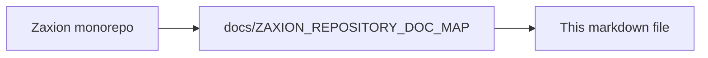

# Zaxion Incremental Architecture Implementation Plan (No-Break Rollout)

## Objective

Implement Merkle hashing + Tree-sitter + selective deep AST in Zaxion with zero production breakage, preserving current outputs until parity is proven.

## Secondary Objective: Structural False Positive Reduction

Reduce governance noise caused by **language- and file-type mismatches** in the current engine. Representative failures observed in production and external-repo scans include:

- JavaScript `console.log` and code-quality rules matching **Python, Rust, YAML, or `package.json` script strings**.
- `reliability` try/catch / bare-`await` heuristics firing on **Rust `.await`** or **Python asyncio** (different error models than JS).
- OPS-001 lockfile warnings on **`package.json` scripts-only** edits (manifest churn misclassified as dependency churn).
- Workflow and manifest files scanned with **generic regex** (`security_patterns`) instead of structured evaluators.

This plan addresses false positives **architecturally** through language-aware parsing, file-kind classification, policy applicability gates, and shallow→deep confirmation — not through one-off regex exclusions. Tactical guardrails in the legacy engine (for example `include_extensions` in YAML, extension checks inside individual checkers) may ship as **interim relief**; they are **not** the long-term solution and must not block or replace incremental rollout.

**Long-term success criterion:** the incremental path shows a **lower false-positive rate** than legacy on a fixed multi-language fixture suite, with **no increase in false negatives** on critical security policies, before canary enforcement (Phase 5).

## Tertiary Objective: Sectioned PR Scan Progress and Report UI

Ship a **GitHub-native governance checklist** while PRs scan in the background — grouped by Security, Architecture, Reliability, Code quality, Testing, Governance, and Operations — with per-row states (`pending` → `running` → `passed` | `warn` | `failed` | `skipped`). This includes:

- Progressive **GitHub Check Run** output updates via `githubReporter.reportProgress`.
- **Sticky PR comment** with sectioned rows (e.g. “Hardcoded secrets scan — No issues”).
- **Zaxion app UI** live checklist on `DecisionResolutionConsole` / `/pr/:owner/:repo/:number` (poll while `PENDING`).

This ships **with** incremental rollout (not a separate track): sectioned evaluation callbacks, `ScanProgress` JSON, and `policyReportMapper` share the same pipeline as the policy router and applicability skips (`skipped` rows explain N/A checks).

Full specification: [ZAXION_PR_SCAN_PROGRESS_AND_REPORT_UI.md](ZAXION_PR_SCAN_PROGRESS_AND_REPORT_UI.md).

## Safety Strategy

- Keep current analyzers as source of truth during initial phases.
- Introduce incremental pipeline behind feature flags.
- Run shadow evaluation and compare decisions before enabling enforcement.
- Provide immediate rollback toggles at every phase.

## Baseline Assumptions

- Existing AST and policy pipeline in backend remains functional.
- Existing policy simulation and remediation flows must remain API-compatible.
- No contract changes to frontend in phase 1 and 2.

## False Positive Problem Statement (Current Engine)

Today, several checkers in `evaluationEngine.service.js` and `patternMatcher.service.js` scan **all fetched file content** with **JavaScript-oriented heuristics**, regardless of language or file role:

| Symptom | Root cause in legacy pipeline | Long-term fix (this plan) |
|--------|-------------------------------|---------------------------|
| `console.log` / code-quality on Python, Rust, YAML | `analyzeCode()` runs regex on every file; `no-console-logs-production` lacks language/file-kind gates | Tree-sitter `CallExpression` facts + `supported_languages` + `supported_file_kinds` |
| try/catch / `await` on Rust, Python asyncio | Single regex in `_checkReliability` applied before language scoping | Per-language reliability adapters; router `fallback` or `skip` until mature |
| OPS-001 lockfile warn on scripts-only `package.json` | Manifest treated like dependency churn without structured diff | Structured manifest diff policy (patch/content semantics), not string scan |
| npm script strings flagged as production code | `package.json` ingested as scannable content for `code_quality` / `security_patterns` | File-kind `manifest` — excluded from source-code policies |
| `md5(` / `sha1(` on Python `hashlib` | Cross-language regex in `security_patterns.yml` | Language-native facts or `supported_languages` gate + deep confirmation |

## Long-Term False Positive Strategy

### 1. Policy Applicability Contract (Phase 0–3)

Every policy declares metadata consumed by `policyRouter.service.js`:

- `supported_languages`: e.g. `["javascript", "typescript"]` — omit or `["*"]` only with explicit justification.
- `supported_file_kinds`: e.g. `["source", "test"]` — never `manifest`, `workflow`, `lockfile` for style/security regex rules.
- `required_depth`: `shallow` | `selective_deep` | `full_fallback`.
- `fallback_behavior`: `run_legacy` | `warn_only` | `skip`.

Policies that cannot apply to a file/language pair **do not run**. The router emits an auditable skip (`inapplicable_language`, `inapplicable_file_kind`) instead of regex-matching and hoping for the best.

### 2. File-Kind Classification (Phase 1–2)

Classify each changed file before evaluation (`fileKindClassifier.service.js`):

| Kind | Examples | Typical policies |
|------|----------|------------------|
| `source` | `.ts`, `.py`, `.rs`, `.go` | code quality, reliability (per language) |
| `test` | `*.test.ts`, `*_test.py`, `/tests/` | relaxed or skipped for style rules |
| `manifest` | `package.json`, `pyproject.toml`, `Cargo.toml` | OPS-001 structured diff only |
| `workflow` | `.github/workflows/*.yml` | OPS-001 supply chain |
| `lockfile` | `package-lock.json`, `poetry.lock`, `Cargo.lock` | `dependency_scan` |
| `infrastructure` | `Dockerfile`, `docker-compose.yml` | OPS-001 |
| `unknown` | unsupported or ambiguous | skip or `full_fallback` only |

Config and manifest files are evaluated by **structured rules** (field-level diff, YAML workflow parsers, OPS-001 lockfile hygiene), not `security_patterns` regex over embedded strings.

### 3. Language-Native Facts (Phase 1–4)

Replace cross-language regex with parser-backed facts:

- **JS/TS:** Tree-sitter shallow facts → Babel deep path for escalated nodes.
- **Python:** Tree-sitter / AST for structural rules; regex fallback only when parser fails.
- **Rust / Go / others:** router `skip` or dedicated adapter when available — **never** inherit JavaScript-only heuristics.

Example: `console_log_in_production` fires only on a verified `CallExpression` to `console.*` in JS/TS **source** files, not on a string literal inside `package.json` `"scripts"`.

### 4. Two-Tier Confirmation (Phase 4)

High-noise policies use **shallow candidate → deep validation**:

1. Shallow pass flags candidate nodes (low cost).
2. Deep AST confirms context (test harness, logger wrapper, build-only path).
3. If confidence below threshold → `OBSERVE` or skip, not `BLOCK`.

Applies first to: `no_hardcoded_secrets`, `security_patterns`, `no_xss`, `code_quality` (console/debug).

### 5. Shadow Parity + False Positive Budget (Phase 4–5)

Before incremental results affect user-visible verdicts:

- Run legacy and incremental in parallel (`shadowComparator.service.js`).
- Classify deltas: `true_improvement` (legacy FP removed), `regression` (new FP or FN), `acceptable_drift`.
- **Gate:** incremental must not increase FP rate on the fixture suite; critical-policy FN budget = 0.

### 6. Feedback Loop (Phase 5–6)

- Track override rate per policy × language × file-kind.
- Feed overrides into policy metadata tuning and fixture expansion.
- Persist `routing_path` + `node_id` so disputed findings are replayable in simulation.

### Out of scope for this plan (tactical interim only)

- Adding `include_extensions` to individual entries in `security_patterns.yml`.
- One-off extension checks inside legacy checkers (e.g. `isJavaScriptLikeAsyncAwaitFile`).

These may ship independently as stopgaps but do not replace Phases 1–6.

## Feature Flags

Add environment toggles (all default `false`):

- `INCR_PARSE_ENABLED`
- `INCR_MERKLE_ENABLED`
- `INCR_POLICY_ROUTER_ENABLED`
- `INCR_DEEP_AST_ENABLED`
- `INCR_SHADOW_COMPARE_ENABLED`
- `INCR_ENFORCEMENT_ENABLED`
- `INCR_SCAN_PROGRESS_UI_ENABLED` — sectioned checklist + progressive GitHub/app updates (Phase 2+; final-only checklist can ship under Phase 2 without streaming)

Hard safety switch:
- `INCR_FORCE_LEGACY=true` bypasses all incremental logic.

## Phase-by-Phase Plan

## Phase 0 - Readiness and Instrumentation (No behavior change)

### Tasks
- Define shared types/interfaces for:
  - canonical node,
  - subtree hash record,
  - routing decision,
  - policy evidence attachment,
  - **`FileKind`** enum (`source`, `test`, `manifest`, `workflow`, `lockfile`, `infrastructure`, `unknown`),
  - **`PolicyApplicability`** (`supported_languages`, `supported_file_kinds`, `required_depth`, `fallback_behavior`).
  - **`ScanProgress`** and **`ReportCheckRow`** (sectioned PR report UI — see [PR scan progress spec](ZAXION_PR_SCAN_PROGRESS_AND_REPORT_UI.md#data-contract-scanprogress)).
- Scaffold **`policyReportMapper.service.js`** (rule_id → display label + section; no GitHub output yet).
- Add metrics counters/timers:
  - parse time,
  - cache hit rate by layer,
  - routing path distribution,
  - parity mismatch count,
  - **`incr_inapplicable_skip_count`** (expected skips by language/file-kind),
  - **`incr_fp_legacy_only`** / **`incr_fp_incremental_only`** (shadow compare deltas).
- Add structured logging fields:
  - `analysis_mode`,
  - `routing_path`,
  - `policy_version`,
  - `node_id`,
  - `file_kind`,
  - `skip_reason` (when policy not applicable).
- Build **multi-language false-positive fixture corpus** under `backend/tests/fixtures/incremental-fp/` (see execution map).

### Exit Criteria
- Existing tests pass unchanged.
- New telemetry appears without affecting policy decisions.
- Fixture corpus checked in and runnable (baseline legacy FP counts recorded).

## Phase 1 - Tree-sitter Parse Layer (Shadow-only)

### Tasks
- Introduce Tree-sitter parser service abstraction:
  - language registry,
  - parse function returning canonical root node.
- Introduce **`fileKindClassifier.service.js`** (path + extension + basename heuristics; no verdict impact yet).
- Parse changed files in parallel with legacy parser when `INCR_PARSE_ENABLED=true`.
- Persist parse artifacts to Layer 0 cache.
- Do not use parse results for enforcement yet.
- Log file-kind distribution per PR for FP baseline analysis.

### Validation
- Compare parse success rates against legacy.
- Alert if parse error rate exceeds threshold.
- File-kind labels match manual audit on fixture corpus (≥ 98% agreement).

### Exit Criteria
- Stable parse success for target languages.
- No API contract changes.
- File-kind classifier integrated in shadow logs only.

## Phase 2 - Merkle Hashing + Node Fact Extraction (Shadow-only)

### Tasks
- Compute deterministic subtree hashes.
- Build changed-node detector via previous snapshot/hash lookup.
- Extract shallow facts from changed nodes only.
- Populate Layer 1 cache.

### Validation
- Cache hit metrics show expected reuse on unchanged files.
- Fact extraction throughput improves over full-file baseline.

### Exit Criteria
- Deterministic hash reproducibility confirmed across reruns.

### Report UI milestone (Phase 2 — final-only)
- **Phase A:** After batch evaluation, build `ScanProgress` from `policy_results`; render sectioned checklist in final `githubReporter.reportStatus` output and sticky comment.
- Unit tests for `policyReportMapper` markdown snapshots (all-pass, blocked, warn fixtures).

## Phase 3 - Policy Router (Observe-only, no decision authority)

### Tasks
- Add policy metadata:
  - required depth,
  - escalation triggers,
  - fallback behavior,
  - **`supported_languages`**,
  - **`supported_file_kinds`**.
- Implement **`policyApplicability.service.js`** and router producing:
  - `shallow`,
  - `selective_deep`,
  - `fallback`,
  - **`skip`** (inapplicable language or file-kind).
- Continue using legacy decision output for user-visible results.
- Log router-selected path, skip reason, and expected policy outcome.
- Map all core policies in `policyMapper.js` / `corePolicies.js` to applicability metadata (defaults documented).

### Validation
- Router coverage report per policy.
- No policy skipped without explicit `skip`, `fallback`, or routed path.
- Report: count of **expected** skips (JS-only policy on `.rs` file) vs **unexpected** routing gaps.
- Fixture run: log how many legacy FPs would have been avoided if incremental skips were authoritative (observe-only).

### Exit Criteria
- 100% policies mapped to a routing behavior.
- 100% policies declare `supported_languages` and `supported_file_kinds` (or explicit `*` with justification in policy pack).

### Report UI milestone (Phase 3 — progressive)
- Refactor evaluation to **section callbacks** (`onSectionComplete`) when `INCR_SCAN_PROGRESS_UI_ENABLED=true`.
- Implement `githubReporter.reportProgress()` — update `in_progress` check run with partial checklist.
- Persist partial `scan_progress` in `pr_decisions.raw_data` during `PENDING`.
- Throttle GitHub API updates (e.g. per section complete, max 1 comment update per 2s).

## Phase 4 - Selective Deep AST (Shadow compare)

### Tasks
- Implement deep analyzer adapters:
  - Babel deep path for JS/TS,
  - Python deep path (initially fallback-compatible).
- Trigger deep analysis only for escalated nodes.
- Store deep facts in Layer 2 cache.
- Run shadow policy decisions and compare with legacy outcomes.

### Validation
- Parity dashboard:
  - exact match,
  - severity mismatch,
  - evidence span mismatch,
  - **`true_improvement`** (legacy FP removed by incremental),
  - **`regression`** (incremental-only FP or FN).
- Investigate and classify mismatches (bug / acceptable drift / policy bug / **intentional FP fix**).
- Run full **`incremental-fp`** fixture suite; document FP delta per policy family.

### Exit Criteria
- Decision parity >= agreed threshold (recommend >= 95%) on full regression suite.
- **False-positive count on `incremental-fp` fixture suite reduced by >= 30% vs legacy** (target; adjust per baseline).
- No critical-policy false negatives (FN budget = 0).
- No critical policy regressions.

### Report UI milestone (Phase 4)
- Checklist rows show **`skipped`** state when router returns `inapplicable_language` / `inapplicable_file_kind`.
- Snapshot tests: GitHub `output.summary` for mixed-language PR with skipped rows.
- `backend/tests/fixtures/scan-progress/` regression suite.

## Phase 5 - Limited Enforcement (Canary)

### Tasks
- Enable incremental decisions for low-risk policy subset only.
- Keep critical policies on legacy/fallback until proven.
- Add canary targeting:
  - selected repos/orgs,
  - percentage rollout.

### Validation
- Monitor:
  - false positives (fixture suite + canary repos),
  - false negatives,
  - **`incr_override_rate_by_policy`** (must not rise week-over-week),
  - latency and timeout regressions.
- Compare canary FP rate to legacy baseline on same orgs/repos.

### Exit Criteria
- Canary stable for defined window (e.g., 7-14 days).
- Canary FP rate **≤ legacy baseline** on monitored repos.
- Override rate stable or decreasing.

### Report UI milestone (Phase 5)
- **`GovernanceScanProgress.tsx`** on DecisionResolutionConsole — poll `scan_progress` while `PENDING`.
- Canary: enable `INCR_SCAN_PROGRESS_UI_ENABLED` for selected orgs/repos.
- Monitor GitHub API rate limits and user feedback on comment noise.

## Phase 6 - Progressive Expansion + Legacy Reduction

### Tasks
- Move medium/high-value policies to incremental path in batches.
- Keep fallback available per policy.
- Decommission legacy full-file paths only after sustained parity.

### Exit Criteria
- Incremental architecture becomes default.
- Legacy mode retained as emergency fallback for one release cycle.
- Multi-language FP fixture suite passes with incremental as authority.
- Manifest/workflow files no longer routed through generic `security_patterns` regex path.
- Sectioned PR report UI is default on GitHub check + app deep link when incremental is default.

## Compatibility and Non-Break Guarantees

- Preserve existing API response shape for policy simulation endpoints.
- Preserve existing `metadata` fields; add new fields under namespaced object:
  - `metadata.incremental.*`
- Never block merge/deployment based on incremental-only result until canary exit criteria pass.
- On any incremental failure:
  - fallback to legacy path for that file/policy,
  - emit warning metric,
  - avoid hard failure of full pipeline.

## Data and Schema Migration Plan

- No destructive DB migrations in early phases.
- Introduce additive tables/collections:
  - `incremental_node_cache`
  - `incremental_policy_cache`
  - optional `incremental_parse_artifacts`
- Use versioned records; old records remain readable.
- Provide TTL cleanup jobs to control storage growth.

## Testing Strategy

## Unit Tests
- hash determinism (same input/order -> same hash),
- canonicalization correctness,
- router decisions from policy metadata,
- cache key/version invalidation logic.

## Integration Tests
- end-to-end simulation on representative PR fixtures,
- mixed language repos,
- fallback path correctness under parse failures.

## Regression Tests
- compare legacy vs incremental decisions and evidence spans.
- enforce mismatch budget thresholds in CI.

## False Positive Regression Tests
- `backend/tests/fixtures/incremental-fp/` — multi-language PR fixtures (see execution map).
- Assert incremental FP count ≤ legacy on fixture suite before `INCR_ENFORCEMENT_ENABLED`.
- Per-fixture cases:
  - `package-json-scripts-only` — scripts change, no lockfile → PASS (OPS-001).
  - `rust-await-no-trycatch` — `.rs` with `.await` → PASS (reliability skip or Rust adapter).
  - `python-no-console` — `.py` with `print()` only → PASS (no `console.log` rule).
  - `package-json-script-console-string` — npm script contains `console.log` text → PASS (manifest not scanned as source).
  - `mixed-pr-js-py-rs` — only applicable policies fire per file.

## PR Scan Progress UI Tests
- `policyReportMapper` — section grouping, label mapping, verdict → row state.
- `githubReporter.reportProgress` — mock Octokit: N progress updates + 1 final `reportStatus`.
- `backend/tests/fixtures/scan-progress/` — all-pass, blocked secrets, OPS-001 scripts-only, skipped-row mixed language.
- Snapshot: GitHub checklist markdown matches [PR scan progress spec](ZAXION_PR_SCAN_PROGRESS_AND_REPORT_UI.md#delivery-surfaces).

## Performance Tests
- p50/p95 latency on small, medium, large PRs.
- cache warm vs cold behavior.

## Observability and Operational Controls

- Metrics:
  - `incr_parse_ms`
  - `incr_cache_hit_ratio`
  - `incr_router_path_count`
  - `incr_parity_mismatch_count`
  - `incr_fallback_count`
  - `incr_inapplicable_skip_count`
  - `incr_fp_legacy_only` (legacy flagged, incremental did not — improvement candidate)
  - `incr_fp_incremental_only` (regression candidate)
  - `incr_fp_confirmed_count` / `incr_fp_candidate_count` (two-tier confirmation)
  - `incr_override_rate_by_policy`
  - `scan_progress_update_count` / `scan_progress_section_ms` (per-section evaluate duration)
- Alerts:
  - parse failure spike,
  - parity mismatch spike for critical policies,
  - fallback saturation,
  - **`incr_fp_incremental_only` spike** (new false positives),
  - override rate spike for a single policy.
- Dashboards:
  - policy parity over time,
  - latency delta vs legacy baseline,
  - **FP rate by policy × language × file-kind**,
  - shadow `true_improvement` vs `regression` trend.

## Rollback Plan

Rollback must be one-step and immediate:
- set `INCR_FORCE_LEGACY=true`,
- restart workers/services (or dynamic config reload),
- keep incremental write paths optional to disable if needed.

No schema rollback required due to additive data model.

## Risk Register and Mitigations

- **Risk: parser grammar mismatch**
  - Mitigation: per-language fallback + parse error thresholds.
- **Risk: unstable node IDs from formatting churn**
  - Mitigation: normalized hash rules + subtree-based caching.
- **Risk: policy behavior drift**
  - Mitigation: mandatory shadow compare and parity gates.
- **Risk: cache bloat**
  - Mitigation: TTL + max size + eviction policy + compression.
- **Risk: routing misconfiguration**
  - Mitigation: policy metadata validation and default-to-fallback behavior.
- **Risk: false positives from legacy regex during hybrid period**
  - Mitigation: router skips inapplicable files; shadow compare blocks enforcement until FP budget met; manifest/workflow never share `code_quality` path.
- **Risk: new language adapter missing → silent skip hides real issues**
  - Mitigation: explicit `OBSERVE` + audit log when policy has no adapter for file language; never apply JS heuristics as substitute.
- **Risk: structured manifest diff false negative (skip when should warn)**
  - Mitigation: OPS-001 patch-aware dependency detection; integration tests for scripts-only vs dep-bump cases.
- **Risk: GitHub rate limits from frequent progress comment updates**
  - Mitigation: throttle updates; prefer check-run output over comment edits during scan.
- **Risk: checklist diverges from final verdict**
  - Mitigation: single `policyReportMapper` for progress and final; integration test asserts consistency.

## Ownership and Delivery Cadence

- Week 1-2: Phase 0 and 1.
- Week 3-4: Phase 2 and 3.
- Week 5-6: Phase 4 shadow parity.
- Week 7+: Phase 5 canary, then phased expansion.

Each phase ends with a go/no-go checkpoint requiring:
- test pass,
- parity/perf evidence,
- rollback validation.

## Definition of Done

- Incremental path is default for supported policies/languages.
- Performance and parity targets are met.
- Legacy fallback remains available and tested.
- Audit evidence includes node hash anchors and routing traces.
- **False-positive rate on multi-language fixture suite is at or below legacy baseline.**
- **No JavaScript-only policy runs on non-JS source without explicit cross-language justification in policy metadata.**
- **Manifest and workflow files use structured evaluators, not generic `security_patterns` / `code_quality` regex scans.**
- Override telemetry wired for continuous policy tuning post-launch.
- **Sectioned PR scan report** on GitHub (final checklist minimum; progressive rows when flag enabled) and matching app UI.
- **`ScanProgress`** contract documented and tested; `skipped` rows when router enabled.

---

<!-- zaxion-doc-map-footer -->

## Repository documentation map

How this file fits in the Zaxion repo: see **[Zaxion repository documentation map](../docs/ZAXION_REPOSITORY_DOC_MAP.md)** (`docs/ZAXION_REPOSITORY_DOC_MAP.md`) for folder roles and links to system architecture.

**Text view** (works in any viewer):

```text
Zaxion/
├── docs/                    ← phase specs, governance, doc map
├── Incremental Architecture/ ← incremental plans, OPS-001
├── frontend/                ← UI (and frontend/src/Docs)
├── backend/                 ← API, policy engine, evaluation
├── PITCH/                   ← pitch materials
├── README.md                ← entry point
└── docs/ZAXION_REPOSITORY_DOC_MAP.md  ← canonical doc index
```

**Diagram** (Mermaid — quoted labels for compatibility):


