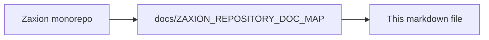

# Zaxion Incremental Architecture Implementation Plan (No-Break Rollout)

## Objective

Implement Merkle hashing + Tree-sitter + selective deep AST in Zaxion with zero production breakage, preserving current outputs until parity is proven.

## Safety Strategy

- Keep current analyzers as source of truth during initial phases.
- Introduce incremental pipeline behind feature flags.
- Run shadow evaluation and compare decisions before enabling enforcement.
- Provide immediate rollback toggles at every phase.

## Baseline Assumptions

- Existing AST and policy pipeline in backend remains functional.
- Existing policy simulation and remediation flows must remain API-compatible.
- No contract changes to frontend in phase 1 and 2.

## Feature Flags

Add environment toggles (all default `false`):

- `INCR_PARSE_ENABLED`
- `INCR_MERKLE_ENABLED`
- `INCR_POLICY_ROUTER_ENABLED`
- `INCR_DEEP_AST_ENABLED`
- `INCR_SHADOW_COMPARE_ENABLED`
- `INCR_ENFORCEMENT_ENABLED`

Hard safety switch:
- `INCR_FORCE_LEGACY=true` bypasses all incremental logic.

## Phase-by-Phase Plan

## Phase 0 - Readiness and Instrumentation (No behavior change)

### Tasks
- Define shared types/interfaces for:
  - canonical node,
  - subtree hash record,
  - routing decision,
  - policy evidence attachment.
- Add metrics counters/timers:
  - parse time,
  - cache hit rate by layer,
  - routing path distribution,
  - parity mismatch count.
- Add structured logging fields:
  - `analysis_mode`,
  - `routing_path`,
  - `policy_version`,
  - `node_id`.

### Exit Criteria
- Existing tests pass unchanged.
- New telemetry appears without affecting policy decisions.

## Phase 1 - Tree-sitter Parse Layer (Shadow-only)

### Tasks
- Introduce Tree-sitter parser service abstraction:
  - language registry,
  - parse function returning canonical root node.
- Parse changed files in parallel with legacy parser when `INCR_PARSE_ENABLED=true`.
- Persist parse artifacts to Layer 0 cache.
- Do not use parse results for enforcement yet.

### Validation
- Compare parse success rates against legacy.
- Alert if parse error rate exceeds threshold.

### Exit Criteria
- Stable parse success for target languages.
- No API contract changes.

## Phase 2 - Merkle Hashing + Node Fact Extraction (Shadow-only)

### Tasks
- Compute deterministic subtree hashes.
- Build changed-node detector via previous snapshot/hash lookup.
- Extract shallow facts from changed nodes only.
- Populate Layer 1 cache.

### Validation
- Cache hit metrics show expected reuse on unchanged files.
- Fact extraction throughput improves over full-file baseline.

### Exit Criteria
- Deterministic hash reproducibility confirmed across reruns.

## Phase 3 - Policy Router (Observe-only, no decision authority)

### Tasks
- Add policy metadata:
  - required depth,
  - escalation triggers,
  - fallback behavior.
- Implement router producing:
  - `shallow`,
  - `selective_deep`,
  - `fallback`.
- Continue using legacy decision output for user-visible results.
- Log router-selected path and expected policy outcome.

### Validation
- Router coverage report per policy.
- No policy skipped without explicit fallback.

### Exit Criteria
- 100% policies mapped to a routing behavior.

## Phase 4 - Selective Deep AST (Shadow compare)

### Tasks
- Implement deep analyzer adapters:
  - Babel deep path for JS/TS,
  - Python deep path (initially fallback-compatible).
- Trigger deep analysis only for escalated nodes.
- Store deep facts in Layer 2 cache.
- Run shadow policy decisions and compare with legacy outcomes.

### Validation
- Parity dashboard:
  - exact match,
  - severity mismatch,
  - evidence span mismatch.
- Investigate and classify mismatches (bug/acceptable drift/policy bug).

### Exit Criteria
- Decision parity >= agreed threshold (recommend >= 95%).
- No critical policy regressions.

## Phase 5 - Limited Enforcement (Canary)

### Tasks
- Enable incremental decisions for low-risk policy subset only.
- Keep critical policies on legacy/fallback until proven.
- Add canary targeting:
  - selected repos/orgs,
  - percentage rollout.

### Validation
- Monitor:
  - false positives,
  - false negatives,
  - latency and timeout regressions.

### Exit Criteria
- Canary stable for defined window (e.g., 7-14 days).

## Phase 6 - Progressive Expansion + Legacy Reduction

### Tasks
- Move medium/high-value policies to incremental path in batches.
- Keep fallback available per policy.
- Decommission legacy full-file paths only after sustained parity.

### Exit Criteria
- Incremental architecture becomes default.
- Legacy mode retained as emergency fallback for one release cycle.

## Compatibility and Non-Break Guarantees

- Preserve existing API response shape for policy simulation endpoints.
- Preserve existing `metadata` fields; add new fields under namespaced object:
  - `metadata.incremental.*`
- Never block merge/deployment based on incremental-only result until canary exit criteria pass.
- On any incremental failure:
  - fallback to legacy path for that file/policy,
  - emit warning metric,
  - avoid hard failure of full pipeline.

## Data and Schema Migration Plan

- No destructive DB migrations in early phases.
- Introduce additive tables/collections:
  - `incremental_node_cache`
  - `incremental_policy_cache`
  - optional `incremental_parse_artifacts`
- Use versioned records; old records remain readable.
- Provide TTL cleanup jobs to control storage growth.

## Testing Strategy

## Unit Tests
- hash determinism (same input/order -> same hash),
- canonicalization correctness,
- router decisions from policy metadata,
- cache key/version invalidation logic.

## Integration Tests
- end-to-end simulation on representative PR fixtures,
- mixed language repos,
- fallback path correctness under parse failures.

## Regression Tests
- compare legacy vs incremental decisions and evidence spans.
- enforce mismatch budget thresholds in CI.

## Performance Tests
- p50/p95 latency on small, medium, large PRs.
- cache warm vs cold behavior.

## Observability and Operational Controls

- Metrics:
  - `incr_parse_ms`
  - `incr_cache_hit_ratio`
  - `incr_router_path_count`
  - `incr_parity_mismatch_count`
  - `incr_fallback_count`
- Alerts:
  - parse failure spike,
  - parity mismatch spike for critical policies,
  - fallback saturation.
- Dashboards:
  - policy parity over time,
  - latency delta vs legacy baseline.

## Rollback Plan

Rollback must be one-step and immediate:
- set `INCR_FORCE_LEGACY=true`,
- restart workers/services (or dynamic config reload),
- keep incremental write paths optional to disable if needed.

No schema rollback required due to additive data model.

## Risk Register and Mitigations

- **Risk: parser grammar mismatch**
  - Mitigation: per-language fallback + parse error thresholds.
- **Risk: unstable node IDs from formatting churn**
  - Mitigation: normalized hash rules + subtree-based caching.
- **Risk: policy behavior drift**
  - Mitigation: mandatory shadow compare and parity gates.
- **Risk: cache bloat**
  - Mitigation: TTL + max size + eviction policy + compression.
- **Risk: routing misconfiguration**
  - Mitigation: policy metadata validation and default-to-fallback behavior.

## Ownership and Delivery Cadence

- Week 1-2: Phase 0 and 1.
- Week 3-4: Phase 2 and 3.
- Week 5-6: Phase 4 shadow parity.
- Week 7+: Phase 5 canary, then phased expansion.

Each phase ends with a go/no-go checkpoint requiring:
- test pass,
- parity/perf evidence,
- rollback validation.

## Definition of Done

- Incremental path is default for supported policies/languages.
- Performance and parity targets are met.
- Legacy fallback remains available and tested.
- Audit evidence includes node hash anchors and routing traces.

---

<!-- zaxion-doc-map-footer -->

## Repository documentation map

How this file fits in the Zaxion repo: see **[Zaxion repository documentation map](../docs/ZAXION_REPOSITORY_DOC_MAP.md)** (`docs/ZAXION_REPOSITORY_DOC_MAP.md`) for folder roles and links to system architecture.

**Text view** (works in any viewer):

```text
Zaxion/
├── docs/                    ← phase specs, governance, doc map
├── Incremental Architecture/ ← incremental plans, OPS-001
├── frontend/                ← UI (and frontend/src/Docs)
├── backend/                 ← API, policy engine, evaluation
├── PITCH/                   ← pitch materials
├── README.md                ← entry point
└── docs/ZAXION_REPOSITORY_DOC_MAP.md  ← canonical doc index
```

**Diagram** (Mermaid — quoted labels for compatibility):


