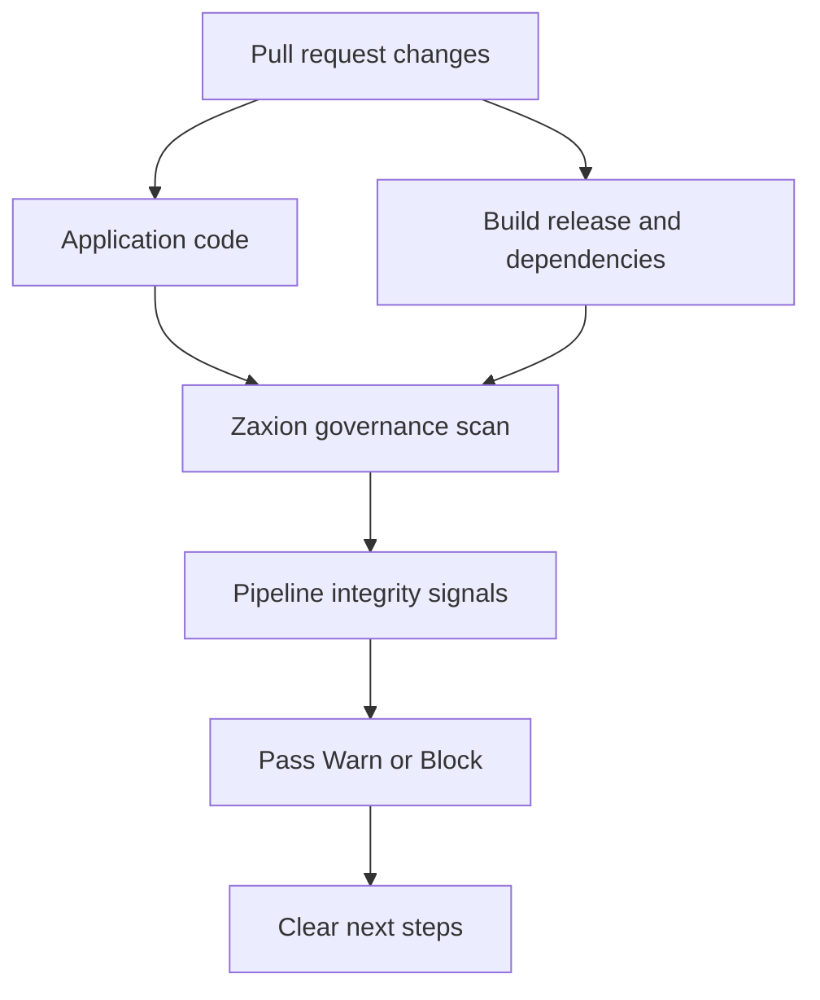
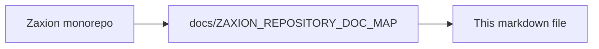

# Zaxion OPS-001 Non-Technical Plan

**Companion:** [ZAXION_OPS_001_TECHNICAL_PLAN.md](ZAXION_OPS_001_TECHNICAL_PLAN.md) (detection scope, file paths, implementation phases). **System view:** [ZAXION_SYSTEM_ARCHITECTURE.md](ZAXION_SYSTEM_ARCHITECTURE.md).

## Implementation order (engineering)

Follow the phases in the technical plan: registry and mapping (`corePolicies`, `policyMapper`, `policyEngine` parity) → evaluation engine checker → simulation/content depth → tests → UI and remediation copy.

**Current status:** Phases through backend tests and core remediation copy are **implemented** in this repository; see [ZAXION_OPS_001_TECHNICAL_PLAN.md — Implementation status](ZAXION_OPS_001_TECHNICAL_PLAN.md#implementation-status-zaxion-repo). Ongoing work is mainly **Phase 4–5** (broader GTM, Founder Console narrative polish, and field feedback).

### Architecture — what the stakeholder sees (conceptual)

This is the product story, not the code layout: the same pull request that changes application code can also change *how software is built and released*. OPS-001 makes that second path visible and governable.

**Text view** (if Mermaid does not render):

```text
Pull request → application code path ──┐
                     └── delivery path ──┼──► Zaxion scan → pipeline signals → Pass/Warn/Block → next steps
```



For how this maps to services and files in the Zaxion monorepo, see [ZAXION_SYSTEM_ARCHITECTURE.md](ZAXION_SYSTEM_ARCHITECTURE.md).

## Policy Proposal

- **Policy ID:** `OPS-001`
- **Policy Name:** `CI/CD Supply Chain Integrity`
- **Primary Goal:** Block risky delivery pipeline changes before they reach production.
- **Policy Promise:** Zaxion scans not only the code, but also the path that code takes into production.

## Why This Policy Matters

Modern teams rely on GitHub Actions, Docker, package managers, and deployment automation for every release. That makes the delivery pipeline one of the highest leverage control points in the software lifecycle.

Zaxion already covers major areas such as secrets, dependencies, containers, IAM, encryption, testing, and performance. The missing gap is pipeline trust itself:

- Are third-party actions pinned and trustworthy?
- Are workflow permissions safely minimized?
- Are production images immutable?
- Are dependency changes backed by lockfile discipline?
- Are deploy paths protected and governed?

This policy closes that gap and gives Zaxion authority over how code reaches production, not only what the code contains.

## What V1 does not cover

The first release is **GitHub Actions–centric** (workflow YAML under `.github/workflows`), common **Dockerfile** patterns, and **lockfile hygiene** next to changed manifests. It does **not** read live GitHub environment protection APIs, full **SBOM/provenance** verification, or deep reasoning across every CI/CD platform. That keeps signal high and false positives lower; see the technical plan non-goals for detail.

## Strategic Value

### Startup Value

- Catches insecure CI shortcuts before they become incidents.
- Gives lean teams immediate guardrails without needing a full AppSec program.
- Helps founders and early engineers ship faster with fewer risky delivery patterns.

### Enterprise Value

- Standardizes software supply chain hygiene across many repositories.
- Creates a common governance baseline for platform, DevOps, and security teams.
- Supports audit readiness with clear, repeatable findings.

### DevOps and Security Value

- Reduces release risk and accidental privilege escalation.
- Highlights risky deploy workflows that often go unreviewed.
- Bridges the gap between source-code scanning and production delivery risk.

### Zaxion Product Value

- Strengthens trust scores and founder-facing repo findings.
- Creates highly understandable public scan output.
- Adds a strong market message:
  - `Zaxion doesn't just scan code. It scans how code reaches production.`

## User-Facing Outcome

The policy should be simple enough for any engineer, founder, or platform lead to understand within seconds.

Expected verdict style:

- `BLOCK`: A production or privilege-related pipeline risk exists and should stop merge or deploy.
- `WARN`: A supply-chain hygiene issue exists and should be fixed soon.
- `PASS`: Core pipeline hardening controls are present.

Each finding should explain:

- what the risk is,
- why it matters,
- what good looks like,
- and what the team should do next.

## MVP Scope

The first release should stay narrow, clear, and high-signal.

### MVP Checks

1. **GitHub Actions must be pinned**
   - Detect mutable references such as `@main`, `@master`, or floating tags on third-party actions.
   - Prefer immutable SHAs or a clearly trusted pinned version strategy.

2. **Workflow permissions must not be broad by default**
   - Detect unsafe patterns such as broad write permissions or overly permissive defaults.
   - Prioritize workflows that can modify releases, deployments, packages, or environments.

3. **Docker base images must be pinned to digest for production-oriented images**
   - Detect `FROM image:tag` without digest pinning where delivery risk is meaningful.
   - Focus first on production-facing Dockerfiles and deployment builds.

4. **Lockfile presence must be enforced when package manifests change**
   - Detect package manifest changes without the corresponding lockfile update for supported ecosystems.
   - Treat this as a supply-chain hygiene signal rather than a deep dependency vulnerability scan.

## MVP Verdict Logic

### Block Conditions

- Production deploy workflow uses broad write permissions.
- Privileged workflow can modify release or deployment state without clear hardening.
- High-confidence production delivery path uses unsafe pipeline defaults.

### Warn Conditions

- GitHub Action is not pinned to an immutable version.
- Docker base image is not pinned to a digest.
- Package manifest changes without an updated lockfile.
- Workflow permissions are broader than necessary but not clearly privileged enough to block.

### Pass Conditions

- Actions are pinned or clearly trusted.
- Workflow permissions are minimized.
- Production images are immutable.
- Dependency changes preserve lockfile integrity.

## Example User Output

- `BLOCK: Production deploy workflow uses broad write permissions`
- `WARN: GitHub Action is not pinned to an immutable version`
- `WARN: Docker base image is not pinned to a digest`
- `WARN: Dependency manifest changed without lockfile update`
- `PASS: Workflow permissions minimized and action sources pinned`

## Later Expansion

After MVP proves clear value and low-noise findings, expand `OPS-001` into broader delivery governance.

### Expansion Areas

1. **Protected deployment flow**
   - Detect direct production deployment without gated environments or approval flow.

2. **Manual approval and environment protection**
   - Identify workflows that bypass environment protection rules.

3. **Staged verification before production**
   - Require build, test, and verification steps before production deployment jobs.

4. **Privileged workflow trigger analysis**
   - Detect dangerous trigger combinations on sensitive jobs.

5. **Trusted action source policies**
   - Allowlist approved action publishers or internal actions.

6. **Cross-repo deployment trust**
   - Detect risky reusable workflow dependencies or external workflow calls.

7. **Privilege escalation paths**
   - Detect workflows with token, package, artifact, release, or environment write access beyond expected scope.

## Relationship to Future Policies

`OPS-001` should become the foundation for an operations and delivery governance family.

### Recommended Follow-On Policies

- **`OPS-002: Rollback Readiness`**
  - Focus on safe rollback paths, migration safety, and controlled release recovery.

- **`OBS-001: Observability Readiness`**
  - Focus on logs, telemetry, alerting, traceability, and incident-response readiness.

## Rollout Plan

### Phase 1: Internal Definition

- Finalize policy name, category, severity model, and verdict philosophy.
- Agree on exactly what belongs in MVP versus later expansion.
- Align product, security, and engineering stakeholders on false-positive tolerance.

### Phase 2: User Language

- Write policy description, help text, remediation guidance, and example findings.
- Ensure wording works for technical and non-technical users.
- Keep findings plain-English and action-oriented.

### Phase 3: Demo and Storytelling

- Prepare clear examples showing `BLOCK`, `WARN`, and `PASS`.
- Use these examples in the policy library, documentation, Founder Console, and outbound content.
- Position the policy as a visible differentiator for Zaxion governance.

### Phase 4: Soft Launch

- Launch as a recommended core policy in the library.
- Surface it in simulation, repo scan summaries, and Founder Console findings.
- Monitor user comprehension and perceived value, not just detection counts.

### Phase 5: Feedback and Refinement

- Review noise levels, clarity of findings, and remediation usefulness.
- Refine policy language before widening technical scope.
- Expand only after the MVP proves strong, broad, and understandable signal.

## Suggested Product Decisions

- **Category:** `Operations`
- **Library severity:** `HIGH` for the core policy row in the catalog.
- **Verdict behavior:** privileged production-style workflows with dangerous permission scope produce **`BLOCK`**; typical hygiene issues (unpinned actions, digest-less base images, manifest without lockfile) produce **`WARN`** unless you tighten posture later. Finding copy may say “critical path” language without changing the stored policy ID severity.
- **Initial Platform Focus:** GitHub-centric workflows first
- **Positioning Style:** strong business and governance language, not only security language

## Success Criteria

- Users understand the policy value in under 30 seconds.
- Findings are broad enough to apply across many real repositories.
- Findings are concrete enough to act on immediately.
- The policy generates strong trust-score and Founder Console narratives.
- MVP produces useful signal without feeling like a compliance checklist.

## Risks to Avoid

- Making the first version too broad and noisy.
- Using language that is too security-heavy for founders or platform leads.
- Shipping low-confidence findings that weaken trust in the policy library.
- Mixing deep dependency scanning goals into a pipeline-integrity MVP.

## Definition of Success for V1

**Today:** the policy is present in the shipped core catalog and evaluation pipeline; success in the field is measured by comprehension, low noise, and teams acting on findings (see success criteria below).

`OPS-001` succeeds when a user can run a scan and immediately understand that Zaxion found delivery-path risk, why that risk matters, and how to harden the route from pull request to production.

---

<!-- zaxion-doc-map-footer -->

## Repository documentation map

How this file fits in the Zaxion repo: see **[Zaxion repository documentation map](../docs/ZAXION_REPOSITORY_DOC_MAP.md)** (`docs/ZAXION_REPOSITORY_DOC_MAP.md`) for folder roles and links to system architecture.

**Text view** (works in any viewer):

```text
Zaxion/
├── docs/                    ← phase specs, governance, doc map
├── Incremental Architecture/ ← incremental plans, OPS-001
├── frontend/                ← UI (and frontend/src/Docs)
├── backend/                 ← API, policy engine, evaluation
├── PITCH/                   ← pitch materials
├── README.md                ← entry point
└── docs/ZAXION_REPOSITORY_DOC_MAP.md  ← canonical doc index
```

**Diagram** (Mermaid — quoted labels for compatibility):


