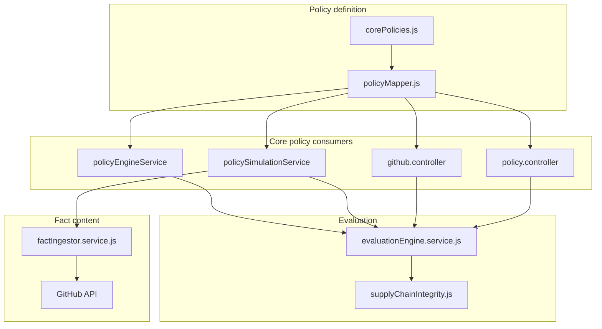
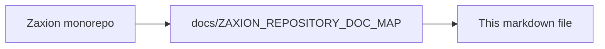

# Zaxion OPS-001 Technical Plan

**Companion:** [ZAXION_OPS_001_NON_TECHNICAL_PLAN.md](ZAXION_OPS_001_NON_TECHNICAL_PLAN.md) (positioning, verdict language, rollout). **System view:** [ZAXION_SYSTEM_ARCHITECTURE.md](ZAXION_SYSTEM_ARCHITECTURE.md).

## Core policy wiring checklist

Every new core policy ID must be wired in **all** of these places, or some entry points will fall back to `core_enforcement` and silently skip real checkers:

1. [`backend/src/policies/corePolicies.js`](../backend/src/policies/corePolicies.js) — library entry (name, description, remediation).
2. [`backend/src/utils/policyMapper.js`](../backend/src/utils/policyMapper.js) — `mapCorePolicyToRules` (simulation, GitHub PR URL analysis, policy controller code analysis).
3. [`backend/src/services/policyEngine.service.js`](../backend/src/services/policyEngine.service.js) — **live PR evaluation** must use the same rule type (prefer calling `mapCorePolicyToRules` instead of duplicating an inline map).
4. [`backend/src/services/evaluationEngine.service.js`](../backend/src/services/evaluationEngine.service.js) — register checker in `checkers` and add the rule `type` to `getRequiredDataDepth` when file content is required.
5. Tests — extend [`backend/tests/unit/policyMapper.test.js`](../backend/tests/unit/policyMapper.test.js) and add or extend simulation/parity tests as needed.

## Implementation status (Zaxion repo)

**Shipped in this codebase:** `OPS-001` is registered in [`corePolicies.js`](../backend/src/policies/corePolicies.js), mapped in [`policyMapper.js`](../backend/src/utils/policyMapper.js), and evaluated via rule type `supply_chain_integrity`. Live PR evaluation uses **`mapCorePolicyToRules`** from [`policyEngine.service.js`](../backend/src/services/policyEngine.service.js) (no duplicate inline map). Detection logic lives in [`supplyChainIntegrity.js`](../backend/src/utils/supplyChainIntegrity.js) and is invoked by [`evaluationEngine.service.js`](../backend/src/services/evaluationEngine.service.js) (`_checkSupplyChainIntegrity`). Content-dependent replay uses `getRequiredDataDepth` plus [`factIngestor.service.js`](../backend/src/services/factIngestor.service.js) (workflows via `.yml`/`.yaml`; Dockerfiles via basename match). Tests: [`backend/tests/unit/supplyChainIntegrity.test.js`](../backend/tests/unit/supplyChainIntegrity.test.js), [`backend/tests/unit/policyMapper.test.js`](../backend/tests/unit/policyMapper.test.js), extended [`backend/src/tests/unit/policySimulationConsistency.test.js`](../backend/src/tests/unit/policySimulationConsistency.test.js). Remediation template: [`Remediation.service.js`](../backend/src/services/remediation/Remediation.service.js).

### Architecture — OPS-001 execution path (current)

This diagram shows how a core policy ID becomes a single rule type and reaches the supply-chain checker, including on-demand file content for historical snapshots.

**Text view** (if Mermaid does not render):

```text
corePolicies.js → policyMapper.js → policyEngine | policySimulation | github.controller | policy.controller
                                              ↓
                         evaluationEngine.service.js → supplyChainIntegrity.js
policySimulation → factIngestorService → GitHub API
```



## Objective

Implement `OPS-001: CI/CD Supply Chain Integrity` as a new core policy that detects risky delivery pipeline changes across GitHub Actions, Docker build definitions, and package-manager lockfile hygiene.

The first version should be:

- high-signal,
- easy to explain,
- safe to simulate,
- and backward-compatible with the current governance pipeline.

## Technical Goals

- Add `OPS-001` to the core policy library.
- Map `OPS-001` to a concrete evaluation rule family instead of relying on generic `core_enforcement`.
- Detect four MVP checks:
  - unpinned GitHub Actions,
  - broad workflow permissions,
  - Docker base images not pinned to digest,
  - missing lockfiles when manifests change.
- Make results work consistently across:
  - policy simulation,
  - GitHub PR URL analysis,
  - historical snapshot replay,
  - and future Founder Console scans.

## Non-Goals for V1

- Full CI platform coverage beyond GitHub-first workflows.
- Deep environment-protection API validation from live GitHub settings.
- Full provenance or SBOM verification.
- Full deployment topology reasoning across all pipelines and infrastructure systems.

## Recommended Detection Model

Implement `OPS-001` as a dedicated rule family instead of folding it into existing `security_patterns`.

### New Rule Family

- **Rule type:** `supply_chain_integrity`

### Why a New Rule Type

- The checks span workflow YAML, Dockerfiles, and repository file inventory.
- The logic is cross-file and policy-oriented, not simple code-pattern matching.
- The user-facing output needs one coherent policy story with multiple evidence types.

## MVP Detection Scope

### 1. GitHub Action Pinning

Detect in `.github/workflows/*.yml` and `.github/workflows/*.yaml`:

- `uses: owner/action@main`
- `uses: owner/action@master`
- `uses: owner/action@v1`
- `uses: docker://image:latest`

Pass conditions:

- immutable commit SHA,
- or a clearly approved trusted pinning policy if later introduced.

Initial recommendation:

- mark floating branches as `WARN`,
- escalate to `BLOCK` when found in privileged production deploy workflows.

### 2. Workflow Permissions Hardening

Detect in workflow files:

- top-level or job-level `permissions: write-all`,
- broad write permissions on sensitive jobs,
- missing explicit permissions on deploy-capable workflows if the default is too permissive,
- workflows with deploy/release intent plus write-capable token scope.

Initial recommendation:

- `BLOCK` for privileged production deploy workflows with broad write permissions,
- `WARN` for general over-broad permissions outside clear production deploy paths.

### 3. Docker Base Image Digest Pinning

Detect in:

- `Dockerfile`
- `Dockerfile.*`
- container build files in common build directories

Flag:

- `FROM node:20`
- `FROM python:3.12-slim`
- similar tag-only images without `@sha256:...`

Initial recommendation:

- `WARN` by default,
- escalate later for production-labeled or deploy-bound container paths.

### 4. Lockfile Hygiene

Detect manifest changes such as:

- `package.json`
- `pnpm-workspace.yaml`
- `requirements.txt`
- `pyproject.toml`
- `poetry.lock` ecosystem pairings

Then verify presence of a matching lockfile or dependency lock artifact:

- `package-lock.json`
- `pnpm-lock.yaml`
- `yarn.lock`
- `poetry.lock`
- other supported lockfiles by ecosystem

Initial recommendation:

- `WARN` for manifest change without lockfile update,
- keep `BLOCK` reserved for later if the repo has stricter enforcement posture.

## Core Policy Library Changes

The following sections describe the **delivered** shape in this repository (not a future spec).

## 1. `backend/src/policies/corePolicies.js`

Policy entry (implemented):

- `id: 'OPS-001'`
- `name: 'CI/CD Supply Chain Integrity'`
- `description: 'Blocks risky CI/CD pipeline patterns such as unpinned actions, broad workflow permissions, mutable container bases, and missing lockfile hygiene.'`
- `severity: 'HIGH'`
- `category: 'Operations'`
- remediation steps that clearly explain pipeline hardening actions

### Recommended Remediation Shape

- Pin third-party GitHub Actions to immutable versions.
- Minimize workflow permissions and avoid broad write access.
- Pin production container base images to digests.
- Keep dependency manifests and lockfiles in sync.

## Rule Mapping Changes

## 2. `backend/src/utils/policyMapper.js`

**Implemented:** `OPS-001` maps so all core-policy entry points resolve consistently to:

- `type: 'supply_chain_integrity'`
- `id: 'OPS-001'`
- `severity: 'HIGH'`

Recommended additive metadata:

- `checks: ['action_pinning', 'workflow_permissions', 'docker_digest_pinning', 'lockfile_presence']`

This is critical because the project already had simulation inconsistencies when core policies were not mapped to a real executable rule type.

## Evaluation Engine Changes

## 3. `backend/src/services/evaluationEngine.service.js`

**Implemented:** dedicated checker:

- `_checkSupplyChainIntegrity(facts, rules)`

Register it in the main rule dispatch so `type: 'supply_chain_integrity'` routes to the new checker.

### Input Data Needed

The checker should work from repository snapshot facts, not from one file only.

Needed inputs:

- `facts.changes.files`
- each file path
- file content when present
- optional metadata about branch/repo context

### Checker Responsibilities

- collect workflow files,
- collect Dockerfiles,
- collect manifest and lockfile changes,
- parse enough structure to produce stable findings,
- return a merged verdict and evidence list.

### Sub-Checks

**As implemented:** the four MVP behaviors are implemented in [`supplyChainIntegrity.js`](../backend/src/utils/supplyChainIntegrity.js) (`findUnpinnedUses`, `analyzeWorkflowPermissions`, `findDockerFromWithoutDigest`, `checkLockfileHygiene`, plus `evaluateSupplyChainIntegrity` for aggregation). The engine exposes a thin wrapper `_checkSupplyChainIntegrity` that delegates there (equivalent to the originally planned helpers below).

Originally planned internal helpers (conceptual split, now colocated in the util module):

- `_checkWorkflowActionPinning(files, rules)`
- `_checkWorkflowPermissions(files, rules)`
- `_checkDockerDigestPinning(files, rules)`
- `_checkLockfilePresence(files, rules)`

Each helper should return:

- verdict contribution,
- message,
- evidence,
- remediation context,
- severity level.

### Verdict Aggregation

Recommended aggregation:

- any privileged production pipeline finding -> final `BLOCK`
- otherwise any medium-confidence hygiene finding -> final `WARN`
- otherwise `PASS`

### Output Shape

Match current engine conventions so UI and simulation do not need contract changes:

- `verdict`
- `message`
- `violations`
- `explanation`
- `remediation`
- `documentation_link`

## Simulation Compatibility

## 4. `backend/src/services/policySimulation.service.js`

**Implemented behavior:** `OPS-001` uses the same `mapCorePolicyToRules` resolution as other core policies; no structural change was required beyond correct `getRequiredDataDepth` for `supply_chain_integrity`.

`OPS-001` must behave identically across simulation modes.

### Required Changes

- Ensure `getRequiredDataDepth` returns `requiresContent: true` for `supply_chain_integrity`.
- If workflow/Docker/manifest files are in snapshots without content, trigger on-demand enrichment.
- Preserve current simulation response contract:
  - `results.summary`
  - `results.per_pr_results`
  - `results.impacted_prs`
  - `results.violations`

### Important Replay Constraint

Historical snapshots may not include workflow or Docker content. The recent enrichment pattern used for security parity should also cover this policy, otherwise:

- GitHub PR URL mode may be correct,
- but repo/branch replay may incorrectly pass.

`OPS-001` should therefore be treated as another content-dependent policy family.

## GitHub PR URL Analysis Alignment

## 5. `backend/src/controllers/github.controller.js`

**Implemented:** core policies use `mapCorePolicyToRules`; `OPS-001` resolves to `supply_chain_integrity` like simulation.

Where core policies are converted into draft rules for PR URL analysis, `OPS-001` must use the same mapping as simulation:

- do not leave it as `core_enforcement`
- always resolve to `supply_chain_integrity`

This keeps:

- GitHub PR URL mode,
- repo simulation mode,
- and future scan entry points

on one consistent execution path.

## Policy Simulation API and Controller Considerations

## 6. `backend/src/controllers/policy.controller.js`

**Current codebase:** core policies are listed from `CORE_POLICIES` and simulated using `mapCorePolicyToRules` (same as GitHub PR URL flow). No API contract change was required for `OPS-001`.

No special frontend contract change is required for `OPS-001`, but the controller should support:

- rendering the policy in core policy lists,
- simulating it like any other core policy,
- returning evidence and rationale cleanly.

Before enabling rollout, confirm the controller and persistence path do not rely on stale columns or schema assumptions for new policy results.

## Fact Data and Enrichment Requirements

## 7. `backend/src/services/factIngestor.service.js`

**Implemented:** workflow YAML remains on the allowed extension set; Dockerfiles without a traditional extension are included in `shouldFetchContent` via basename `Dockerfile` / `Dockerfile.*` matching.

`OPS-001` depends heavily on repository file content quality.

### Required Behaviors

- fetch content for workflow YAML files,
- fetch content for Dockerfiles,
- preserve manifest and lockfile file entries,
- enrich existing snapshots that were previously stored without content.

### Important Edge Cases

- workflow file exists but was not modified in a way that preserved content,
- Dockerfile has non-standard name,
- manifest exists in nested workspace folder,
- lockfile exists in one package directory but not another.

### Recommendation

Keep V1 repo-aware but still conservative:

- evaluate changed files first,
- optionally inspect surrounding repository structure only when that data is already available,
- avoid large new GitHub API expansion in the first pass unless required for correctness.

## Pattern and Parsing Strategy

The MVP does not require a full YAML parser if stable line-based detection is enough, but the implementation should be designed so it can evolve.

### V1 Parsing Recommendation

- use lightweight structured matching for workflow files,
- use regex plus line extraction for Docker `FROM` instructions,
- use path-based ecosystem mapping for lockfiles,
- keep helper functions deterministic and easy to unit test.

### V2 Parsing Upgrade Path

- add YAML parsing for workflow job-level permission inheritance,
- add better deploy-job identification,
- add stronger multi-stage Docker analysis,
- add repo-wide dependency workspace understanding.

## Finder Heuristics

### Sensitive Workflow Indicators

Use these to distinguish general CI from deployment-sensitive jobs:

- workflow/job names containing `deploy`, `release`, `publish`, `production`, `prod`
- references to environments named `production`
- use of package publishing or deployment actions

### Trusted File Targets

- `.github/workflows/*.yml`
- `.github/workflows/*.yaml`
- `Dockerfile`
- `Dockerfile.*`
- root and nested dependency manifest files

## Suggested Rule Shape

Recommended mapped rules object:

```js
{
  type: 'supply_chain_integrity',
  id: 'OPS-001',
  severity: 'HIGH',
  checks: ['action_pinning', 'workflow_permissions', 'docker_digest_pinning', 'lockfile_presence'],
  block_on_privileged_deploy_risk: true
}
```

## Testing Plan

## Unit Tests

Add focused tests for each helper:

- action pinning detection
- workflow permission detection
- Docker digest pinning detection
- lockfile presence detection
- verdict aggregation

Recommended test file:

- `backend/src/tests/unit/supplyChainIntegrity.test.js`

## Simulation Regression Tests

Add parity tests similar to the existing simulation consistency work:

- same repo snapshot should produce the same result across:
  - mapped core policy simulation,
  - GitHub PR URL-derived evaluation,
  - replayed snapshot evaluation

Recommended test file:

- `backend/src/tests/unit/policySimulationSupplyChainConsistency.test.js`

## Fixture Coverage

Include fixtures for:

- unpinned GitHub Action in workflow
- privileged deploy workflow with broad write permissions
- Dockerfile without digest pinning
- `package.json` changed without lockfile
- all controls present resulting in `PASS`

## Docs and UI Surfaces

## 8. Frontend and Docs

The frontend should not need schema changes if the engine output stays consistent, but update policy-facing content so users understand `OPS-001`.

Likely follow-up surfaces:

- policy library descriptions
- core policy cards
- simulation rationale copy
- docs pages for policy explanations and remediation

## Rollout Plan

### Phase 1: Library and Mapping

- add `OPS-001` to `corePolicies.js`
- add mapping in `policyMapper.js`
- add remediation and docs link

### Phase 2: Engine Support

- implement `supply_chain_integrity` checker in `evaluationEngine.service.js`
- add deterministic sub-check helpers
- return stable evidence

### Phase 3: Simulation and PR URL Parity

- ensure required content depth is requested
- verify historical enrichment works
- align GitHub PR URL path with the same rule mapping

### Phase 4: Tests and Confidence

- add unit coverage for each MVP check
- add consistency regression coverage
- validate that all entry points return the same verdicts for the same inputs

### Phase 5: UI and Docs

- expose the policy in the core library
- add user-friendly explanation and remediation copy
- make example output available in docs and demos

## Risks and Mitigations

- **Risk:** false positives from simplistic workflow parsing
  - **Mitigation:** keep privileged deploy blocking narrow in V1

- **Risk:** replay mode missing file content
  - **Mitigation:** enforce enrichment for content-dependent checks

- **Risk:** inconsistent rule mapping across controllers and simulation
  - **Mitigation:** centralize all core-policy mapping in `policyMapper.js` (implemented: `policyEngine.service.js` imports `mapCorePolicyToRules` so live PR evaluation matches simulation and PR URL analysis.)

- **Risk:** noisy lockfile checks in monorepos
  - **Mitigation:** scope lockfile matching by directory and ecosystem pairing

## Definition of Done

**Status in this repository:** the checklist below is satisfied for the shipped OPS-001 baseline (see **Implementation status** and tests above).

`OPS-001` is complete for V1 when:

- it appears in `corePolicies.js`,
- it maps to `supply_chain_integrity`,
- the engine returns correct `BLOCK`, `WARN`, and `PASS` verdicts,
- GitHub PR URL mode and simulation mode agree on the same inputs,
- historical replay works with content enrichment,
- and targeted unit plus regression tests pass.

Broader product work (expanded Founder Console copy, marketing docs pages) may still follow the rollout phases below.

---

<!-- zaxion-doc-map-footer -->

## Repository documentation map

How this file fits in the Zaxion repo: see **[Zaxion repository documentation map](../docs/ZAXION_REPOSITORY_DOC_MAP.md)** (`docs/ZAXION_REPOSITORY_DOC_MAP.md`) for folder roles and links to system architecture.

**Text view** (works in any viewer):

```text
Zaxion/
├── docs/                    ← phase specs, governance, doc map
├── Incremental Architecture/ ← incremental plans, OPS-001
├── frontend/                ← UI (and frontend/src/Docs)
├── backend/                 ← API, policy engine, evaluation
├── PITCH/                   ← pitch materials
├── README.md                ← entry point
└── docs/ZAXION_REPOSITORY_DOC_MAP.md  ← canonical doc index
```

**Diagram** (Mermaid — quoted labels for compatibility):


