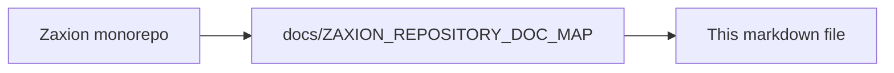

# Zaxion PR Scan Progress and Sectioned Report UI

**Companion:** [ZAXION_INCREMENTAL_IMPLEMENTATION_PLAN.md](ZAXION_INCREMENTAL_IMPLEMENTATION_PLAN.md) (phased rollout), [ZAXION_INCREMENTAL_FILE_BY_FILE_EXECUTION_MAP.md](ZAXION_INCREMENTAL_FILE_BY_FILE_EXECUTION_MAP.md) (code touchpoints). **System view:** [ZAXION_SYSTEM_ARCHITECTURE.md](ZAXION_SYSTEM_ARCHITECTURE.md).

## Objective

Deliver a **GitHub-native, sectioned governance report** while a PR is scanned in the background — matching the product pattern:

- Overall status header (**Passed** / **Warning** / **Blocked**) with Zaxion bot identity.
- **Zaxion Security & Governance Report** card with rows per check (e.g. “Hardcoded secrets scan — No issues”).
- Rows grouped into user-facing sections: **Security**, **Architecture**, **Reliability**, **Code quality**, **Testing**, **Governance**, **Operations**.
- **Live progress** during scan: rows transition `pending` → `running` → `passed` | `warn` | `failed` | `skipped`.
- **View full report** deep link to Zaxion (`/pr/:owner/:repo/:number`).

This feature ships **with** the incremental architecture rollout — not as a separate product track. Sectioned evaluation, applicability skips, and progressive reporting share the same `ScanProgress` contract and policy display mapping.

## Current state (Zaxion repo)

| Component | Today | Gap |
|-----------|--------|-----|
| `prAnalysis.service.js` | `PENDING` → batch `evaluate()` → final decision | No per-section or per-checker progress |
| `githubReporter.service.js` | Check run `in_progress` then `completed`; sticky comment with summary + deep link | No checklist rows in check output or comment |
| `policyEngine.service.js` | Returns `policies[]` with `passed`, `name`, `message` after full run | No `category`; internal rule type names exposed |
| `corePolicies.js` | Each policy has `category` (Security, Architecture, …) | Not used for GitHub report grouping |
| `DecisionResolutionConsole.tsx` | Shows final decision + violations | No live checklist while `PENDING` |

**Text view** (today):

```text
webhook → prAnalysis (PENDING) → diffAnalyzer + policyEngine (batch) → githubReporter (final only)
```

**Text view** (target):

```text
webhook → prAnalysis (PENDING + ScanProgress) → sectioned evaluate with progress callbacks
         → githubReporter.reportProgress (in_progress updates) → githubReporter.reportStatus (final)
         → DecisionResolutionConsole polls ScanProgress
```

## Product UX specification

### Status header (GitHub check + optional app UI)

| Overall decision | Header label | Icon / color |
|------------------|--------------|--------------|
| `PASS` | Passed | Green check |
| `WARN` | Warning | Amber |
| `BLOCK` | Blocked | Red |
| `PENDING` / scanning | Analyzing… | Spinner / pulse |
| `OVERRIDDEN_PASS` | Bypass authorized | Amber unlock |

Subtext example: `All checks passed by Zaxion · just now` or `2 issues found · View full report`.

### Sectioned report card

Collapse internal rule types into **6–8 user-facing rows** (not 40+ policy IDs). Example **Security** section:

| Display label | Backing rule types / policies | User-facing pass text |
|---------------|------------------------------|------------------------|
| Hardcoded secrets scan | `no_hardcoded_secrets`, SEC-001/007/008 | No issues |
| Risky SQL patterns scan | `no_sql_injection`, SEC-002 | No issues |
| Dependency & supply chain | `dependency_scan`, `supply_chain_integrity`, SEC-004, OPS-001 | No issues |
| Security patterns scan | `security_patterns`, SEC-005/006 | No issues |

Example **Governance** section:

| Display label | Backing rule types |
|---------------|-------------------|
| Deterministic governance rules | Core policy pack summary |
| Protocol level compliance | `mandatory_review`, `pr_size`, GOV-* |

### Row states (per check line)

| State | GitHub markdown | App UI | When |
|-------|-----------------|--------|------|
| `pending` | ⬜ … — Pending | Muted row | Not started |
| `running` | ⏳ … — Running… | Animated | Checker in progress |
| `passed` | ✅ … — No issues | Green check | `PASS` / no violations |
| `warn` | 🟡 … — N warning(s) | Amber | `WARN` |
| `failed` | ❌ … — N issue(s) | Red | `BLOCK` |
| `skipped` | ➖ … — Not applicable | Gray | Router `skip` (incremental: wrong language/file-kind) |

**Skipped** rows are essential once incremental applicability ships — they explain why Rust files do not show “await try/catch” warnings instead of falsely passing.

### Section taxonomy (maps `corePolicies.js` `category`)

| UI section | `category` values | Notes |
|------------|-------------------|--------|
| Security | Security | Secrets, SQL, XSS, deps, supply chain |
| Architecture | Architecture | Layering, circular deps, API versioning |
| Reliability | Reliability | Error handling, timeouts, health checks |
| Code quality | Code Quality | Complexity, console logs, naming |
| Testing | Testing | Coverage, test hygiene |
| Performance | Performance | Perf tests, benchmarks |
| Operations | Operations | OPS-001 CI/CD supply chain (also listed under Security row “Supply chain” or own subsection) |
| Governance | (synthetic) | PR size, reviews, GOV-* — not a single `category` today; group by rule type |

## Data contract: `ScanProgress`

Additive JSON stored in `pr_decisions.raw_data.scan_progress` (or top-level alongside decision when `PENDING`):

```json
{
  "scan_status": "RUNNING",
  "overall_label": "Analyzing…",
  "started_at": "2026-05-20T12:00:00.000Z",
  "updated_at": "2026-05-20T12:00:03.500Z",
  "sections": [
    {
      "id": "security",
      "label": "Security",
      "order": 1,
      "checks": [
        {
          "id": "hardcoded_secrets",
          "label": "Hardcoded secrets scan",
          "state": "passed",
          "rule_types": ["no_hardcoded_secrets"],
          "issue_count": 0,
          "summary": "No issues"
        },
        {
          "id": "sql_patterns",
          "label": "Risky SQL patterns scan",
          "state": "running",
          "rule_types": ["no_sql_injection"],
          "issue_count": null,
          "summary": "Running…"
        }
      ]
    }
  ],
  "deep_link": "https://app.zaxion.dev/pr/owner/repo/42"
}
```

**Final state:** `scan_status: "COMPLETED"`; each check has final `state` and `issue_count`; `sections` mirror what GitHub check output and app UI render.

**Compatibility:** Existing `raw_data` consumers ignore unknown fields. `evaluation_status: PENDING` remains until full pipeline completes.

## Display mapping layer

New module: `policyReportMapper.service.js` (see execution map).

Responsibilities:

- Map `rule_id` / `policy_type` → **display label** + **section id**.
- Aggregate multiple internal checkers into one user-facing row (e.g. all secrets checkers → “Hardcoded secrets scan”).
- Compute row `state` from worst `verdict` in backing results: `BLOCK` > `WARN` > `PASS` > `skipped`.
- Produce GitHub-flavored markdown for `output.summary` and sticky comment body.
- Produce React-friendly JSON for `DecisionResolutionConsole` and share pages.

Do **not** expose raw `supply_chain_integrity` or `reliability` strings in GitHub UI.

## Delivery surfaces

### 1. GitHub Check Run (primary for “bg on PR”)

Extend `githubReporter.service.js`:

- `reportProgress(owner, repo, headSha, checkRunId, scanProgress)` — update existing `in_progress` run:
  - `output.title`: `Analyzing Risk…` or section name while running
  - `output.summary`: sectioned checklist markdown
- `reportStatus(...)` — final update unchanged in conclusion logic; **include full sectioned report** in `output.text` and concise checklist in sticky comment.

GitHub Checks API supports multiple `update` calls on the same `check_run_id` while `status: in_progress`.

### 2. Sticky PR comment

Update sticky comment (`<!-- ZAXION_STICKY_COMMENT -->`) on each meaningful progress milestone (throttle: e.g. max 1 update per 2s or per section complete to avoid rate limits).

Body structure:

```markdown
<!-- ZAXION_STICKY_COMMENT -->
### Zaxion Security & Governance Report

**Security**
- ✅ Hardcoded secrets scan — No issues
- ⏳ Risky SQL patterns scan — Running…

[View full report](deep_link)
```

### 3. Zaxion app UI

`DecisionResolutionConsole.tsx` (and `/pr/:owner/:repo/:number`):

- Poll `GET /v1/github/repos/:owner/:repo/pr/:number/decision` while `evaluationStatus === 'PENDING'` or `scan_progress.scan_status === 'RUNNING'`.
- Render sectioned checklist matching GitHub (shared component `GovernanceScanProgress.tsx`).
- On complete, transition to existing violation detail view.

Optional: WebSocket later; **polling is sufficient for v1**.

## Evaluation pipeline changes

### Phase A — Final-only checklist (can ship before streaming)

After batch `policyEngine.evaluate()`:

1. Build `ScanProgress` from `policy_results` + `violations` + `policyReportMapper`.
2. Attach to `decisionObject` and `raw_data`.
3. Render in final `reportStatus` only.

No change to evaluation order.

### Phase B — Progressive updates (bundled with incremental Phase 3–5)

Refactor `evaluationEngine.evaluate()` or `policyEngine.evaluate()` to support **section callbacks**:

```javascript
async evaluate(prContext, options, { onSectionComplete }) {
  for (const section of REPORT_SECTIONS) {
    markChecksRunning(section);
    await onSectionComplete?.(buildPartialScanProgress());
    const results = await runCheckersForSection(section);
    markChecksComplete(section, results);
    await onSectionComplete?.(buildPartialScanProgress());
  }
}
```

`prAnalysis.service.js`:

1. Create check run `in_progress`; store `check_run_id`.
2. Pass callback → `reporter.reportProgress` + DB `raw_data` patch.
3. Final `reportStatus` on completion.

**Ordering:** Run **Security** first (user expectation + fail-fast for critical issues); then Architecture, Reliability, Code quality, Testing, Governance.

## Alignment with incremental architecture

| Incremental capability | Report UI benefit |
|------------------------|-------------------|
| `policyApplicability` skip | Row state `skipped` + “Not applicable” — reduces FP confusion |
| `file_kind` classifier | Section rows only run on relevant files; progress text can say “Scanning 3 source files…” |
| Shadow compare | Optional dev-only row: “Parity check” under Observability section |
| Router `running` per policy | Maps 1:1 to checklist `running` state |

Feature flag: `INCR_SCAN_PROGRESS_UI_ENABLED` (default `false`). When off, legacy single-shot `reportStatus` behavior preserved.

## Phased rollout (within incremental plan)

| Incremental phase | Report UI milestone |
|-------------------|---------------------|
| Phase 0 | Define `ScanProgress` types; `policyReportMapper` scaffold; display label table in config |
| Phase 1 | (optional) Log would-be section order in shadow — no GitHub UI change |
| Phase 2 | **Phase A:** Final-only sectioned report in check output + sticky comment |
| Phase 3 | **Phase B start:** `reportProgress` + DB partial `scan_progress` on section complete |
| Phase 4 | `skipped` rows from router; snapshot tests for markdown output |
| Phase 5 | App UI live checklist + canary; throttle/rate-limit tuning |
| Phase 6 | Default on; incremental authority drives row states |

## Testing

- Unit: `policyReportMapper` — rule_id → section, verdict aggregation, markdown snapshot.
- Unit: row state machine — `pending` → `running` → `passed`/`skipped`.
- Integration: mock Octokit — `reportProgress` called N times then `reportStatus` once.
- Integration: `prAnalysis` with stub slow checkers — `raw_data.scan_progress` monotonic updates.
- Snapshot: GitHub `output.summary` markdown for all-pass, mixed-warn, blocked PR fixtures.
- E2E: DecisionResolutionConsole shows checklist then final state (Playwright optional).

Fixtures: `backend/tests/fixtures/scan-progress/` — all-pass PR, blocked secrets, scripts-only package.json (OPS-001 pass), mixed-language (skipped rows).

## Risks and mitigations

| Risk | Mitigation |
|------|------------|
| GitHub API rate limits on comment/check updates | Throttle progress updates; update check run more often than comment |
| Too many rows overwhelm PR UI | Cap at 6–8 rows; roll up low-priority checkers |
| Progress DB races | Single writer per `pr_decisions` row; optimistic lock on `updated_at` |
| PENDING stuck without partial progress | Timeout → show “Analysis delayed” + last known section |
| Divergence GitHub vs app UI | Single `policyReportMapper` for both surfaces |

## Definition of done

- GitHub check shows sectioned checklist on **final** report (Phase A minimum).
- While scanning, at least **Security** section rows update from `pending` → `running` → terminal state on GitHub check (Phase B).
- Sticky comment includes sectioned summary + deep link.
- App PR page polls and renders matching checklist.
- `skipped` rows documented when incremental router enabled.
- No regression to final PASS/BLOCK/WARN semantics.

---

<!-- zaxion-doc-map-footer -->

## Repository documentation map

How this file fits in the Zaxion repo: see **[Zaxion repository documentation map](../docs/ZAXION_REPOSITORY_DOC_MAP.md)** (`docs/ZAXION_REPOSITORY_DOC_MAP.md`) for folder roles and links to system architecture.

**Text view** (works in any viewer):

```text
Zaxion/
├── docs/                    ← phase specs, governance, doc map
├── Incremental Architecture/ ← incremental plans, OPS-001, PR scan progress UI
├── frontend/                ← UI (and frontend/src/Docs)
├── backend/                 ← API, policy engine, evaluation
├── PITCH/                   ← pitch materials
├── README.md                ← entry point
└── docs/ZAXION_REPOSITORY_DOC_MAP.md  ← canonical doc index
```

**Diagram** (Mermaid — quoted labels for compatibility):


