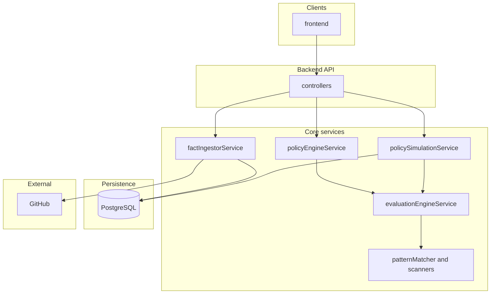
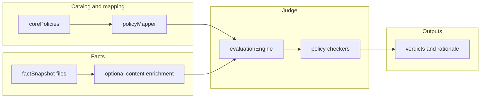
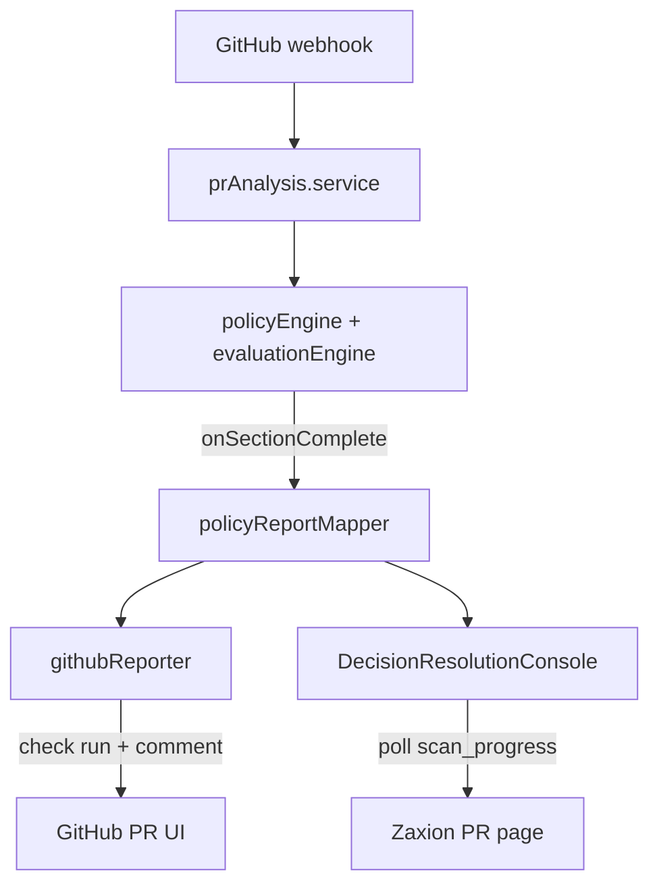
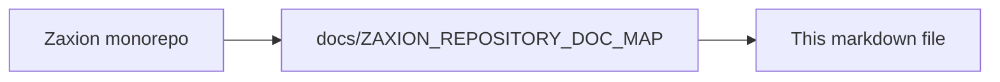

# Zaxion — System architecture

This document summarizes how the **Zaxion** product is structured in this repository at a high level. It complements policy-specific plans (for example [ZAXION_OPS_001_TECHNICAL_PLAN.md](ZAXION_OPS_001_TECHNICAL_PLAN.md)) with a single place for **end-to-end system** context.

**Repository layout**

| Area | Path | Role |
|------|------|------|
| Web UI | [`frontend/`](../frontend/) | Governance UI (e.g. policy simulation), consumes backend APIs |
| API and services | [`backend/src/`](../backend/src/) | Express app, controllers, policy and fact pipeline, evaluation engine |
| Core policy catalog | [`backend/src/policies/corePolicies.js`](../backend/src/policies/corePolicies.js) | Static definitions for built-in policies (including OPS-001) |
| Policy ID → rules | [`backend/src/utils/policyMapper.js`](../backend/src/utils/policyMapper.js) | Single mapping used by simulation, PR URL analysis, and live engine |

---

## High-level system diagram

Clients interact with the **backend**; the backend pulls **facts** from **GitHub**, persists **snapshots** and **decisions**, and runs the **evaluation engine** against **policies**.

**Text view** (if Mermaid does not render):

```text
frontend → controllers → policyEngine / policySimulation / factIngestor
              policySimulation + factIngestor → database + GitHub
              policyEngine + policySimulation → evaluationEngine → pattern matchers
```



---

## Governance evaluation path (policies)

Core policies are defined once, mapped to **rule types**, and evaluated deterministically. Custom UUID-backed policies follow a parallel path (DB-backed `PolicyVersion.rules_logic`).

**Text view** (if Mermaid does not render):

```text
corePolicies + policyMapper → evaluationEngine ← factSnapshot + enrichment
evaluationEngine → policy checkers → verdicts and rationale
```



**Notable rule types** (non-exhaustive): `no_hardcoded_secrets`, `security_patterns`, `dependency_scan`, `supply_chain_integrity` (OPS-001), `coverage`, `pr_size`, and others registered on `EvaluationEngineService.checkers`.

---

## False positives and the incremental path

The **current** evaluation path runs several checkers (`evaluationEngine.service.js`, `patternMatcher.service.js`) against fetched file content. Some rules are **JavaScript-oriented regex heuristics** that can fire on the wrong language or file role — for example `console.log` patterns matching `package.json` script strings, or `reliability` try/catch logic on Rust `.await`. OPS-001 can warn on scripts-only `package.json` edits when manifest changes are not distinguished from dependency churn.

**Tactical mitigations** may exist in the legacy engine (extension guards, patch-aware lockfile checks in `supplyChainIntegrity.js`). The **long-term fix** is the incremental architecture:

```text
file → file_kind + language → policy applicability → skip | shallow | deep | fallback → verdict
```

Key ideas (detailed in the incremental docs):

- **File-kind classification** — `source` vs `manifest` vs `workflow` vs `lockfile`; config files use structured rules (OPS-001 model), not generic regex scans.
- **Policy applicability** — each policy declares `supported_languages` and `supported_file_kinds`; inapplicable pairs **skip** with audit reason instead of regex-matching.
- **Language-native facts** — Tree-sitter / AST for JS/TS (and Python over time); no JS heuristics on Rust/Go until adapters exist.
- **Shadow compare + FP budget** — incremental must beat legacy on a multi-language fixture suite before enforcement.

See [ZAXION_INCREMENTAL_IMPLEMENTATION_PLAN.md — Long-Term False Positive Strategy](ZAXION_INCREMENTAL_IMPLEMENTATION_PLAN.md#long-term-false-positive-strategy) and [ZAXION_INCREMENTAL_ANALYSIS_DESIGN.md — False Positives and Precision](ZAXION_INCREMENTAL_ANALYSIS_DESIGN.md#false-positives-and-precision).

---

## PR scan progress and sectioned report (target UX)

While a PR is analyzed in the background, Zaxion should show a **sectioned governance checklist** on GitHub (check run + sticky comment) and on the app deep link — not only a final Passed/Blocked badge.

**Target pattern:**

```text
Overall: Passed | Warning | Blocked | Analyzing…
└── Zaxion Security & Governance Report
    ├── Security — Hardcoded secrets scan ✅ No issues
    ├── Security — Risky SQL patterns scan ✅ No issues
    ├── Architecture — …
    └── Governance — Protocol level compliance ✅ No issues
```

**Today:** `prAnalysis.service.js` posts `PENDING` then a single final `reportStatus` via `githubReporter.service.js`. Per-policy results exist in `policy_results` but are not grouped by `corePolicies.js` category for display.

**Incremental rollout** adds `ScanProgress` JSON, `policyReportMapper.service.js`, progressive `reportProgress` updates, and `GovernanceScanProgress.tsx` on the PR page. Row state `skipped` aligns with policy applicability (incremental FP work).

See [ZAXION_PR_SCAN_PROGRESS_AND_REPORT_UI.md](ZAXION_PR_SCAN_PROGRESS_AND_REPORT_UI.md).



---

## OPS-001 in context

CI/CD supply chain checks depend on **file paths and contents** under `.github/workflows/`, Dockerfiles, and manifest/lockfile pairs. The simulation service uses `getRequiredDataDepth` to decide when to call `FactIngestorService.enrichFactData` so historical snapshots without inline content can still be evaluated consistently with PR URL mode.

See [ZAXION_OPS_001_TECHNICAL_PLAN.md — Architecture — OPS-001 execution path](ZAXION_OPS_001_TECHNICAL_PLAN.md#architecture--ops-001-execution-path-current) for a focused diagram.

---

## Related documents

- [ZAXION_REPOSITORY_DOC_MAP.md](../docs/ZAXION_REPOSITORY_DOC_MAP.md) — Where every markdown file fits in the repo (canonical index)  
- [ZAXION_INCREMENTAL_IMPLEMENTATION_PLAN.md](ZAXION_INCREMENTAL_IMPLEMENTATION_PLAN.md) — Phased Merkle/Tree-sitter rollout; includes long-term false positive strategy and FP fixture gates  
- [ZAXION_INCREMENTAL_ANALYSIS_DESIGN.md](ZAXION_INCREMENTAL_ANALYSIS_DESIGN.md) — Merkle cache, policy applicability contract, and precision model  
- [ZAXION_INCREMENTAL_FILE_BY_FILE_EXECUTION_MAP.md](ZAXION_INCREMENTAL_FILE_BY_FILE_EXECUTION_MAP.md) — File-level execution map, `fileKindClassifier`, FP regression fixtures  
- [ZAXION_PR_SCAN_PROGRESS_AND_REPORT_UI.md](ZAXION_PR_SCAN_PROGRESS_AND_REPORT_UI.md) — Sectioned GitHub/app checklist during background PR scan  
- [ZAXION_OPS_001_TECHNICAL_PLAN.md](ZAXION_OPS_001_TECHNICAL_PLAN.md) — OPS-001 implementation and wiring checklist  
- [ZAXION_OPS_001_NON_TECHNICAL_PLAN.md](ZAXION_OPS_001_NON_TECHNICAL_PLAN.md) — OPS-001 product positioning and user-facing outcomes  
- [README.md](../README.md) — Repository entry and local development pointers  

---

<!-- zaxion-doc-map-footer -->

## Repository documentation map

How this file fits in the Zaxion repo: see **[Zaxion repository documentation map](../docs/ZAXION_REPOSITORY_DOC_MAP.md)** (`docs/ZAXION_REPOSITORY_DOC_MAP.md`) for folder roles and links to system architecture.

**Text view** (works in any viewer):

```text
Zaxion/
├── docs/                    ← phase specs, governance, doc map
├── Incremental Architecture/ ← incremental plans, OPS-001
├── frontend/                ← UI (and frontend/src/Docs)
├── backend/                 ← API, policy engine, evaluation
├── PITCH/                   ← pitch materials
├── README.md                ← entry point
└── docs/ZAXION_REPOSITORY_DOC_MAP.md  ← canonical doc index
```

**Diagram** (Mermaid — quoted labels for compatibility):


