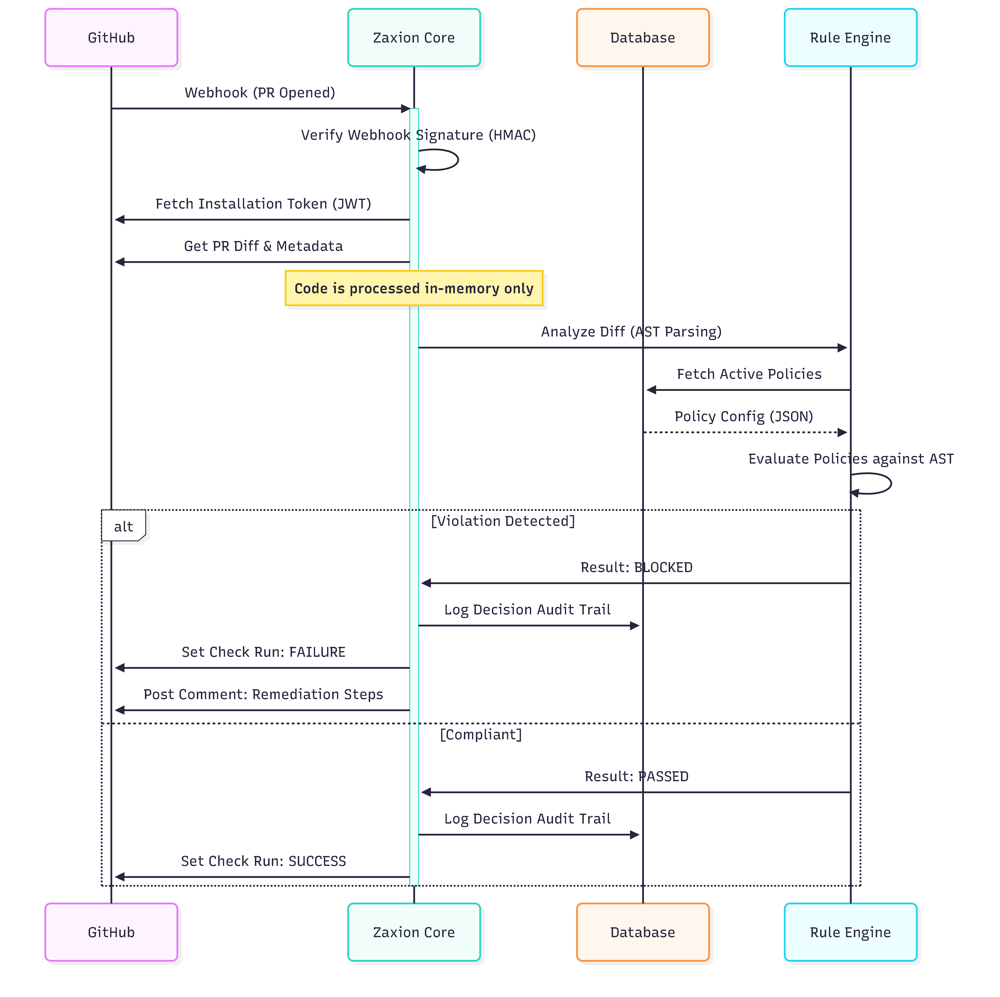

# Zaxion System Architecture

## 1. High-Level System Overview
The following diagram illustrates the flow of data and control within the Zaxion ecosystem, from the moment a developer opens a Pull Request to the final governance decision.

## 2. Data Flow & Security Model
This sequence diagram details how Zaxion handles sensitive data during a governance check, emphasizing that **source code is never permanently stored**.

## 3. Rule Execution Logic
How Zaxion determines if a PR should be blocked.

