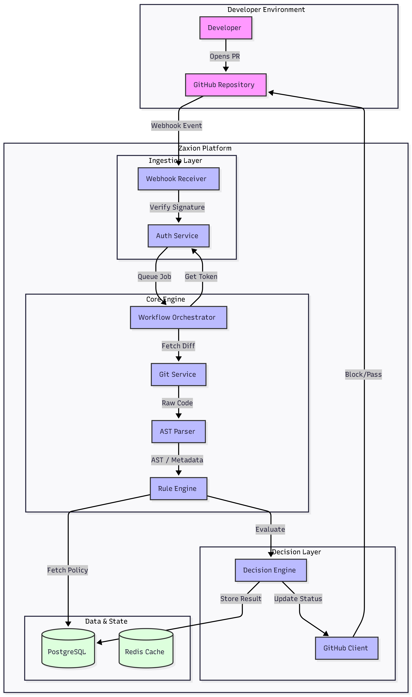
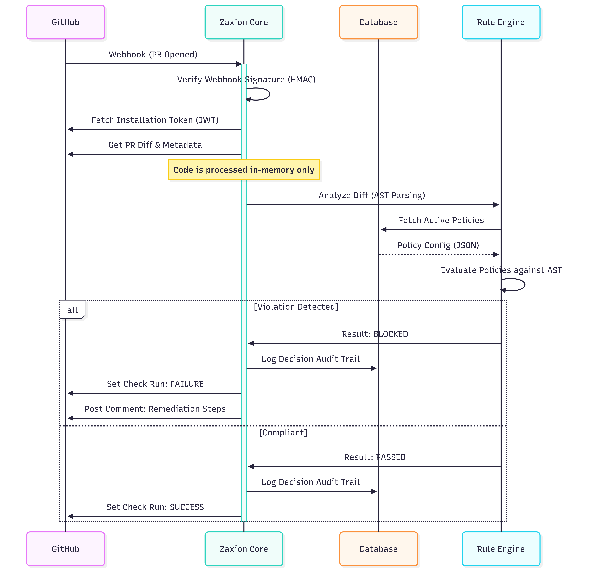
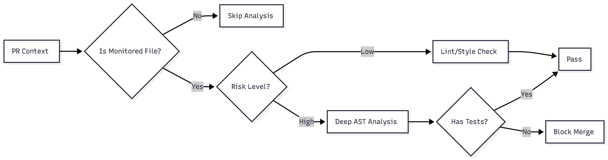
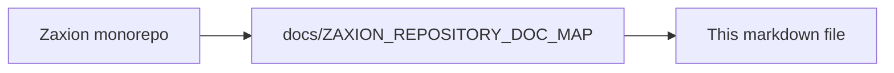

# Zaxion System Architecture

## 1. High-Level System Overview
The following diagram illustrates the flow of data and control within the Zaxion ecosystem, from the moment a developer opens a Pull Request to the final governance decision.



## 2. Data Flow & Security Model
This sequence diagram details how Zaxion handles sensitive data during a governance check, emphasizing that **source code is never permanently stored**.



## 3. Rule Execution Logic
How Zaxion determines if a PR should be blocked.



---

<!-- zaxion-doc-map-footer -->

## Repository documentation map

How this file fits in the Zaxion repo: see **[Zaxion repository documentation map](../docs/ZAXION_REPOSITORY_DOC_MAP.md)** (`docs/ZAXION_REPOSITORY_DOC_MAP.md`) for folder roles and links to system architecture.

**Text view** (works in any viewer):

```text
Zaxion/
├── docs/                    ← phase specs, governance, doc map
├── Incremental Architecture/ ← incremental plans, OPS-001
├── frontend/                ← UI (and frontend/src/Docs)
├── backend/                 ← API, policy engine, evaluation
├── PITCH/                   ← pitch materials
├── README.md                ← entry point
└── docs/ZAXION_REPOSITORY_DOC_MAP.md  ← canonical doc index
```

**Diagram** (Mermaid — quoted labels for compatibility):


```mermaid
flowchart LR
  root["Zaxion monorepo"]
  map["docs/ZAXION_REPOSITORY_DOC_MAP"]
  here["This markdown file"]
  root --> map
  map --> here
```
