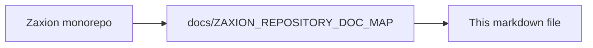

# The Pitch: Zaxion (Spoken Version)

**(Target: CTO / VP Engineering)**

"Hey [Name],

You know how every engineering team has that 'Best Practices' document? The one that says 'Always add tests for payment logic' or 'Don't import heavy libraries in the frontend'?

And you know how... nobody actually reads it?

The problem isn't that your developers want to write bad code. It's that they're rushing to ship features. They forget the rules. And your code reviewers are human—they get tired, they miss things, and bad patterns slip into production. That's how technical debt piles up.

**I built Zaxion to fix this gap.**

Zaxion turns your passive documentation into an active, autonomous guardian.

It connects to your GitHub repo and watches every single Pull Request. But unlike a simple linter that just checks for typos, Zaxion understands the *context* of your code.

For example:
If a developer modifies a high-risk file—like your authentication logic—but doesn't add any tests?
**Zaxion blocks the merge.** automatically.

It tells them: 'Hey, you touched `auth.js`. Our policy requires 100% test coverage here. Please add tests.'

It creates a hard guardrail. It means the standards you define in your head are the standards that actually get shipped to production.

I designed it with security first: it doesn't store your code—it analyzes it in memory and discards it. It’s secure, it’s fast, and it gives you an audit trail for every single decision.

Basically, Zaxion stops technical debt *before* it merges, so your team can move faster without breaking things."

---

<!-- zaxion-doc-map-footer -->

## Repository documentation map

How this file fits in the Zaxion repo: see **[Zaxion repository documentation map](../docs/ZAXION_REPOSITORY_DOC_MAP.md)** (`docs/ZAXION_REPOSITORY_DOC_MAP.md`) for folder roles and links to system architecture.

**Text view** (works in any viewer):

```text
Zaxion/
├── docs/                    ← phase specs, governance, doc map
├── Incremental Architecture/ ← incremental plans, OPS-001
├── frontend/                ← UI (and frontend/src/Docs)
├── backend/                 ← API, policy engine, evaluation
├── PITCH/                   ← pitch materials
├── README.md                ← entry point
└── docs/ZAXION_REPOSITORY_DOC_MAP.md  ← canonical doc index
```

**Diagram** (Mermaid — quoted labels for compatibility):


