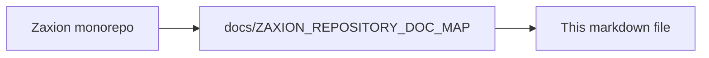

# ⚙️ Backend: How to Run

This is the core engine of the GitHub Test Case Generator. It handles GitHub webhooks, manages the PR analysis queue, and integrates with AI services.

## 📋 Prerequisites
- **Node.js**: v18+
- **Database**: PostgreSQL (v14+)
- **Queue**: Redis (v6+)

---

## 🚀 Quick Start

1. **Install Dependencies**
   ```bash
   npm install
   ```

2. **Configure Environment**
   ```bash
   cp .env.example .env
   # Edit .env with your DB, Redis, and GitHub App credentials
   ```

3. **Run Migrations**
   ```bash
   npm run db:migrate
   ```

4. **Start Services**
   ```bash
   # Terminal 1: API Server
   npm run dev

   # Terminal 2: PR Worker
   node src/workers/prAnalysis.worker.js
   ```

---

## 🛠️ Development Tools

- **Linting**: `npm run lint`
- **Testing**: `npm test`
- **DB Check**: `npm run test-db`

---

## 🛡️ Core Engine: The Decision Producer
As of Phase 5, the backend implements the **Deterministic Judge**. 
- **Fact Ingestor**: Extracts PR metadata.
- **Policy Resolver**: Binds Org/Repo rules.
- **Evaluation Engine**: Stateless verdict generator.
- **Decision Handoff**: Immutable ledger & GitHub reporting.

---

## 🔗 Key API Routes (v1)

| Route | Method | Description |
| :--- | :--- | :--- |
| `/api/health` | GET | System health & diagnostic info |
| `/api/v1/auth/github` | GET | Initiate GitHub App OAuth |
| `/api/v1/webhook` | POST | GitHub Webhook listener (HMAC verified) |
| `/api/v1/governance/decisions` | GET | Fetch immutable decision history |
| `/api/v1/policies` | GET/POST | Manage hierarchical policies |
| `/api/v1/overrides` | POST | Sign a human-led exception |

---

## 🛡️ Security Note
All webhooks require a valid `X-Hub-Signature-256` header. Ensure your `GITHUB_WEBHOOK_SECRET` in `.env` matches your GitHub App configuration.

---

<!-- zaxion-doc-map-footer -->

## Repository documentation map

How this file fits in the Zaxion repo: see **[Zaxion repository documentation map](../docs/ZAXION_REPOSITORY_DOC_MAP.md)** (`docs/ZAXION_REPOSITORY_DOC_MAP.md`) for folder roles and links to system architecture.

**Text view** (works in any viewer):

```text
Zaxion/
├── docs/                    ← phase specs, governance, doc map
├── Incremental Architecture/ ← incremental plans, OPS-001
├── frontend/                ← UI (and frontend/src/Docs)
├── backend/                 ← API, policy engine, evaluation
├── PITCH/                   ← pitch materials
├── README.md                ← entry point
└── docs/ZAXION_REPOSITORY_DOC_MAP.md  ← canonical doc index
```

**Diagram** (Mermaid — quoted labels for compatibility):


