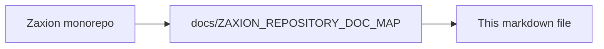

# Zaxion Enterprise Hardening & Security Lockdown Plan

This document outlines the mandatory security and architectural improvements required before the public release of Zaxion. The goal is to transform Zaxion from a functional prototype into an "Enterprise-Safe" SaaS tool.

---

## 🏗️ Phase A: Structural Safeguards (The "Walls")

### 1. Compile-Time Boundary Enforcement
*   **Objective**: Prevent accidental leakage of sensitive internal data by enforcing directory isolation.
*   **Mechanism**: Configure ESLint with `eslint-plugin-import` rules.
*   **Rule**: `controllers` and `routes` are strictly forbidden from importing `models` directly. They must use `dtos` (Data Transfer Objects) or `services`.
*   **Benefit**: Security moves from a "human review" task to a "machine enforced" constraint.

### 2. CI Leak Gate (Automated Immunity)
*   **Objective**: Prevent credentials and debug logs from ever reaching the main branch.
*   **Mechanism**: 
    *   Pre-commit/CI script to grep for `console.log` and `console.dir` in production paths.
    *   Integration of secret scanning (Grep-based keywords: `token`, `key`, `secret`).
*   **Benefit**: Provides a safety net for developers under pressure.

---

## 🔒 Phase B: Data & Identity Hardening (The "Lockdown")

### 3. Data Leakage Prevention & Redaction
*   **Objective**: Eliminate credential exposure in system logs.
*   **Immediate Action**: Remove explicit token logging in [auth.controller.js](backend/src/controllers/auth.controller.js).
*   **Mechanism**: Implement a `SafeLog` helper that recursively redacts sensitive keys (`access_token`, `client_secret`, etc.) from any object before logging.

### 4. Trust Boundary Enforcement (DTO Pattern)
*   **Objective**: Ensure the Frontend only receives data authorized for public viewing.
*   **Mechanism**: Implement `backend/src/dtos/`.
*   **Implementation**: All PR decision responses will pass through `DecisionDTO.toPublic()`.
*   **Fields to Redact**: `raw_data` (AST facts), `evaluation_hash`, `github_check_run_id`, and internal database IDs.

### 5. Identity Conflict Resolution
*   **Objective**: Eliminate "Ghost Checks" and ensure consistent GitHub reporting.
*   **Mechanism**: 
    *   Kill the "fallback to user token" logic in [github.controller.js](backend/src/controllers/github.controller.js).
    *   Enforce a strict **GitHub App Identity** for all PR status updates.
*   **Benefit**: Ensures branch protection rules behave predictably.

---

## 📈 Phase C: Observability & Verification (The "Verification")

### 6. Centralized Logging Service
*   **Objective**: Replace unstructured `console` calls with a professional logging infrastructure.
*   **Mechanism**: Implement a Winston-based logger with environment-aware verbosity (Redacted `info` in prod, `debug` in dev).

### 7. Negative Assertion Testing
*   **Objective**: Prove that the system *doesn't* leak data.
*   **Mechanism**: 
    *   Add tests that call public APIs and assert that internal-only keys are **ABSENT**.
    *   Snapshot testing for API response structures.

---

## 🛡️ Architectural Safeguard: Deny-by-Default
Every piece of data leaving the backend is considered **UNSAFE** until it has been explicitly mapped by a DTO. We do not whitelist what to hide; we whitelist what to show.

---

**Status**: ✅ COMPLETED (v0.9.1-hardening-observability)

---

<!-- zaxion-doc-map-footer -->

## Repository documentation map

How this file fits in the Zaxion repo: see **[Zaxion repository documentation map](./ZAXION_REPOSITORY_DOC_MAP.md)** (`docs/ZAXION_REPOSITORY_DOC_MAP.md`) for folder roles and links to system architecture.

**Text view** (works in any viewer):

```text
Zaxion/
├── docs/                    ← phase specs, governance, doc map
├── Incremental Architecture/ ← incremental plans, OPS-001
├── frontend/                ← UI (and frontend/src/Docs)
├── backend/                 ← API, policy engine, evaluation
├── PITCH/                   ← pitch materials
├── README.md                ← entry point
└── docs/ZAXION_REPOSITORY_DOC_MAP.md  ← canonical doc index
```

**Diagram** (Mermaid — quoted labels for compatibility):


