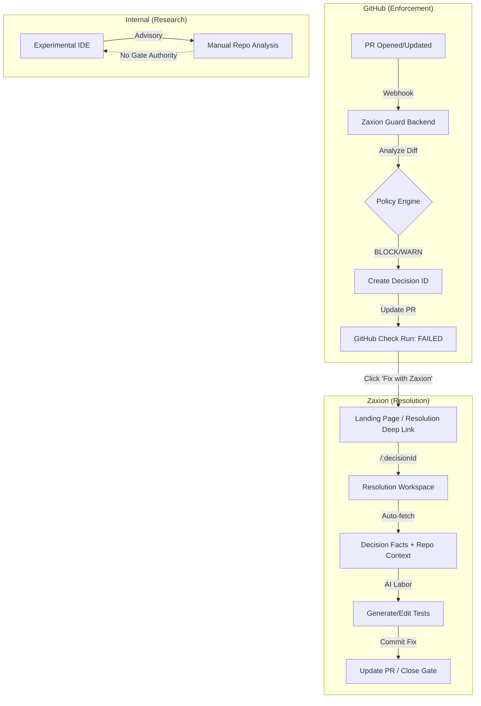

# PHASE 3 — RESOLUTION & DECOUPLING (LOCKED)

Status: ✅ COMPLETE
Date locked: 2026-01-19

This phase transforms Zaxion from a "Developer Tool" into an "Enterprise Quality Gate" by enforcing a strict resolution-first workflow and decoupling the product surface area.

---

## 🏗️ Architectural Decoupling (Frozen)

The frontend architecture is now strictly partitioned to protect brand authority and prevent "AI Exploration" from diluting the "Guard" model.

| Path | Component | Purpose | Access |
| :--- | :--- | :--- | :--- |
| `/` | `LandingPage` | Product Authority & Marketing | Public |
| `/resolution/:id` | `ResolutionPage` | **Authoritative Fix Path** | Deep-link Only |
| `/_experimental` | `ExperimentalIDE` | Internal Research & Dev Lab | Internal/Hidden |

---

## ⚖️ Resolution Jurisdiction (Frozen)

The **Resolution-First Doctrine** dictates that `decisionId` is the only immutable anchor for a fix.

1. **Sole Entry Point**: The `ResolutionPage` is the only functional entry point for users resolving a violation.
2. **Context-Awareness**: The workspace auto-fetches decision data, repo context, and affected files based on the `:decisionId`.
3. **Jurisdiction Isolation**: Components like `AnalysisView` are strictly prohibited from fetching decisions by ID; they are limited to advisory PR status checks only.

---

## 🔄 System Flow Diagram

---

## 🔒 Immutable UI Constraints

1. **No Functional Root**: The root `/` URL must remain a marketing/explanation page. It MUST NOT contain "Select Repo" or "Generate Tests" buttons.
2. **Deep-Link Dependency**: Functional workflows MUST be anchored to a `decisionId` or a valid `session`.
3. **Lab Quarantine**: The legacy IDE UI (`ExperimentalIDE`) is hidden behind a non-discoverable path to prevent it from being perceived as the primary product.

---

## ✅ Phase 3 Milestones (Verified)

- [x] **Product Rebranding**: Zaxion Guard branding applied globally.
- [x] **Context-Aware Workspace**: `ResolutionPage` implements auto-fetch logic for `decisionId`.
- [x] **Logic Isolation**: Stripped `decisionId` authority from advisory components.
- [x] **Marketing Surface**: Root `/` converted to high-authority explanation page.

---

## Rationale

Phase 3 moves the product from "Advice" (Phase 1/2) to "Enforcement & Resolution" (Phase 3). By locking this architecture, we ensure that the AI is always framed as the "Laborer" that helps the developer pass the "Guard."
