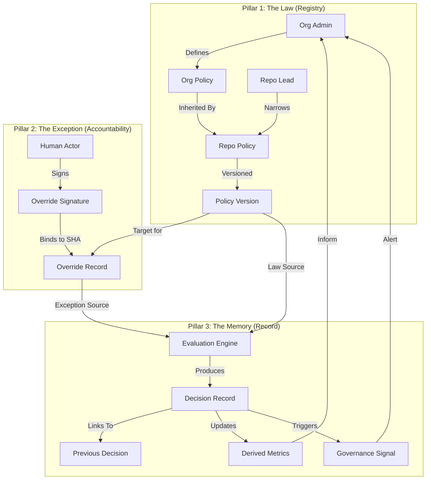

# PHASE 4 — GOVERNANCE, TRUST & SCALE (LOCKED)

Status: ✅ COMPLETE
Date locked: 2026-01-20

This document is the authoritative record of Phase 4. It defines the immutable governance architecture of Zaxion, including its laws, accountabilities, and longitudinal memory.

---

## 🏗️ Architectural Overview & Flow

The following diagram illustrates the lifecycle of a governance event, from policy definition to organizational memory.

---

## 🏛️ Pillar Specification & Invariants

### 📋 Pillar 1: Policy Governance (The Rule of Law)
**Role**: A passive registry for declarative governance rules.
- **Invariants**:
    1. **Immutability**: Policies and Versions are append-only.
    2. **Strict Narrowing**: Child scopes cannot weaken parent mandatory rules.
    3. **Passive Registry**: No active enforcement logic exists here.
- **Object Models**:
    - `Policy`: [policy.js](file:///c%3A/Users/hamza/OneDrive/Desktop/hamza/backend/src/models/policy.js)
    - `PolicyVersion`: [policyVersion.js](file:///c%3A/Users/hamza/OneDrive/Desktop/hamza/backend/src/models/policyVersion.js)
- **Database Schema**: `Policies` (id, name, scope, target_id), `PolicyVersions` (id, policy_id, version_number, enforcement_level, metadata).
- **Service**: [policy.service.js](file:///c%3A/Users/hamza/OneDrive/Desktop/hamza/backend/src/services/policy.service.js)
- **Migration**: [20250901000000-create-policies-and-versions.cjs](file:///c%3A/Users/hamza/OneDrive/Desktop/hamza/backend/src/migrations/20250901000000-create-policies-and-versions.cjs)

### 🧾 Pillar 2: Human Accountability (The Exception)
**Role**: An immutable registry of human-signed exceptions.
- **Invariants**:
    1. **Human-Centered Authority**: The system records authority; it does not grant it.
    2. **SHA-Binding**: Overrides are cryptographically invalid if the commit SHA changes.
    3. **Auto-Expiry**: Overrides expire upon merge or code change.
- **Object Models**:
    - `Override`: [override.js](file:///c%3A/Users/hamza/OneDrive/Desktop/hamza/backend/src/models/override.js)
    - `OverrideSignature`: [overrideSignature.js](file:///c%3A/Users/hamza/OneDrive/Desktop/hamza/backend/src/models/overrideSignature.js)
- **Database Schema**: `Overrides` (id, subject_ref, status), `OverrideSignatures` (id, override_id, actor_id, justification, commit_sha).
- **Service**: [override.service.js](file:///c%3A/Users/hamza/OneDrive/Desktop/hamza/backend/src/services/override.service.js)
- **Migration**: [20250915000000-create-overrides-and-signatures.cjs](file:///c%3A/Users/hamza/OneDrive/Desktop/hamza/backend/src/migrations/20250915000000-create-overrides-and-signatures.cjs)

### 📊 Pillar 3: Organizational Memory (The Record)
**Role**: A neutral, append-only historical ledger of outcomes and patterns.
- **Invariants**:
    1. **Passive Observation**: Pillar 3 records facts without interpretive authority.
    2. **Causal Linking**: Decisions are linked to predecessors for full replayability.
    3. **Signal Non-Enforcement**: Signals are informational artifacts only.
- **Object Models**:
    - `Decision`: [decision.js](file:///c%3A/Users/hamza/OneDrive/Desktop/hamza/backend/src/models/decision.js)
    - `GovernanceSignal`: [governanceSignal.js](file:///c%3A/Users/hamza/OneDrive/Desktop/hamza/backend/src/models/governanceSignal.js)
    - `DerivedPolicyMetric`: [derivedPolicyMetric.js](file:///c%3A/Users/hamza/OneDrive/Desktop/hamza/backend/src/models/derivedPolicyMetric.js)
- **Database Schema**: `Decisions` (id, result, rationale, fact_id, prev_decision_id), `GovernanceSignals` (id, type, signal_level, target_id), `DerivedPolicyMetrics` (id, policy_id, total_evaluations).
- **Service**: [governanceMemory.service.js](file:///c%3A/Users/hamza/OneDrive/Desktop/hamza/backend/src/services/governanceMemory.service.js)
- **Migration**: [20250920000000-create-decisions-signals-metrics.cjs](file:///c%3A/Users/hamza/OneDrive/Desktop/hamza/backend/src/migrations/20250920000000-create-decisions-signals-metrics.cjs)

---

## 📈 Pillar Summary Table

| Pillar | Model(s) | Database Table(s) | Primary Purpose |
| :--- | :--- | :--- | :--- |
| **1: Law** | `Policy`, `PolicyVersion` | `Policies`, `PolicyVersions` | Declarative rule registry |
| **2: Exception** | `Override`, `OverrideSignature` | `Overrides`, `OverrideSignatures` | Human accountability tracking |
| **3: Memory** | `Decision`, `Signal`, `Metric` | `Decisions`, `Signals`, `Metrics` | Longitudinal audit & analysis |

---

## 🚫 What Phase 4 is NOT (Explicit Constraints)

- ❌ **NOT an Enforcement Engine**: Phase 4 does not block PRs. It provides the truth for the engine that does.
- ❌ **NOT a Workflow Manager**: It records signatures; it does not manage the "request/approval" UI flow.
- ❌ **NOT a Judge**: It does not decide if an override is "justified"—only if it is "valid" (internally consistent).
- ❌ **NOT a Runtime Resolver**: It does not calculate inheritance at runtime; it stores the declarative intent.

---

## ✅ Final Build Summary

1.  **Immutability Locked**: All models utilize append-only logic. No `update()` or `delete()` calls are exposed for historical records.
2.  **Schema Migrated**: Full relational integrity between Policies, Versions, Overrides, and Decisions.
3.  **Neutral Signaling**: Signals like `BYPASS_VELOCITY` are implemented as statistical observations.
4.  **Causal Replay**: `previous_decision_id` allows the system to reconstruct the history of any PR or Fact.

**Phase 4 is SECURED.**
*This document is now the internal contract for all downstream systems.*
