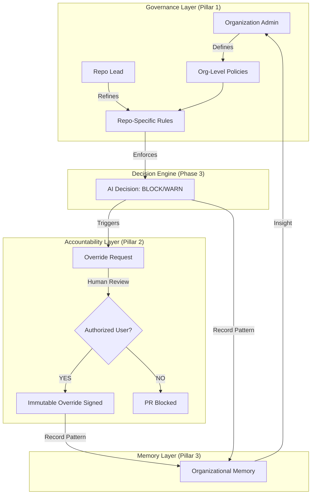

# PHASE 4 — GOVERNANCE, TRUST & SCALE (DESIGN)

Status: 📝 DESIGN PHASE (DO NOT CODE)
Date: 2026-01-19

## 🔑 Core Mission
Turn Zaxion from a single-decision engine into an **organizational governance system**. 

Phase 4 moves beyond "Can I prove why a PR was blocked?" (Phase 3) to "Can an organization trust this system at scale?" It shifts the focus from individual decisions to law, policy, and accountability.

---

## 🧱 Pillar 1: Policy Governance (The Rule of Law)
*Who sets the rules?*

Right now, policies exist and block PRs. Phase 4 introduces a formal hierarchy and ownership model.

- **Policy Ownership**: Every policy must have an assigned human owner (e.g., Security Lead, QA Manager).
- **Strength Levels**:
    - **MANDATORY**: Non-overridable.
    - **OVERRIDABLE**: Requires a Senior/Lead signature.
    - **ADVISORY**: Warning only.
- **Jurisdiction & Inheritance**:
    - **Org Policy → Repo Policy → PR Decision**.
    - Repos can *narrow* (make stricter) but not *weaken* Mandatory Org policies.
- **Versioned Lifecycle**: Policies evolve without rewriting history. Every decision is tied to a specific policy version.
- **Policy Change Impact Awareness**: Policy updates are evaluated for affected repositories and surfaced as informational signals before enforcement (the "blast radius" check).

---

## 🧾 Pillar 2: Human Accountability (The Human in the Loop)
*Who made the call?*

Overrides are not failures; they are signals. Phase 4 adds structure to the "how" and "who" of bypassing the system.

- **Role & Permission Matrix**: 
    - **Juniors**: View decisions, request overrides.
    - **Seniors/Leads**: Grant overrides for specific repos.
    - **Admins**: Change global policies.
- **Override Scoping**:
    - Overrides are **PR-Specific** and **Auto-Expire** upon merge.
    - New commits invalidate existing overrides (Commit-Specific).
- **Anti-Abuse Safeguards**:
    - **Immutable Audit Trails**: Actions cannot be deleted or hidden.
    - **Visibility Asymmetry**: Manager/Admin actions are subject to higher scrutiny and automatic peer-flagging.
    - **Bypass Flagging**: Repeatedly bypassing the same policy triggers a review.

---

## 📊 Pillar 3: Organizational Memory (The Pattern Search)
*What patterns emerge?*

Moving from one-off decisions to longitudinal analysis.

- **Passive Observation**: Recording patterns without immediate punishment.
- **Bypass Velocity**: Which teams bypass the most? Is it due to deadlines or bad policies?
- **Policy Effectiveness**: Which policies block the most? Are they catching real bugs or just creating noise?
- **Risk Correlation**: Are high-risk areas showing improved compliance over time?

---

## 🔄 Governance Flow Diagram

---

## 🔒 Design Answers (The "Paper" Test)

### 1. Who owns policies?
**The Organization and Repository Leads.** 
Policies are no longer "static files" but "governed assets." A policy is owned by a human role (e.g., `security-admin`). If a policy is too noisy, that owner is responsible for versioning it.

### 2. Who overrides?
**Authorized Personnel only.** 
Authority is mapped via a Role-Based Access Control (RBAC) matrix. A developer can propose an override, but a designated "Signer" (Senior/Lead) must execute it. Every override is an immutable record signed by the human actor.

### 3. Who gets blamed if something breaks?
**The Data Points to the Truth.**
- If a **Policy** was followed but code broke: The **Policy Owner** needs to refine the rules.
- If a **Policy** was **Overridden** and code broke: The **Override Actor** is accountable.
- The system provides the "Courtroom Truth" (Phase 3) to support the "Governance Review" (Phase 4).

---

## 🚫 What Phase 4 is NOT
- ❌ **Better AI Prompts**: We aren't making the AI smarter; we're making the human control better.
- ❌ **More Test Generation**: That's labor; Phase 4 is oversight.
- ❌ **Fancy Dashboards**: We want actionable signals, not "analytics fluff."
- ❌ **Automated Policy Editing**: Humans decide the law; AI only enforces it.

---

## 📋 Implementation Roadmap (The Correct Order)

1.  **Step 1: Policy Ownership Model**: Define scope, owners, and versioning schema in the database. (No UI).
2.  **Step 2: Role & Permission Matrix**: Implement RBAC for viewing, overriding, and editing policies.
3.  **Step 3: Override Signal Analysis (Passive)**: Start recording *why* and *who* for every bypass.
4.  **Step 4: Org-Level Read Views**: Create read-only "Truth Views" for management visibility.
