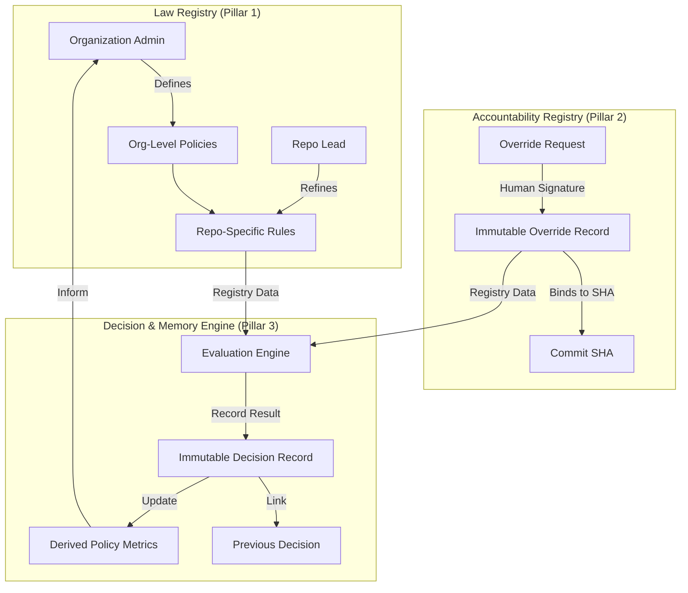

# PHASE 4 — GOVERNANCE, TRUST & SCALE (LOCKED)

Status: ✅ COMPLETE
Date locked: 2026-01-20

This phase transforms Zaxion from a single-decision engine into an **organizational governance system**. It establishes the "Law" (Policies), the "Exception" (Overrides), and the "Memory" (Decisions) as an immutable foundation for trust at scale.

---

## 🏗️ The Three Pillars of Governance (Frozen)

### Pillar 1: Policy Governance (The Rule of Law)
- **Immutable Policy Registry**: Every policy and version is permanent and append-only.
- **Strict Narrowing**: Child jurisdictions (Repos) can only *stricter* than parent jurisdictions (Orgs), never more lenient.
- **Enforcement Levels**: Mandatory, Overridable, and Advisory tiers are codified at the version level.

### Pillar 2: Human Accountability (The Exception)
- **Cryptographic Binding**: Overrides are bound to specific human actors, roles, and commit SHAs.
- **Auto-Expiry Integrity**: Overrides are ephemeral and expire automatically if the code state (SHA) changes.
- **Passive Recording**: Overrides are records of fact, not approval outcomes. Authority rests with the signer.

### Pillar 3: Organizational Memory (The Record)
- **Causal Decision Linking**: Every decision links to its predecessor, creating a replayable audit trail.
- **Statistical Signaling**: Neutral signals (e.g., Bypass Velocity) are generated from longitudinal data.
- **Derived Metrics**: Real-time aggregation of pass/block/override rates and human challenges.

---

## 🔄 Governance Flow Diagram

---

## 🔒 Immutable System Constraints

1. **Passive Role**: Phase 4 components MUST NOT perform active enforcement (blocking PRs). They are registries of truth only.
2. **Append-Only History**: No governance record (Policy, Override, Decision) may ever be updated or deleted.
3. **No Executable Logic**: Metadata and policy fields must remain declarative. They are prohibited from containing scripts or runtime rules.
4. **Human Supremacy**: The system never overrides a human; it records the human's decision to override the system.

---

## ✅ Phase 4 Milestones (Verified)

- [x] **Pillar 1 Built**: Law registry with Org/Repo inheritance and strict narrowing logic.
- [x] **Pillar 2 Built**: Human accountability layer with SHA-bound overrides and signature tracking.
- [x] **Pillar 3 Built**: Organizational memory with causal decision linking and bypass velocity signals.
- [x] **Schema Migrated**: All database tables for policies, overrides, decisions, and signals are live.
- [x] **Internal Contract Locked**: `PHASE_4_COMPLETION.md` established as the governance constitution.

---

## Rationale

Phase 4 moves Zaxion from "Helping a developer fix a test" to "Providing an organization with a trustable audit trail." By locking this governance layer, we ensure that as the system scales to thousands of repositories, the "Rule of Law" remains immutable and human accountability remains transparent.
