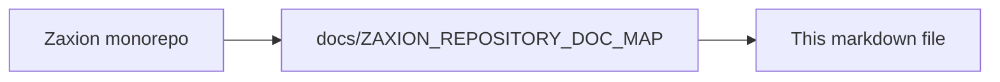

# PHASE 4 — PILLAR 1: POLICY GOVERNANCE (DETAILED DESIGN)

Status: 📝 DESIGN LOCK (DO NOT CODE)
Date: 2026-01-19

This document locks the invariants and object model for **Pillar 1: Policy Governance**. Pillar 1 is a **Law Registry**, not a police force. Its sole responsibility is the storage, versioning, and jurisdiction of policies.

---

## 🔒 Step 1: Pillar 1 Invariants (The Non-Negotiables)

These invariants are the "Laws of Physics" for Pillar 1:

1.  **Single Ownership**: Every policy must have exactly one owning role (e.g., `security-lead`).
2.  **Immutability of Versions**: Once a `PolicyVersion` is created, it is frozen. Changes require a new version.
3.  **The Narrowing Principle**: Repo-level policies may only increase strictness (narrowing) of Org-level minimums. This constraint is enforced at policy-definition time, not during PR evaluation.
4.  **Decision-Version Binding**: Every decision must reference the exact `PolicyVersion` ID used.
5.  **Append-Only History**: History cannot be rewritten or deleted.
6.  **Inheritance is Law**: All repos within an Org are subject to the Org's Mandatory policies. This is a system invariant.

---

## 🏗️ Step 2: Policy Object Model (Corrected Minimal Model)

To avoid friction and ambiguous scope, we use a minimal model with no redundant entities.

### **1. Policy**
The registry entry for a governance rule.
- `id`: UUID
- `name`: String (e.g., "Unit Test Coverage")
- `scope`: `ORG` | `REPO`
- `target_id`: UUID (Org ID or Repo ID)
- `owning_role`: String (e.g., "security-admin")
- `created_at`: Timestamp

### **2. PolicyVersion**
The immutable snapshot of the "Law".
- `id`: UUID
- `policy_id`: UUID (Reference to Policy)
- `version_number`: Integer
- `enforcement_level`: `MANDATORY` | `OVERRIDABLE` | `ADVISORY`
- `rules_logic`: JSON (The raw parameters)
- `created_by`: UserID
- `created_at`: Timestamp

---

## 🛠️ Step 3: Build Strategy (Law Registry Only)

Implementation is strictly limited to storage and metadata:

1.  **Schema Implementation**: Tables for `Policy` and `PolicyVersion` only.
2.  **Policy Resolution Metadata (Declarative Only)**: Store scope, target_id, and enforcement level as declarative data. This metadata must not contain executable logic or evaluation rules.
3.  **Version Management**: Logic to create and retrieve immutable snapshots.

**DO NOT build:**
- ❌ Inheritance Resolution Engine (No merging yet)
- ❌ Enforcement Logic (No PASS/FAIL checks)
- ❌ PR Evaluation (No active gating)

---

## 🛑 Step 4: Governance Guardrails

- **Law Registry Only**: Pillar 1 is complete when we can store and retrieve laws with perfect historical accuracy.
- **No Active Gating**: If the system is making decisions or resolving conflicts, you have moved to Pillar 2/3 too early.
- **Boring & Rigid**: Pillar 1 should feel like a database of rules, nothing more.

---

<!-- zaxion-doc-map-footer -->

## Repository documentation map

How this file fits in the Zaxion repo: see **[Zaxion repository documentation map](./ZAXION_REPOSITORY_DOC_MAP.md)** (`docs/ZAXION_REPOSITORY_DOC_MAP.md`) for folder roles and links to system architecture.

**Text view** (works in any viewer):

```text
Zaxion/
├── docs/                    ← phase specs, governance, doc map
├── Incremental Architecture/ ← incremental plans, OPS-001
├── frontend/                ← UI (and frontend/src/Docs)
├── backend/                 ← API, policy engine, evaluation
├── PITCH/                   ← pitch materials
├── README.md                ← entry point
└── docs/ZAXION_REPOSITORY_DOC_MAP.md  ← canonical doc index
```

**Diagram** (Mermaid — quoted labels for compatibility):


