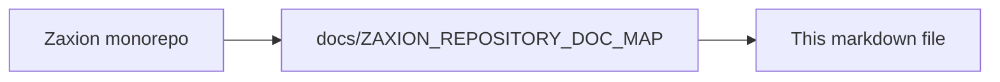

# PHASE 4 — PILLAR 3: ORGANIZATIONAL MEMORY & DECISIONS (DETAILED DESIGN)

Status: 📝 DESIGN LOCK (DO NOT CODE)
Date: 2026-01-20

This document locks the invariants and object model for **Pillar 3: Organizational Memory & Decisions**. Pillar 3 is the engine that records the Law (Pillar 1), the Exception (Pillar 2), and the resulting Judgment (Decision) for long-term learning and statistical observation.

---

## 🔒 Step 1: Pillar 3 Invariants (The Non-Negotiables)

These invariants ensure that organizational insights are derived from truth, not manipulation:

1.  **Passive Observation**: Pillar 3 records data but never alters the outcome of a PR or Decision.
2.  **Longitudinal Integrity**: Historical data points (Bypasses, Blocks, Pass rates) are immutable and append-only.
3.  **Binding Recording Only**: Pillar 3 records the association between a Decision and any Override that influenced it, as provided by the Decision Producer.
4.  **Policy Drift Tracking**: The system must track how "PASS" rates change as policy versions evolve.
5.  **Bypass Velocity Limits**: The system monitors the frequency of overrides. High velocity in a specific area is treated as a "Governance Signal" (informational only).
6.  **Tamper-Proof Metrics**: Metrics are derived directly from the append-only logs of Pillar 1, 2, and 3. They cannot be manually edited.
7.  **Decision Non-Authority**: Pillar 3 does not determine decision outcomes. It records decisions produced by the Evaluation Engine and binds them immutably to policy versions and overrides.
8.  **Signal Non-Enforcement**: GovernanceSignals carry no directive, blocking, or enforcement authority. They are informational artifacts only.

---

## 🏗️ Step 2: Object Model (Decisions & Analytics)

### **1. Decision**
An immutable record of an evaluation outcome produced outside Pillar 3. Decisions are append-only; later decisions may reference earlier decisions via `previous_decision_id`, but never replace them.
- `id`: UUID
- `policy_version_id`: UUID (Reference to Pillar 1)
- `fact_id`: UUID (The data being evaluated, e.g., PR metadata)
- `result`: `PASS` | `BLOCK` | `WARN`
- `rationale`: Text (AI-generated or system-provided reason)
- `override_id`: UUID | NULL (Bound to Pillar 2)
- `previous_decision_id`: UUID | NULL (Pointer to causal history)
- `timestamp`: Timestamp

### **2. GovernanceSignal**
A recorded informational event that highlights governance patterns. Signals may inform human review but cannot trigger actions automatically.
- `id`: UUID
- `type`: `BYPASS_VELOCITY` | `POLICY_DRIFT` | `COMPLIANCE_GAP`
- `target_id`: UUID (Org, Repo, or Team)
- `signal_level`: `INFO` | `ATTENTION` | `ANOMALY`
- `metadata`: JSON (e.g., `{ bypass_count: 5, timeframe: "24h" }`)
- `timestamp`: Timestamp

### **3. DerivedPolicyMetric**
Tracking how a specific policy performs over time (Derived computation).
- `policy_id`: UUID
- `version_id`: UUID
- `total_evaluations`: Integer
- `total_blocks`: Integer
- `total_overrides`: Integer
- `policy_challenge_count`: Integer (Observations of human disputes/challenges)

---

## 🛠️ Step 3: Build Strategy (Observation Only)

Implementation is focused on data aggregation and neutral pattern detection:

1.  **Metric Aggregators**: Logic that scans `Decision` and `OverrideSignature` tables to calculate counts and rates.
2.  **Pattern Detectors**: Background jobs that identify statistically significant deviations (e.g., unusually high override frequency).
3.  **Read-Only Truth Views**: Data structures optimized for management-level visibility (Pillar 4 of the roadmap).

**DO NOT build:**
- ❌ Dashboards or Charts (Keep it as raw data/API for now).
- ❌ Automatic policy adjustments based on metrics.
- ❌ Team "Leaderboards" (Focus on governance, not competition).

---

## 🛑 Step 4: Governance Guardrails

- **No Punishment Logic**: Pillar 3 is for *learning*, not *policing*. It informs managers; it does not punish developers.
- **Truth over Fluff**: Avoid "vanity metrics." Focus on signals that correlate with real risk or policy degradation.
- **Privacy-Aware**: Ensure that longitudinal tracking doesn't violate developer trust or local labor laws.
- **Neutral Language**: The system identifies deviations and challenges, it does not assign "abuse" or "falsehood."

---

## 🏛️ Summary: The Constitutional Role

After these corrections, Pillar 3 is strictly:
- A **Historical Ledger** (What happened?)
- A **Statistical Pattern Surface** (What is the trend?)
- A **Governance Memory** (Where is the friction?)

It is **NEVER**:
- A Judge
- A Recommender
- A Policy Editor
- A Risk Engine

---

<!-- zaxion-doc-map-footer -->

## Repository documentation map

How this file fits in the Zaxion repo: see **[Zaxion repository documentation map](./ZAXION_REPOSITORY_DOC_MAP.md)** (`docs/ZAXION_REPOSITORY_DOC_MAP.md`) for folder roles and links to system architecture.

**Text view** (works in any viewer):

```text
Zaxion/
├── docs/                    ← phase specs, governance, doc map
├── Incremental Architecture/ ← incremental plans, OPS-001
├── frontend/                ← UI (and frontend/src/Docs)
├── backend/                 ← API, policy engine, evaluation
├── PITCH/                   ← pitch materials
├── README.md                ← entry point
└── docs/ZAXION_REPOSITORY_DOC_MAP.md  ← canonical doc index
```

**Diagram** (Mermaid — quoted labels for compatibility):


