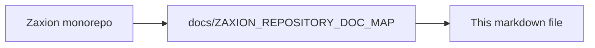

# PHASE 5 — THE DECISION PRODUCER (THE COURTROOM ENGINE)

**Status: ✅ COMPLETED
**Date**: 2026-01-21

---

## 🔑 1. Phase 5 Mission
**Produce a deterministic, explainable PASS / BLOCK / WARN evaluation outcome for a single code change, without owning history, policy, or enforcement.**

Phase 5 is the "Judge" sitting in court today. It reads the Law (Policies), looks at the Facts (PR Data), and produces an evaluation outcome. It does not write history itself; it merely produces an **Evaluation Result** (or Decision Proposal) for Pillar 3 to record.

> **Constitutional Boundary**: A Decision is only formed when Pillar 3 records this evaluation output. Phase 5 evaluates; Governance (Phase 4) decides.

---

## 🧱 2. Internal Pillars (The Decision Flow)

Phase 5 is divided into four internal layers of responsibility:

### **🔹 Pillar 5.1 — Fact Ingestion (Reality Layer)**
- **Role**: Collects objective truth about the PR.
- **Inputs**: PR number, Repo, Commit SHA.
- **Facts collected**: Files changed, lines added/deleted, languages, security-sensitive paths, metadata (author, reviewers, labels).
- **Invariants**: 
    - Facts are read-only and snapshotted.
    - Facts are never inferred or guessed.
    - If it didn’t happen in the PR, it’s not a fact.
    - **Snapshot Dependency**: All evaluations must use a versioned fact snapshot, not a live pointer.

### **🔹 Pillar 5.2 — Policy Resolution (Law Lookup)**
- **Role**: Determines which policies apply to this PR.
- **Responsibilities**: 
    - Resolve org → repo → path scope.
    - Apply narrowing rules (never weakening).
    - Fetch correct `PolicyVersions` from Pillar 1.
- **Invariants**: 
    - No policy mutation.
    - No inheritance rewriting.
    - No caching that breaks correctness.

### **🔹 Pillar 5.3 — Evaluation Engine (The Judge)**
- **Role**: Evaluates `FACTS + POLICY LOGIC → RESULT`.
- **Outputs**: 
    - `result`: PASS | BLOCK | WARN
    - `rationale`: Plain English explanation.
    - `violated_policies`: List of `policy_version_ids`.
    - `evaluation_hash`: Deterministic fingerprint.
- **Invariants**: 
    - **Deterministic**: Same input always produces the same output.
    - **Explainable**: No black box or "AI vibes" in the decision logic.
    - **Stateless**: No memory of past PRs.

### **🔹 Pillar 5.4 — Decision Handoff (Boundary Layer)**
- **Role**: Manages the constitutional boundary of the Decision Producer.
- **Responsibilities**: 
    - Sends evaluation payload to Pillar 3 (Memory).
    - Accepts override references from Pillar 2 (Accountability).
    - Returns final status to GitHub.
- **Critical Rule**: Phase 5 can see overrides, but cannot approve them. Overrides remain human-only.
- **Override Non-Influence Rule**: The presence or absence of overrides must not alter the evaluation result. Overrides are applied only during decision recording and enforcement, not during evaluation.

---

## 📝 3. Evaluation Schema (Draft)

Phase 5 produces an **Evaluation Result**, which is then finalized as a Decision by the recording pillars.

```json
{
  "fact_snapshot_id": "fact_v1_pr_123", 
  "policy_version_ids": ["v3", "v7"],
  "result": "BLOCK",
  "rationale": "Security policy forbids direct DB access in auth service",
  "evaluation_hash": "abc123_xyz789_deterministic_fingerprint",
  "evaluation_engine_version": "1.0.0"
}
```
*Note: `fact_snapshot_id` references a frozen, immutable fact snapshot, not a live PR pointer.*

---

## 🔒 4. Phase 5 Invariants (The Non-Negotiables)

1.  **Total Determinism**: Any change in the evaluation outcome must be traceable to a change in Facts, Policy Version, or Evaluation Engine Version.
2.  **No Ownership of Truth**: Phase 5 calculates truth but does not store it.
3.  **Statelessness**: The engine must treat every evaluation as if it were the first time it ever ran.
4.  **Zero AI in the Verdict**: AI may provide "Advice" (Advisor Service), but the "Judge" (Evaluation Engine) must use only deterministic logic.
5.  **Fact Snapshot Integrity**: Phase 5 must evaluate against an immutable, versioned fact snapshot. Re-evaluation must be possible without re-fetching live PR data.
6.  **Evaluation Versioning Invariant**: The Evaluation Engine itself must be versioned. Any change in evaluation logic must produce a new `evaluation_engine_version`, and historical evaluations must remain attributable to the engine version that produced them.

---

## 🚫 5. Explicit Non-Goals

- ❌ **Learning**: Phase 5 will NOT learn from past decisions or user behavior.
- ❌ **Self-Tuning**: It will NOT modify policy parameters or risk thresholds automatically.
- ❌ **Auto-Overrides**: It will NOT auto-approve overrides or predict if an override will be granted.
- ❌ **Ranking**: It will NOT rank developers, teams, or repositories.
- ❌ **Scoring**: It will NOT provide numerical "Quality Scores" (use informational signals instead).

---

## 🚦 6. Next Steps

1.  Lock Decision Semantics and Schema.
2.  Define Fact Ingestion Interface (Pillar 5.1).
3.  Define Evaluation Logic Contract (Pillar 5.3).

---

**End of Phase 5 Design Document**

---

<!-- zaxion-doc-map-footer -->

## Repository documentation map

How this file fits in the Zaxion repo: see **[Zaxion repository documentation map](./ZAXION_REPOSITORY_DOC_MAP.md)** (`docs/ZAXION_REPOSITORY_DOC_MAP.md`) for folder roles and links to system architecture.

**Text view** (works in any viewer):

```text
Zaxion/
├── docs/                    ← phase specs, governance, doc map
├── Incremental Architecture/ ← incremental plans, OPS-001
├── frontend/                ← UI (and frontend/src/Docs)
├── backend/                 ← API, policy engine, evaluation
├── PITCH/                   ← pitch materials
├── README.md                ← entry point
└── docs/ZAXION_REPOSITORY_DOC_MAP.md  ← canonical doc index
```

**Diagram** (Mermaid — quoted labels for compatibility):


