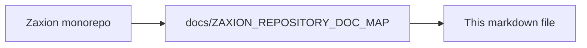

# PHASE 5 — PILLAR 1: FACT INGESTION (DETAILED DESIGN)

**Status**: ✅ COMPLETED
**Date**: 2026-01-22

This document defines the architecture for **Pillar 5.1: Fact Ingestion**. This pillar is the "Reality Layer" of the Decision Producer. Its sole responsibility is to extract objective, immutable truth from a GitHub Pull Request and freeze it into a versioned snapshot.

---

## 🔒 Step 1: Pillar 5.1 Invariants (The Non-Negotiables)

1.  **Objective Truth Only**: Facts must be measurable (e.g., "3 files changed") or metadata (e.g., "Label: security"). No interpretation, risk scoring, or AI inference is allowed at this layer.
2.  **Immutability**: Once a `FactSnapshot` is created for a specific Commit SHA, it can never be changed.
3.  **No Live Pointers**: The Evaluation Engine (Pillar 5.3) never talks to GitHub directly; it only ever reads from a `FactSnapshot`.
4.  **Completeness**: If a piece of data is needed for policy evaluation (e.g., file extensions, line counts), it must be captured in the snapshot.
5.  **Source of Truth**: GitHub is the only source of truth for facts. If GitHub says a file changed, it changed.

---

## 🏗️ Step 2: Fact Object Model

### **1. FactSnapshot**
The frozen record of reality for a specific point in time.
- `id`: UUID (Primary Key)
- `repo_full_name`: String (e.g., "org/repo")
- `pr_number`: Integer
- `commit_sha`: String (The exact commit being evaluated)
- `ingested_at`: Timestamp
- `data`: JSON (The detailed fact payload)
- `snapshot_version`: String (e.g., "1.0.0" - Schema version for the `data` field)
- **Deduplication Invariant**: The unique key for a snapshot is `(repo_full_name, commit_sha)`. This prevents collisions between forks or mirrored repositories sharing the same SHA.

### **2. Fact Data Schema (Internal JSON)**
```json
{
  "ingestion_status": {
    "complete": true,
    "missing_fields": [],
    "ingested_at": "2026-01-22T12:00:00Z"
  },
  "provenance": {
    "source": "github",
    "api_version": "v3",
    "ingestion_method": "webhook",
    "rate_limit_remaining": 4995
  },
  "pull_request": {
    "title": "Fix auth bug",
    "author": {
      "github_user_id": 12345678,
      "username": "dev-123"
    },
    "base_branch": "main",
    "labels": ["bug", "security"],
    "is_draft": false
  },
  "changes": {
    "total_files": 5,
    "additions": 150,
    "deletions": 20,
    "files": [
      {
        "path": "src/auth/login.ts",
        "extension": ".ts",
        "status": "modified",
        "additions": 45,
        "deletions": 5,
        "is_test_file": false
      }
    ]
  },
  "metadata": {
    "test_files_changed_count": 0,
    "path_prefixes": ["src/auth"]
  }
}
```
*Note on `metadata`:*
- `path_prefixes`: Derived deterministically from `changes.files.path` using a fixed prefix-extraction algorithm.
- `test_files_changed_count`: Derived deterministically from `changes.files.is_test_file`.
*Both derivations are versioned with `snapshot_version` to ensure identical results across implementations.*

---

## 🛠️ Step 3: Build Strategy (Reality Capture)

1.  **GitHub API Integration**: Implement robust fetching of PR metadata and file diffs.
2.  **Standard Test Detection**: 
    - Logic to identify if a file is a "test" based on naming conventions (e.g., `*.test.ts`, `tests/`).
    - **Authority Warning**: `is_test_file` is a "standard signal" provided for convenience. Policies (Pillar 5.3) are free to ignore this and use raw signals (`path`, `extension`) if they require a custom definition of what constitutes a test.
3.  **Snapshot Storage**: Securely store the `FactSnapshot` in the database.
4.  **Deduplication**: If a snapshot already exists for the `(repo_full_name, commit_sha)` key, return the existing one instead of re-fetching.

---

## 🛑 Step 4: Guardrails (Non-Goals)

- ❌ **No Risk Scoring**: Do not calculate if a PR is "High Risk". That is Pillar 5.3 (Advisor).
- ❌ **No Policy Matching**: Do not check if a PR violates a policy. That is Pillar 5.3 (Judge).
- ❌ **No AI**: This layer is 100% deterministic code.
- ❌ **No History Analysis**: Do not look at previous PRs or commit history outside the current branch.

---

**End of Pillar 5.1 Detailed Design**

---

<!-- zaxion-doc-map-footer -->

## Repository documentation map

How this file fits in the Zaxion repo: see **[Zaxion repository documentation map](./ZAXION_REPOSITORY_DOC_MAP.md)** (`docs/ZAXION_REPOSITORY_DOC_MAP.md`) for folder roles and links to system architecture.

**Text view** (works in any viewer):

```text
Zaxion/
├── docs/                    ← phase specs, governance, doc map
├── Incremental Architecture/ ← incremental plans, OPS-001
├── frontend/                ← UI (and frontend/src/Docs)
├── backend/                 ← API, policy engine, evaluation
├── PITCH/                   ← pitch materials
├── README.md                ← entry point
└── docs/ZAXION_REPOSITORY_DOC_MAP.md  ← canonical doc index
```

**Diagram** (Mermaid — quoted labels for compatibility):


