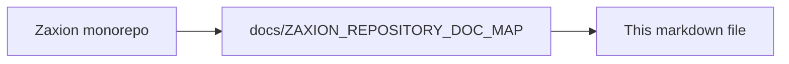

# PHASE 5 — PILLAR 2: POLICY RESOLUTION (LAW LOOKUP)

**Status**: ✅ COMPLETED
**Date**: 2026-01-22

This document defines the architecture for **Pillar 5.2: Policy Resolution**. This pillar is the "Law Lookup" layer. Its sole responsibility is to identify which policies from Pillar 1 apply to a specific PR based on its facts.

---

## 🔒 Step 1: Pillar 5.2 Invariants (The Non-Negotiables)

1.  **Hierarchy of Authority**: Policies are resolved from Org → Repo → Path. Higher-level Mandatory policies cannot be ignored or weakened by lower-level ones.
2.  **Snapshot Binding**: For a given evaluation, the set of applied `PolicyVersions` must be resolved and locked. You cannot change the policy list mid-evaluation.
3.  **Deterministic Resolution**: Given the same Org, Repo, and Files changed, the list of applicable policies must always be identical.
4.  **No Logic Execution**: Pillar 5.2 only *finds* the laws; it does not *interpret* them. It returns a list of `PolicyVersion` IDs and their parameters.
5.  **Auditability**: The resolution process must be explainable (e.g., "Policy X applies because file Y is in directory Z").
6.  **Policy Uniqueness**: A single `policy_version_id` must only appear once in the `applicable_policies` list per evaluation, even if triggered by multiple files.
7.  **Path Normalization**: All paths must be normalized (e.g., removing `./`, handling case sensitivity consistently) before matching to ensure deterministic resolution.

---

## 🏗️ Step 2: Resolution Logic Model

### **1. Resolution Context**
The input required to find the laws.
- `org_id`: UUID
- `repo_id`: UUID
- `raw_changed_paths`: String[] (From Pillar 5.1 FactSnapshot; raw paths only)
- `snapshot_timestamp`: Timestamp (From Pillar 5.1; used for point-in-time policy resolution)

### **2. Resolved Policy Set**
The output produced for the Judge.
- `evaluation_id`: UUID (Reference to the ongoing evaluation)
- `applicable_policies`: Object[]
    - `policy_version_id`: UUID
    - `level`: `MANDATORY` | `OVERRIDABLE` | `ADVISORY`
    - `resolution_path`: String (The path/prefix that triggered this policy)
    - `reason`: String (e.g., "Org-level global policy")

---

## 🛠️ Step 3: Build Strategy (The Law Librarian)

1.  **Scope Resolver**: 
    - Logic to match `raw_changed_paths` against policy scopes (Global, Repo-specific, or Path-specific).
    - **Matching Standards**: Implementations must use a unified standard for path matching (e.g., POSIX-style globbing or anchored regex). This standard must be documented in the implementation appendix to prevent drift between engine versions.
2.  **Inheritance Engine**:
    - Fetch all Org-level policies.
    - Fetch all Repo-level policies.
    - Merge them, ensuring `MANDATORY` status is preserved.
3.  **Point-in-Time Version Fetcher**: 
    - Query Pillar 1 for the `PolicyVersion` that was **active** at the exact `snapshot_timestamp` of the facts.
    - **Invariant**: Re-running an evaluation against the same `FactSnapshot` must resolve the same `PolicyVersions`, even if new versions have been published since.
4.  **Deterministic Conflict Resolution**: 
    - If multiple policies cover the same path, they are resolved by:
        1. **Hierarchy**: Org-level Mandatory takes precedence over Repo-level.
        2. **Strictness**: `MANDATORY` > `OVERRIDABLE` > `ADVISORY`.
        3. **Tie-breaker**: Deterministic fallback using Policy UUID (alphabetical).
5.  **Advisory Metadata**: `ADVISORY` policies are resolved and passed to the Judge as metadata only; they do not participate in the conflict resolution flow for gating.

---

## 🛑 Step 4: Guardrails (Non-Goals)

- ❌ **No Evaluation**: Do not check if the PR passes these policies.
- ❌ **No Policy Creation**: Do not allow creating or editing policies here.
- ❌ **No Bypassing Pillar 1**: All policies must exist in the Pillar 1 registry.
- ❌ **No Hardcoding**: Do not hardcode "standard" policies; all rules must be resolved dynamically from the registry.

---

**End of Pillar 5.2 Detailed Design**

---

<!-- zaxion-doc-map-footer -->

## Repository documentation map

How this file fits in the Zaxion repo: see **[Zaxion repository documentation map](./ZAXION_REPOSITORY_DOC_MAP.md)** (`docs/ZAXION_REPOSITORY_DOC_MAP.md`) for folder roles and links to system architecture.

**Text view** (works in any viewer):

```text
Zaxion/
├── docs/                    ← phase specs, governance, doc map
├── Incremental Architecture/ ← incremental plans, OPS-001
├── frontend/                ← UI (and frontend/src/Docs)
├── backend/                 ← API, policy engine, evaluation
├── PITCH/                   ← pitch materials
├── README.md                ← entry point
└── docs/ZAXION_REPOSITORY_DOC_MAP.md  ← canonical doc index
```

**Diagram** (Mermaid — quoted labels for compatibility):


