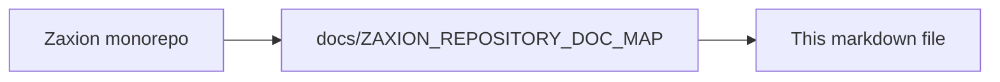

# PHASE 5 — PILLAR 4: DECISION HANDOFF (BOUNDARY LAYER)

**Status**: ✅ COMPLETED
**Date**: 2026-01-22

This document defines the architecture for **Pillar 5.4: Decision Handoff**. This is the "Boundary Layer" that bridges the Decision Producer (Phase 5) with the Governance System (Phase 4) and the External World (GitHub).

---

## 🔒 Step 1: Pillar 5.4 Invariants (The Non-Negotiables)

1.  **The Constitutional Handshake**: A "Decision" is only officially born when this layer successfully hands the Evaluation Result to Pillar 3 (The Policy Memory) for recording.
2.  **Override Separation**: This layer may *receive* an override reference (from Pillar 2), but it must never *generate* or *validate* one. Overrides are external to the evaluation logic.
3.  **Causal Decision Publication**: A GitHub Check Run must only be created or updated *after* the Final Decision Record has been successfully persisted in Pillar 3. If persistence fails, the external status must not be emitted. This ensures that every external claim of success or failure is backed by a canonical, auditable record.
4.  **No Logic Leakage**: No evaluation logic or policy resolution happens here. This layer is purely a dispatcher and status reporter.
5.  **Immutability of Intent**: Once a result is handed off, it cannot be recalled. If a re-evaluation is needed, a new evaluation flow must be started from Pillar 5.1.

---

## 🏗️ Step 2: Handoff Model

### **1. Handoff Payload**
The bundle sent to the Governance pillars.
- `evaluation_result`: (The output from Pillar 5.3)
- `override_id`: UUID | null (Optional reference to a human override from Pillar 2)
- `external_reference`: String (e.g., GitHub Check Run ID)

### **2. Final Decision Record (Stored in Pillar 3)**
- `id`: UUID
- `evaluation_result_id`: UUID
- `final_status`: `SUCCESS` | `FAILURE` | `NEUTRAL` (The enforced result after considering overrides)
- `recorded_at`: Timestamp

---

## 🛠️ Step 3: Build Strategy (The Dispatcher)

1.  **Pillar 3 Integration**: Implement the "Record Decision" call to Phase 4, Pillar 3.
2.  **GitHub Check Run Reporter**:
    - Format the `rationale` and `advisor` data into a beautiful GitHub Check Run summary.
    - Post the status (Success, Failure, or Neutral) to the PR.
    - Provide the "Deep Link" to the Zaxion Resolution Workspace for fixes.
3.  **Override Applier**: Logic to check if a `BLOCK` result should be reported as `SUCCESS` on GitHub because a valid `override_id` was provided in the handoff.
4.  **Error Handling**: If the handoff to Pillar 3 fails, implement a retry mechanism or log a critical system error.

---

## 🛑 Step 4: Guardrails (Non-Goals)

- ❌ **No Decision Making**: This layer does not decide if a PR passes. It only reports what the Judge said and what the Governance system recorded.
- ❌ **No GitHub Action Ownership**: This layer reports *to* GitHub; it does not manage the GitHub Action runner itself.
- ❌ **No UI Rendering**: While it formats text for GitHub, it does not render the Zaxion web UI.
- ❌ **No Secret Management**: It uses existing tokens; it does not manage or rotate them.

---

**End of Pillar 5.4 Detailed Design**

---

<!-- zaxion-doc-map-footer -->

## Repository documentation map

How this file fits in the Zaxion repo: see **[Zaxion repository documentation map](./ZAXION_REPOSITORY_DOC_MAP.md)** (`docs/ZAXION_REPOSITORY_DOC_MAP.md`) for folder roles and links to system architecture.

**Text view** (works in any viewer):

```text
Zaxion/
├── docs/                    ← phase specs, governance, doc map
├── Incremental Architecture/ ← incremental plans, OPS-001
├── frontend/                ← UI (and frontend/src/Docs)
├── backend/                 ← API, policy engine, evaluation
├── PITCH/                   ← pitch materials
├── README.md                ← entry point
└── docs/ZAXION_REPOSITORY_DOC_MAP.md  ← canonical doc index
```

**Diagram** (Mermaid — quoted labels for compatibility):


