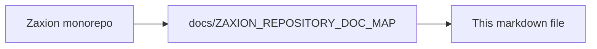

# PHASE 6 — GOVERNANCE CONTROL PLANE (HUMAN-IN-THE-LOOP)

**Status**: 📝 DESIGN LOCK (DO NOT CODE)
**Date**: 2026-01-22

This document defines the architecture for **Phase 6: Governance Control Plane**. This phase builds the human interaction layer around the deterministic cores of Phase 4 and Phase 5. It ensures that humans can review, override, and evolve the system without breaking its constitutional integrity.

---

## 🔒 Step 1: Phase 6 Invariants (The Non-Negotiables)

1.  **Non-Corruption**: Human interaction must never modify historical decisions, facts, or policy versions.
2.  **Explicit Authority**: Overrides are not "deletions" of a block; they are first-class governance artifacts that reference a block.
3.  **Auditability of Intent**: Every human action (override, policy change) must be accompanied by a "Signature" (Who, When, Why).
4.  **Simulation Before Enforcement**: Policy changes must be simulatable against historical facts before being promoted to "Active."
5.  **Separation of Concerns**: Phase 6 governs the *process*; Phase 5 governs the *code*. Phase 6 never writes directly to storage; it issues governance commands that are recorded by the canonical memory layer (Phase 4 Pillar 3).
6.  **Non-Delegable Authority**: Override authority cannot be implicitly delegated via automation, policy configuration, or role inheritance beyond explicit RBAC grants.
7.  **Evaluation Hash Binding**: An override is cryptographically bound to a specific `evaluation_hash`. If the code or policy changes (resulting in a new hash), the override is automatically invalidated.

---

## 🏗️ Step 2: Phase 6 Pillars

### **🔹 Pillar 6.1 — Decision Review & Explanation**
- **Role**: Projection of truth for human auditors.
- **Capabilities**:
    - **Decision Timeline**: Visual flow of `FactSnapshot` → `Resolved Policies` → `Evaluation` → `Record`.
    - **Causality Drill-down**: Clicking a violation shows the specific `checker` and the `actual` vs `expected` facts.
    - **Integrity Verification**: Display the `evaluation_hash` and `engine_version` to prove the decision hasn't been tampered with.

### **🔹 Pillar 6.2 — Override Workflow (Human Authority)**
- **Role**: Managed exceptions to the law.
- **Artifact: OverrideSignature**:
    - `actor_id`: UUID (The human who signed)
    - `evaluation_hash`: String (The exact evaluation result being bypassed)
    - `justification`: String (Why the law was bypassed)
    - `scope`: `PR` | `COMMIT` | `TIME_BOUNDED`
    - `expires_at`: Timestamp | null
- **Invariants**:
    - An override is only valid if the `actor` has sufficient permissions (RBAC).
    - Overrides are automatically invalidated if `commit_sha` changes (unless scoped to `PR`).

### **🔹 Pillar 6.3 — Policy Evolution & Simulation**
- **Role**: Safe evolution of the law.
- **Capabilities**:
    - **Policy Drafting**: Create a `PolicyVersion` in `DRAFT` status.
    - **Blast Radius Preview**: Run the `DRAFT` policy against a configurable sample of historical `FactSnapshots`.
    - **Sampling Strategy**: Support explicit strategies including time-based (last 30 days), repo-based (high-risk only), or risk-based sampling.
    - **Drift Analysis**: Report: "If this policy were active, 15% more PRs would have been blocked last month."

### **🔹 Pillar 6.4 — Governance Analytics & Trust Signals**
- **Role**: Longitudinal health monitoring.
- **Signals**:
    - **Bypass Velocity**: Frequency of overrides per policy/repo.
    - **Friction Index**: Average time from `BLOCK` to `FIX` vs `BLOCK` to `OVERRIDE`.
    - **Policy Effectiveness**: Correlation between policy enforcement and reduced production incidents (if external data available).

---

## 📝 3. Governance Artifact Schema

### **1. OverrideSignature**
```json
{
  "id": "sig_789",
  "decision_id": "dec_123",
  "actor": {
    "id": "user_456",
    "role": "SECURITY_LEAD"
  },
  "justification": "Emergency hotfix for production outage. Tests skipped to save time.",
  "scope": "COMMIT",
  "created_at": "2026-01-22T14:00:00Z"
}
```

---

## 🛑 4. Guardrails (Non-Goals)

- ❌ **No Automated Overrides**: Only humans can sign overrides.
- ❌ **No AI Approval**: AI may suggest a justification, but a human must click "Sign."
- ❌ **No AI-Initiated Governance Actions**: AI may suggest, but cannot initiate, sign, or apply governance artifacts.
- ❌ **No Retroactive Law**: Changing a policy version does not change past "BLOCK" decisions to "PASS."
- ❌ **No Bypass of Pillar 3**: All human interactions must be recorded in the canonical memory.

---

**End of Phase 6 Design Document**

---

<!-- zaxion-doc-map-footer -->

## Repository documentation map

How this file fits in the Zaxion repo: see **[Zaxion repository documentation map](./ZAXION_REPOSITORY_DOC_MAP.md)** (`docs/ZAXION_REPOSITORY_DOC_MAP.md`) for folder roles and links to system architecture.

**Text view** (works in any viewer):

```text
Zaxion/
├── docs/                    ← phase specs, governance, doc map
├── Incremental Architecture/ ← incremental plans, OPS-001
├── frontend/                ← UI (and frontend/src/Docs)
├── backend/                 ← API, policy engine, evaluation
├── PITCH/                   ← pitch materials
├── README.md                ← entry point
└── docs/ZAXION_REPOSITORY_DOC_MAP.md  ← canonical doc index
```

**Diagram** (Mermaid — quoted labels for compatibility):


