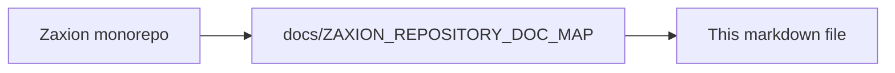

# Pillar 7.7 — Repository Risk Intelligence & Historical Persistence

## **1. Strategic Objective**
To transition Zaxion from a real-time "Gate" into a longitudinal **Intelligence System**. This pillar ensures that governance decisions are not ephemeral events but become a structured, searchable, and auditable record of an organization's architectural health.

---

## **2. Core Components**

### **A. PR Evaluation Persistence (The Fact Ledger)**
Every PR evaluation must result in a permanent, immutable snapshot. 
- **Storage Strategy**: Document-store for flexible JSON evaluation results + Relational indexing for metadata.
- **Data Model**:
    - `repo_id` (Indexed)
    - `base_branch` / `head_branch`
    - `pr_number` (Unique per repo)
    - `author_id`
    - `risk_score` (0-100)
    - `policy_results` (Full JSON snapshot of FactSnapshot + Judge results)
    - `override_status` (NONE | PENDING | GRANTED)
    - `final_decision` (PASSED | BLOCKED | OVERRIDDEN)
    - `merged_by` (Optional)
    - `timestamp`

### **B. Repository Risk Intelligence APIs**
Endpoints designed for multi-dimensional analysis of governance effectiveness.
- `GET /repos/{repo_id}/pr-history`: List evaluations with multi-filter support.
- `GET /repos/{repo_id}/risk-summary`: Aggregated risk metrics over time.
- `GET /repos/{repo_id}/policy-trends`: Identification of "Hot Policies" (policies most frequently violated).

### **C. The Governance Dashboard (The Admin Console)**
A centralized interface for engineering leadership to monitor compliance without manual PR hunting.
- **PR Registry**: A high-density table for filtering and sorting historical decisions.
- **Drill-down View**: Comprehensive timeline of the "Technical Trial" for any historical PR.

---

## **3. Phase 7 Invariants (Applied to 7.7)**
1. **Immutable Records**: Historical snapshots cannot be edited once the final decision is recorded.
2. **Privacy & Retention**: PR snapshots must adhere to the organization's data retention policies (defined in the footer).
3. **No Re-computation**: The dashboard displays the *original* evaluation result, even if the policy has since changed (Versioning integrity).

---

## **4. Success Metrics**
- **Search Latency**: Admin can find any historical PR evaluation in < 2 seconds.
- **Visibility Index**: 100% of merged PRs have a corresponding persistent evaluation record.
- **Audit Speed**: Time required to review all overrides in a given month is reduced to minutes.

---

<!-- zaxion-doc-map-footer -->

## Repository documentation map

How this file fits in the Zaxion repo: see **[Zaxion repository documentation map](./ZAXION_REPOSITORY_DOC_MAP.md)** (`docs/ZAXION_REPOSITORY_DOC_MAP.md`) for folder roles and links to system architecture.

**Text view** (works in any viewer):

```text
Zaxion/
├── docs/                    ← phase specs, governance, doc map
├── Incremental Architecture/ ← incremental plans, OPS-001
├── frontend/                ← UI (and frontend/src/Docs)
├── backend/                 ← API, policy engine, evaluation
├── PITCH/                   ← pitch materials
├── README.md                ← entry point
└── docs/ZAXION_REPOSITORY_DOC_MAP.md  ← canonical doc index
```

**Diagram** (Mermaid — quoted labels for compatibility):


