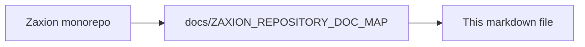

# Policy simulation: exact line + snippet in findings (plan)

**One-line summary:** When simulation blocks a PR, show **which file and line** broke the policy and **the offending code snippet**, alongside generic remediation — similar to Codex / GitHub Checks annotations — without breaking existing APIs or UI.

---

## Problem

Today, policy simulation surfaces **generic remediation text** (reuse from `RULE_REMEDIATIONS` and YAML). Developers must hunt for the violation even though the engine often already knows **path, line, column**, and **matched text**. The experience feels weaker than bots that pin comments to a specific line.

## Goal / outcome

- **At a glance:** Each blocked finding clearly shows `path:line` (and optionally column).
- **Ground truth:** Show a short **code snippet** (matched line or token) when available.
- **Safe rollout:** Additive JSON fields and additive UI; no removal or rename of existing violation shape consumers rely on.

## Current state (reference)

- **Backend:** `PatternMatcherService` and several semantic checks already emit `file`, `line`, `column`, `code` / context for many rules. `EvaluationEngineService.evaluate()` maps sub-violations into structured violations including `file`, `line`, `column`, `code`.
- **Frontend:** `PolicySimulation` shows **Location** (file / line / column) but **does not render `code`**. Remediation sections remain generic bullets.
- **Reports:** HTML simulation report already has a Location column (`file` + `line`).

## Feature description (what we will ship)

1. **Simulation UI**
   - Extend violation typing with optional **`code`** (or alias **`snippet`** for clarity).
   - Add a **“Matched code”** (or “Snippet”) panel when `code` is present — monospace, truncated if long.
   - Optionally reinforce **`path:line` in the violation title row** so it’s visible without expanding accordion.

2. **Backend polish (small, backward compatible)**
   - Prefer **`current_value`** from `sv.code` when `sv.actual` is missing so “Values” reflects the finding, not the aggregate summary string.
   - Optional: expose **`snippet`** duplicate of `code` for GitHub annotation clients; keep `code` for existing behavior.

3. **Dedup / multi-hit behavior**
   - Today dedup can collapse multiple lines into one violation with `line` as a comma-separated string. Either:
     - Document this as intentional summary mode, or
     - Add **`occurrences: [{ line, column, code }][]`** while preserving existing top-level `file` / `line` for older clients.

4. **GitHub bot / annotations (later slice)**
   - Map structured violations to GitHub **`pull_request_review`** line comments: `path`, `line`, body = message + snippet + remediation link.

## Non-goals (for this plan doc)

- Replacing generic remediation catalogs with LLM-generated per-line prose.
- Changing verdict or blocking logic.

## Implementation plan (ordered)

| Phase | Work | Risk |
|-------|------|------|
| 1 | Frontend: show `code`/`snippet`; optional title prefix `path:line` | Low |
| 2 | Backend: fix `current_value` fallback for pattern hits | Low |
| 3 | Optional `occurrences[]` for multi-line dedup | Medium — coordinate consumers |
| 4 | GitHub reporter annotations using same payload | Medium — scopes & tokens |

## Acceptance criteria

- For a simulated PR where pattern matching runs on **full file content**, at least one BLOCK finding shows **file**, **line**, and **visible snippet** in the simulation UI.
- Existing simulation API responses remain parseable; new fields are optional.
- No regression: violations without `code` still render Location/remediation as today.

## Dependencies / prerequisites

- Snapshots used in simulation must include **`changes[].content`** (or `file_content`) for rules that scan source; otherwise line-level findings cannot be produced for those runs.

---


---

<!-- zaxion-doc-map-footer -->

## Repository documentation map

How this file fits in the Zaxion repo: see **[Zaxion repository documentation map](./ZAXION_REPOSITORY_DOC_MAP.md)** (`docs/ZAXION_REPOSITORY_DOC_MAP.md`) for folder roles and links to system architecture.

**Text view** (works in any viewer):

```text
Zaxion/
├── docs/                    ← phase specs, governance, doc map
├── Incremental Architecture/ ← incremental plans, OPS-001
├── frontend/                ← UI (and frontend/src/Docs)
├── backend/                 ← API, policy engine, evaluation
├── PITCH/                   ← pitch materials
├── README.md                ← entry point
└── docs/ZAXION_REPOSITORY_DOC_MAP.md  ← canonical doc index
```

**Diagram** (Mermaid — quoted labels for compatibility):


