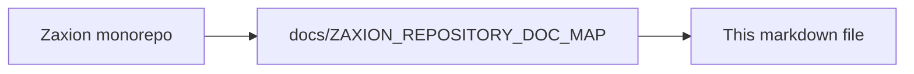

# Zaxion Tech Stack Documentation

This document provides a comprehensive overview of the technologies, libraries, and tools used in the Zaxion ecosystem.

## 🏗️ Architecture Overview

Zaxion is built as a **monorepo-style** application with a clear separation of concerns:
- **Frontend:** A Single Page Application (SPA) built with React and Vite, serving as the user interface.
- **Backend:** A RESTful API built with Node.js and Express, handling business logic, database interactions, and AI orchestration.
- **Database:** PostgreSQL for persistent storage and Redis for queue management.
- **Infrastructure:** Containerized with Docker and deployed via Railway.

---

## 🎨 Frontend Stack (`/frontend`)

The frontend is a modern, type-safe React application designed for performance and developer experience.

### Core Framework
- **React 18**: UI library.
- **Vite**: Build tool and development server (SWC-based).
- **TypeScript**: Static typing and type safety.

### State Management & Data Fetching
- **Zustand**: Lightweight global state management.
- **TanStack Query (React Query)**: Server state management, caching, and data synchronization.
- **Axios**: HTTP client for API requests (with `axios-retry` for resilience).

### Routing
- **React Router v6**: Client-side routing.

### UI & Styling
- **Tailwind CSS**: Utility-first CSS framework.
- **Shadcn/UI**: Reusable component system built on Radix UI.
- **Radix UI**: Headless, accessible UI primitives (Dialog, Popover, Tabs, etc.).
- **Lucide React**: Icon library.
- **Framer Motion**: Animation library.
- **Recharts**: Data visualization and charting.
- **Sonner**: Toast notifications.
- **Vaul**: Drawer component for mobile/responsive views.
- **Class Variance Authority (CVA)**: Type-safe UI component variants.
- **clsx / tailwind-merge**: Conditional class merging.

### Forms & Validation
- **React Hook Form**: Performant form handling.
- **Zod**: Schema validation (shared schema philosophy with backend).
- **@hookform/resolvers**: Zod integration for React Hook Form.

### Specialized Components
- **Monaco Editor**: Code editor embedding (VS Code-like experience).
- **React Day Picker**: Date selection.
- **CMDK**: Command palette interface.
- **Input OTP**: One-time password input fields.

### Testing (Frontend)
- **Vitest**: Unit and integration test runner (Jest-compatible).
- **React Testing Library**: Component testing utilities.
- **JSDOM**: Browser environment for testing.

---

## ⚙️ Backend Stack (`/backend`)

The backend is a robust Node.js service designed for security, scalability, and AI integration.

### Core Runtime
- **Node.js**: JavaScript runtime.
- **Express.js**: Web framework.

### Database & Storage
- **PostgreSQL**: Primary relational database.
- **Sequelize**: ORM (Object-Relational Mapping) for database interactions.
- **Redis**: In-memory data store for caching and job queues.

### Background Processing
- **BullMQ**: Message queue and background job processor (backed by Redis).
- **IORedis**: Robust Redis client.

### AI & Intelligence
- **Google Generative AI (Gemini)**: LLM integration for intelligent code analysis and policy explanation.
- **Python AST Parser**: Specialized parsing for accurate code structure analysis and rule enforcement.

### Email & Communication
- **Resend**: Transactional email service API.
- **Email Templates**: HTML/CSS templates with protocol-style branding.

### Authentication & Security
- **Passport.js**: Authentication middleware (GitHub Strategy).
- **Octokit**: GitHub API client (`rest`, `auth-oauth-app`).
- **JWT**: JSON Web Tokens for stateless session management.
- **Helmet**: Security headers.
- **CSURF**: CSRF protection.
- **Express Rate Limit**: API rate limiting.
- **DOMPurify**: Input sanitization (XSS protection).
- **Cors**: Cross-Origin Resource Sharing configuration.

### Logging & Observability
- **Winston**: Structured logging library.
- **Logger Bridge**: Custom bridge for consistent logging across migrations and legacy modules.
- **Redaction**: Custom middleware to scrub sensitive data (tokens, secrets) from logs.

### Testing (Backend)
- **Jest**: Testing framework.
- **Supertest**: HTTP assertions for API testing.
- **Chai / Sinon**: Assertion and mocking libraries (legacy/helper usage).

---

## 🛠️ DevOps & Infrastructure

### CI/CD (GitHub Actions)
- **Workflows**: Defined in `.github/workflows/ci.yml`.
- **Steps**:
  - **Linting**: Static code analysis.
  - **Security Audit**: `npm audit` for vulnerability scanning.
  - **Secret Scanning**: Grep-based checks for leaked keys/tokens in source.
  - **Log Scanning**: Prevention of `console.log` in production code.
  - **Tests**: Automated unit and integration tests with Postgres/Redis service containers.

### Deployment
- **Docker**: Containerization for consistent environments.
- **Docker Compose**: Multi-container orchestration (App + DB + Redis).
- **Railway**: Production deployment platform.

### Linting & Code Quality
- **ESLint**: JavaScript/TypeScript linting.
- **Prettier**: Code formatting (implied).

---

## 📂 Project Structure

```
Zaxion/
├── frontend/           # React + Vite Application
│   ├── src/
│   │   ├── components/ # Shadcn/UI & Custom Components
│   │   ├── hooks/      # Custom React Hooks
│   │   ├── lib/        # Utilities (API, Logger)
│   │   ├── pages/      # Route Components
│   │   └── ...
│   └── ...
├── backend/            # Node.js + Express API
│   ├── src/
│   │   ├── config/     # Environment & DB Config
│   │   ├── controllers/# Route Handlers
│   │   ├── models/     # Sequelize Definitions
│   │   ├── services/   # Business Logic (AI, Email, GitHub)
│   │   ├── workers/    # BullMQ Job Processors
│   │   └── ...
│   └── ...
└── .github/            # CI/CD Workflows
```

---

<!-- zaxion-doc-map-footer -->

## Repository documentation map

How this file fits in the Zaxion repo: see **[Zaxion repository documentation map](./ZAXION_REPOSITORY_DOC_MAP.md)** (`docs/ZAXION_REPOSITORY_DOC_MAP.md`) for folder roles and links to system architecture.

**Text view** (works in any viewer):

```text
Zaxion/
├── docs/                    ← phase specs, governance, doc map
├── Incremental Architecture/ ← incremental plans, OPS-001
├── frontend/                ← UI (and frontend/src/Docs)
├── backend/                 ← API, policy engine, evaluation
├── PITCH/                   ← pitch materials
├── README.md                ← entry point
└── docs/ZAXION_REPOSITORY_DOC_MAP.md  ← canonical doc index
```

**Diagram** (Mermaid — quoted labels for compatibility):


