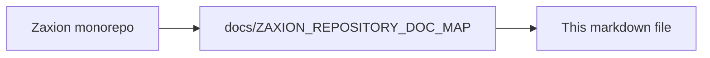

# Authentication & Authorization Testing Guide

This guide outlines how to verify the new Role-Based Access Control (RBAC) system, specifically focusing on the `maintainer` role and repository-scoped permissions.

## 1. Prerequisites
- Ensure you have the latest backend code running.
- Ensure database migrations have been applied (`npm run db:migrate`).
- You need a GitHub account to test the OAuth flow and permission syncing.

## 2. Test Scenarios

### Scenario A: Authentication & Role Assignment
1. **Login with GitHub**:
   - Navigate to `/login` and click "Login with GitHub".
   - **Expected**: Redirect to GitHub, then back to Zaxion.
   - **Verification**: Check your User record in the database (`users` table).
     - If you are an admin of any repo Zaxion can see, your `role` should be `maintainer` (or `admin` if manually set).
     - If you have no admin rights, your `role` should be `user`.

2. **Permission Sync**:
   - **Check**: `repositories` table should contain repos you have access to.
   - **Check**: `repository_maintainer_mappings` should link your User ID to those Repo IDs with `github_permission_level` as 'admin' or 'write'.

### Scenario B: Authorization Enforcement

#### 1. Public/User Access (Role: `user`)
- **Action**: Access `/v1/policies` (GET).
- **Expected**: 200 OK (List policies).
- **Action**: Try to run a simulation (POST `/v1/policies/:id/simulate`).
- **Expected**: 403 Forbidden.

#### 2. Maintainer Access (Role: `maintainer`)
- **Action**: Run simulation on **owned** repo.
  - Endpoint: `POST /v1/policies/:id/simulate`
  - Body: `{ "target_repo_full_name": "your-username/your-repo", ... }`
  - **Expected**: 202 Accepted (Simulation starts).
- **Action**: Run simulation on **unauthorized** repo.
  - Body: `{ "target_repo_full_name": "other-user/other-repo", ... }`
  - **Expected**: 403 Forbidden (Access denied).
- **Action**: Approve Policy.
  - Endpoint: `POST /v1/policies/:id/approve`
  - **Expected**: 200 OK (if scoped to repo, currently global approval might still be restricted to Admin depending on specific route config). Note: Our current route config allows `maintainer` to hit the endpoint, but controller logic might apply further checks.

#### 3. Admin Access (Role: `admin`)
- **Action**: Run simulation on **any** repo.
- **Expected**: 202 Accepted.
- **Action**: Access Admin Settings (hypothetical endpoint).
- **Expected**: 200 OK.

## 3. Audit Logging Verification
- Perform any of the actions above (Login, Simulate, Access Denied).
- **Check**: `audit_events` table in the database.
- **Expected**: New rows with `event_type` like 'AUTH', 'AUTHORIZATION', 'RESOURCE' corresponding to your actions.

## 4. Automated Tests
Run the backend test suite to verify no regressions:
```bash
cd backend
npm test
```

## 5. Troubleshooting
- **Role not updating?** Check `backend/src/services/github.service.js` logs. Ensure your GitHub token has `repo` scope.
- **Simulation 403?** Ensure the `target_repo_full_name` matches exactly what is in the `repositories` table.

---

<!-- zaxion-doc-map-footer -->

## Repository documentation map

How this file fits in the Zaxion repo: see **[Zaxion repository documentation map](./ZAXION_REPOSITORY_DOC_MAP.md)** (`docs/ZAXION_REPOSITORY_DOC_MAP.md`) for folder roles and links to system architecture.

**Text view** (works in any viewer):

```text
Zaxion/
├── docs/                    ← phase specs, governance, doc map
├── Incremental Architecture/ ← incremental plans, OPS-001
├── frontend/                ← UI (and frontend/src/Docs)
├── backend/                 ← API, policy engine, evaluation
├── PITCH/                   ← pitch materials
├── README.md                ← entry point
└── docs/ZAXION_REPOSITORY_DOC_MAP.md  ← canonical doc index
```

**Diagram** (Mermaid — quoted labels for compatibility):


