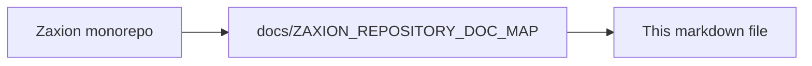

# 🚀 Zaxion Waitlist Launch: The Senior Engineer's Guide

Welcome to the big leagues! Launching a waitlist is the most effective way to validate a product without the pressure of a 1,000-user day-one load. As your Senior Partner, I've put together this "Junior-to-Senior" roadmap to ensure we launch Zaxion properly and gain high-quality users.

---

## 🧠 The Strategy: "The Black Box"
We are moving from a **"Tool"** to a **"Governance Protocol."** 
By hiding the "Access Console," we create mystery and exclusivity. Users shouldn't see how the engine works yet—they should only see the **promise** of what it does.

---

## 🛠 Step 1: Code Preparation (Pre-Launch)

### 1. Hide the "Access Console"
In `LandingPage.tsx`, we have hidden all direct links to the `/governance` dashboard. 
*   **Why?** Because if a user sees a "Login" or "Dashboard" they can't access, it feels like a broken product. If they only see a "Join Waitlist" button, it feels like an exclusive club.

### 2. Update the "Hero" Messaging
We changed the focus from "Technical Tests" to "Deterministic Governance." 
*   **Junior mistake:** Talking about features (e.g., "We generate Jest tests").
*   **Senior move:** Talking about outcomes (e.g., "Every PR becomes a verifiable record").

---

## 📊 Step 2: Database & Backend (The Leads Engine)

The backend is already equipped with a `Waitlist` table. 
*   **Location:** `backend/src/services/waitlist.service.js`
*   **What it does:** Captures email, IP address, and User Agent. 
*   **Senior Tip:** We use Rate Limiting (`waitlistLimiter`) to prevent bots from spamming your database. Never launch a public form without a limiter!

---

## 🚢 Step 3: Deployment (The Actual Launch)

Since you haven't launched before, here is exactly how to do it:

### 1. Environment Variables (`.env`)
Ensure your production database URL and GitHub App credentials are set correctly. 
*   **NEVER** commit your `.env` file. Use your hosting provider's (Vercel, Railway, etc.) dashboard to set these.

### 2. The "Smoke Test"
Before telling anyone:
1.  Go to the live URL.
2.  Enter a fake email (e.g., `test@example.com`).
3.  Check your database to see if it appeared.
4.  If it works, you are ready.

---

## 📣 Step 4: Gaining "Above Expected" Users

To beat the average conversion rate, follow this "Viral Loop":

1.  **The GitHub Tease:** Create a high-quality README in your Zaxion repo. Add a badge: `[Zaxion: Beta Phase 7]`.
2.  **The "Eligibility" Check:** (Future Task) Let users sign in with GitHub just to see if their repo "qualifies" for Zaxion. This captures their GitHub ID immediately.
3.  **Social Proof:** Share a screenshot of the "Deterministic Audit Trail" on Twitter/LinkedIn. Tag it #PlatformEngineering. 

---

## 🧑‍🏫 Senior Advice to Junior

1.  **Don't over-engineer the landing page.** If people understand what you solve in 5 seconds, they will sign up.
2.  **Monitor your logs.** Use `tail -f logs/app.log` during the first hour of launch.
3.  **Talk to your leads.** Every email on that list is a human. Email the first 10 personally. Ask them: *"What is your biggest headache with PRs today?"* Their answers will build your product roadmap.

---

## 🏁 Checklist for Today
- [ ] Hide "Access Console" buttons in `LandingPage.tsx`. (I am doing this now)
- [ ] Verify `Waitlist.tsx` connects to `/api/v1/waitlist`.
- [ ] Run a local test to ensure emails are saving.

**You've got this. Let's make Zaxion the gold standard for PR governance.**

---

<!-- zaxion-doc-map-footer -->

## Repository documentation map

How this file fits in the Zaxion repo: see **[Zaxion repository documentation map](./ZAXION_REPOSITORY_DOC_MAP.md)** (`docs/ZAXION_REPOSITORY_DOC_MAP.md`) for folder roles and links to system architecture.

**Text view** (works in any viewer):

```text
Zaxion/
├── docs/                    ← phase specs, governance, doc map
├── Incremental Architecture/ ← incremental plans, OPS-001
├── frontend/                ← UI (and frontend/src/Docs)
├── backend/                 ← API, policy engine, evaluation
├── PITCH/                   ← pitch materials
├── README.md                ← entry point
└── docs/ZAXION_REPOSITORY_DOC_MAP.md  ← canonical doc index
```

**Diagram** (Mermaid — quoted labels for compatibility):


