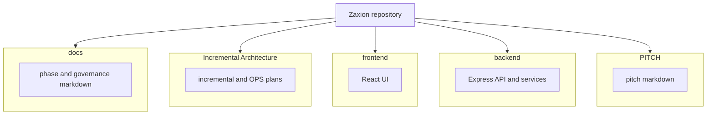

# Zaxion — Repository documentation map

Use this page when **Mermaid diagrams** in other files do not render in your viewer (some PDF tools, older Markdown previewers, or plain-text editors). Every markdown file in the repo includes a **text tree** and a small Mermaid diagram in its footer pointing here.

**Canonical system architecture** (components and services): [ZAXION_SYSTEM_ARCHITECTURE.md](../Incremental%20Architecture/ZAXION_SYSTEM_ARCHITECTURE.md)

**OPS-001 (CI/CD supply chain)**:

- Technical: [ZAXION_OPS_001_TECHNICAL_PLAN.md](../Incremental%20Architecture/ZAXION_OPS_001_TECHNICAL_PLAN.md)
- Non-technical: [ZAXION_OPS_001_NON_TECHNICAL_PLAN.md](../Incremental%20Architecture/ZAXION_OPS_001_NON_TECHNICAL_PLAN.md)

---

## Folder roles (text diagram)

```text
Zaxion/
├── docs/                      Phase specs, governance, operations guides
├── Incremental Architecture/  Incremental delivery plans, OPS-001, system overview
├── frontend/                  React app; src/Docs = product-facing markdown
├── backend/                   Node API, policy engine, evaluation, ingestion
├── PITCH/                     Investor and challenge materials
├── scripts/                   Automation (e.g. doc-map footer generator)
├── README.md                  Clone and run entry
└── ZAXION_*.md                Top-level architecture and phase writeups
```

---

## Repository layout (Mermaid)

All node labels are **quoted** so parsers do not break on spaces or dots.



---

## How to read Mermaid in this repo

1. Prefer **GitHub** or **VS Code** with a Mermaid-capable preview (e.g. built-in Markdown preview or extension).
2. If a diagram fails, look for the **Text view** code block immediately under the same heading in that document.
3. For cross-file navigation, use this **ZAXION_REPOSITORY_DOC_MAP** and [ZAXION_SYSTEM_ARCHITECTURE.md](../Incremental%20Architecture/ZAXION_SYSTEM_ARCHITECTURE.md).

---

<!-- zaxion-doc-map-footer -->

## Repository documentation map

**You are reading** `docs/ZAXION_REPOSITORY_DOC_MAP.md` (the canonical index). For runtime components, see [ZAXION_SYSTEM_ARCHITECTURE.md](../Incremental%20Architecture/ZAXION_SYSTEM_ARCHITECTURE.md).
