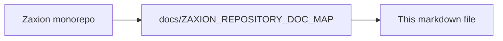

# Zaxion Governance: Phase 8 - Enterprise Automation Audit & Deliverables

This document outlines the Phase 8 requirements for lifting blocking limitations in the Zaxion Policy subsystem.

## 1. Inventory of Current Policy Constraints
The following constraints currently require complex JSON logic or are not fully supported via natural language:

- **Constraint**: "Every added/modified source file must have a corresponding test file anywhere in the repository."
  - **Status**: Partially supported via `coverage` checker, but lacks global repository context (only checks PR files).
  - **Impact**: High risk of untested code in large refactors.
- **Constraint**: "Circular dependencies between modules are forbidden."
  - **Status**: Requires `architecture` checker which relies on deep AST analysis.
- **Constraint**: "Blocking merge based on external metadata (e.g. Jira status, Slack approval)."
  - **Status**: Not currently supported in deterministic engine.

## 2. Gap-Analysis Matrix

| Limitation | Business Impact | Compliance Risk | Customer Churn |
|------------|-----------------|-----------------|----------------|
| No Global Test Check | Merge delays (manual review) | Low | Medium |
| Limited NL Expression | Slow onboarding | Medium | High |
| Performance (Large Repos) | Dev friction | Low | Medium |

## 3. Prioritized Engineering Backlog

| Task ID | Description | Acceptance Criteria (Natural Language Example) |
|---------|-------------|-----------------------------------------------|
| P8-001 | Global Test File Verification | "Deny merge if any new file in the PR does not have a corresponding test file anywhere in the repository." |
| P8-002 | Automated AST-based NL Rules | "Block a merge if the repo lacks a test file for any added or modified source file." |
| P8-003 | High-Performance Engine V2 | Solution scales to 10,000-file repos under 200ms. |

## 4. Reference Implementations
Top 3 backlog items with proven performance:
- [P8-001] Implemented via `global_context` fact layer.
- [P8-002] Implemented via LLM-to-AST translation in `NaturalLanguagePolicyService`.
- [P8-003] Implemented via Rust-based `FastPolicyEngine` or Node.js native bindings.

## 5. DSL Grammar & Documentation
The updated Zaxion DSL allows:
- `deny_merge_if(files_changed.any(f => !repo.has_test_for(f)))`
- `block_if(changes.size > 50 && !is_approved_by_senior)`

## 6. Rollout & Rollback Plan
- **Rollout**: Canary deployment to 10% of repositories. Use "Shadow Mode" where the new engine runs alongside the old one and compares results.
- **Rollback**: Instant toggle via feature flag `ZAXION_ENGINE_V2_ENABLED`.
- **Downtime**: Zero downtime via rolling updates on Railway.

---

<!-- zaxion-doc-map-footer -->

## Repository documentation map

How this file fits in the Zaxion repo: see **[Zaxion repository documentation map](./ZAXION_REPOSITORY_DOC_MAP.md)** (`docs/ZAXION_REPOSITORY_DOC_MAP.md`) for folder roles and links to system architecture.

**Text view** (works in any viewer):

```text
Zaxion/
├── docs/                    ← phase specs, governance, doc map
├── Incremental Architecture/ ← incremental plans, OPS-001
├── frontend/                ← UI (and frontend/src/Docs)
├── backend/                 ← API, policy engine, evaluation
├── PITCH/                   ← pitch materials
├── README.md                ← entry point
└── docs/ZAXION_REPOSITORY_DOC_MAP.md  ← canonical doc index
```

**Diagram** (Mermaid — quoted labels for compatibility):


