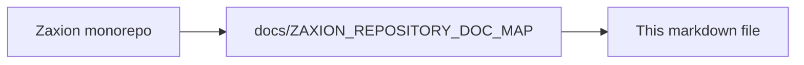

# 🎨 Frontend: How to Run

This is the user interface for the GitHub Test Case Generator, built with **React**, **Vite**, and **shadcn/ui**.

## 📋 Prerequisites
- **Node.js**: v18+
- **Backend**: The backend server must be running at `http://localhost:5000` (by default).

---

## 🚀 Quick Start

1. **Install Dependencies**
   ```bash
   npm install
   ```

2. **Configure Environment**
   ```bash
   cp .env.example .env
   # Ensure VITE_API_URL points to your backend
   ```

3. **Start Development Server**
   ```bash
   npm run dev
   ```

4. **Open Browser**
   Visit `http://localhost:5173`

---

## 🛠️ Project Structure

- **`/src/components`**: UI components powered by shadcn/ui and Tailwind CSS.
- **`/src/hooks`**: Custom React hooks for API interaction and state management.
- **`/src/lib`**: Utility functions and API client configurations.
- **`/src/components/workbench`**: The core analysis and editor interface.

---

## ✨ Features
- **Governance Dashboard**: Monitor organization-wide PR health and policy compliance.
- **Resolution UI**: Specialized workbench for developers to fix policy violations.
- **Audit Ledger**: Immutable view of historical decisions and human overrides.
- **Repo Selector**: Browse and select your GitHub repositories.
- **Test Editor**: Review, edit, and approve AI-generated test cases.

---

## 🛠️ Development Tools

- **Linting**: `npm run lint`
- **Build**: `npm run build`
- **Preview**: `npm run preview`

---

<!-- zaxion-doc-map-footer -->

## Repository documentation map

How this file fits in the Zaxion repo: see **[Zaxion repository documentation map](../docs/ZAXION_REPOSITORY_DOC_MAP.md)** (`docs/ZAXION_REPOSITORY_DOC_MAP.md`) for folder roles and links to system architecture.

**Text view** (works in any viewer):

```text
Zaxion/
├── docs/                    ← phase specs, governance, doc map
├── Incremental Architecture/ ← incremental plans, OPS-001
├── frontend/                ← UI (and frontend/src/Docs)
├── backend/                 ← API, policy engine, evaluation
├── PITCH/                   ← pitch materials
├── README.md                ← entry point
└── docs/ZAXION_REPOSITORY_DOC_MAP.md  ← canonical doc index
```

**Diagram** (Mermaid — quoted labels for compatibility):


