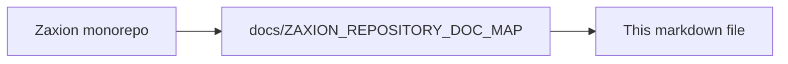

# Audit & Compliance Ledger

## 1. The Decision Ledger
Every PR analysis is recorded as a **Decision**. This includes:
*   The exact `commit_sha`.
*   The `policy_version` used for the evaluation.
*   The raw code facts (AST data).
*   The rationale for the PASS/BLOCK.

## 2. Governance Signals
Beyond simple decisions, Zaxion records **Signals**:
*   **Bypass Velocity:** Alerts when overrides are happening too frequently.
*   **Policy Drift:** Tracks how many PRs would fail if a new policy version were applied today.
*   **Audit Trail:** A complete, unchangeable history of who merged what and why.

## 3. Exporting Data
All governance data is available via REST API for integration with external security dashboards and compliance tools.

---

<!-- zaxion-doc-map-footer -->

## Repository documentation map

How this file fits in the Zaxion repo: see **[Zaxion repository documentation map](../../../docs/ZAXION_REPOSITORY_DOC_MAP.md)** (`docs/ZAXION_REPOSITORY_DOC_MAP.md`) for folder roles and links to system architecture.

**Text view** (works in any viewer):

```text
Zaxion/
├── docs/                    ← phase specs, governance, doc map
├── Incremental Architecture/ ← incremental plans, OPS-001
├── frontend/                ← UI (and frontend/src/Docs)
├── backend/                 ← API, policy engine, evaluation
├── PITCH/                   ← pitch materials
├── README.md                ← entry point
└── docs/ZAXION_REPOSITORY_DOC_MAP.md  ← canonical doc index
```

**Diagram** (Mermaid — quoted labels for compatibility):


