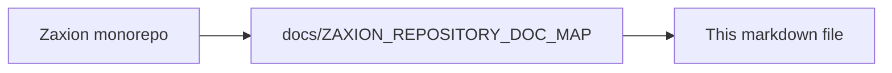

# The Zaxion Constitution

**Status:** ⚖️ SUPREME SOURCE OF TRUTH  
**Version:** 1.0.0

## 1. Core Mission
Zaxion's mission is to transform automated decision-making into a trusted organizational governance system. We move beyond "Can we block a PR?" to "Can we trust the merge?"

## 2. The Three Pillars
Zaxion is built on three decoupled registries that ensure accountability and transparency:

### **Pillar 1: The Law (Policy Registry)**
*   **Role:** Defines what is allowed.
*   **Responsibility:** Versioned storage of organizational policies.
*   **Outcome:** Deterministic rules that judge every Pull Request.

### **Pillar 2: The Exception (Human Accountability)**
*   **Role:** Records human-signed overrides.
*   **Responsibility:** Captures intent and justification when "The Law" is bypassed.
*   **Outcome:** Cryptographically signed audit trails bound to specific actors.

### **Pillar 3: The Memory (Decision Engine)**
*   **Role:** Historical ledger of outcomes.
*   **Responsibility:** Binds the Law to the Exception and records the final Judgment.
*   **Outcome:** Longitudinal patterns for team-wide code health analysis.

## 3. System Invariants
1.  **Immutability:** Every decision, signature, and policy version is immutable once written.
2.  **Append-Only:** Historical truth cannot be deleted or edited.
3.  **Human Authority:** Systems never "decide" to change rules; only human owners can update policies.

---

<!-- zaxion-doc-map-footer -->

## Repository documentation map

How this file fits in the Zaxion repo: see **[Zaxion repository documentation map](../../../docs/ZAXION_REPOSITORY_DOC_MAP.md)** (`docs/ZAXION_REPOSITORY_DOC_MAP.md`) for folder roles and links to system architecture.

**Text view** (works in any viewer):

```text
Zaxion/
├── docs/                    ← phase specs, governance, doc map
├── Incremental Architecture/ ← incremental plans, OPS-001
├── frontend/                ← UI (and frontend/src/Docs)
├── backend/                 ← API, policy engine, evaluation
├── PITCH/                   ← pitch materials
├── README.md                ← entry point
└── docs/ZAXION_REPOSITORY_DOC_MAP.md  ← canonical doc index
```

**Diagram** (Mermaid — quoted labels for compatibility):


