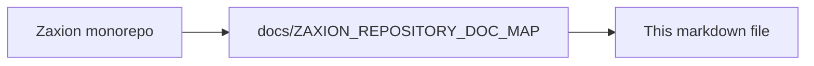

# Zaxion Governance Primitives

## 1. What is a Policy?
A Policy is a declarative set of rules that define the success criteria for a PR. Policies can be organization-wide or repository-specific.

## 2. Overrides & Signatures
An **Override** is a deliberate bypass of a BLOCK state. 
*   **Override Signature:** An immutable record containing `Who`, `When`, `Why`, and `Which` (Decision ID).
*   **Accountability:** Signatures ensure that every bypass is traceable back to a responsible maintainer.

## 3. Policy Strength Levels
*   **MANDATORY:** Cannot be overridden by standard developers.
*   **ADVISORY:** Generates warnings but allows merging with a justification.
*   **OVERRIDABLE:** Requires a maintainer's signature to bypass.

## 4. Jurisdiction
Organization-level policies are inherited by all repositories. A repository can make a rule **stricter** but never **weaker** than the organizational mandate.

---

<!-- zaxion-doc-map-footer -->

## Repository documentation map

How this file fits in the Zaxion repo: see **[Zaxion repository documentation map](../../../docs/ZAXION_REPOSITORY_DOC_MAP.md)** (`docs/ZAXION_REPOSITORY_DOC_MAP.md`) for folder roles and links to system architecture.

**Text view** (works in any viewer):

```text
Zaxion/
├── docs/                    ← phase specs, governance, doc map
├── Incremental Architecture/ ← incremental plans, OPS-001
├── frontend/                ← UI (and frontend/src/Docs)
├── backend/                 ← API, policy engine, evaluation
├── PITCH/                   ← pitch materials
├── README.md                ← entry point
└── docs/ZAXION_REPOSITORY_DOC_MAP.md  ← canonical doc index
```

**Diagram** (Mermaid — quoted labels for compatibility):


