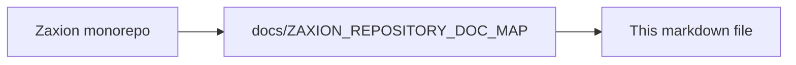

# Zaxion PR Gate (The Core Concept)

## 1. Introduction
The PR Gate is the entry point of the Zaxion system. It acts as a guardian between code changes and your production environment.

## 2. How it Works
1.  **Webhook Trigger:** GitHub sends a `pull_request` event to the Zaxion backend.
2.  **Analysis:** The Zaxion Worker fetches the diff and analyzes the risk surface using AST parsing.
3.  **Evaluation:** The Policy Engine compares the changes against the current Policy Version.
4.  **Status Check:** Zaxion posts a Check Run back to GitHub:
    *   ✅ **PASS:** Merge is allowed.
    *   ⚠️ **WARN:** Merge is allowed but issues are flagged.
    *   ❌ **BLOCK:** Merge is prevented until resolved or overridden.

## 3. Why a Gate?
Unlike traditional CI, a Gate focuses on **intent and governance**. It ensures that high-risk areas (like `auth`, `payments`, or `config`) have documented verification before they reach your main branch.

---

<!-- zaxion-doc-map-footer -->

## Repository documentation map

How this file fits in the Zaxion repo: see **[Zaxion repository documentation map](../../../docs/ZAXION_REPOSITORY_DOC_MAP.md)** (`docs/ZAXION_REPOSITORY_DOC_MAP.md`) for folder roles and links to system architecture.

**Text view** (works in any viewer):

```text
Zaxion/
├── docs/                    ← phase specs, governance, doc map
├── Incremental Architecture/ ← incremental plans, OPS-001
├── frontend/                ← UI (and frontend/src/Docs)
├── backend/                 ← API, policy engine, evaluation
├── PITCH/                   ← pitch materials
├── README.md                ← entry point
└── docs/ZAXION_REPOSITORY_DOC_MAP.md  ← canonical doc index
```

**Diagram** (Mermaid — quoted labels for compatibility):


