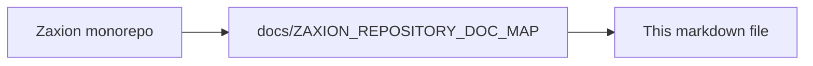

# Policy Engine & Gating Guide

## 1. High-Risk File Gating
Zaxion automatically identifies changes in sensitive directories. By default, these include:
*   `**/auth/**/*`
*   `**/payment/**/*`
*   `**/config/**/*`
*   `**/.env*`

## 2. Defining Custom Rules
Rules are defined in JSON/YAML and versioned. A typical rule looks like:
```json
{
  "name": "Strict Auth Policy",
  "scope": "**/auth/**",
  "min_tests": 1,
  "level": "MANDATORY"
}
```

## 3. Admin Overrides
Maintainers can bypass gates by commenting on the PR with a specific justification. This triggers an **Override Signature** event in the Governance Memory.

---

<!-- zaxion-doc-map-footer -->

## Repository documentation map

How this file fits in the Zaxion repo: see **[Zaxion repository documentation map](../../../docs/ZAXION_REPOSITORY_DOC_MAP.md)** (`docs/ZAXION_REPOSITORY_DOC_MAP.md`) for folder roles and links to system architecture.

**Text view** (works in any viewer):

```text
Zaxion/
├── docs/                    ← phase specs, governance, doc map
├── Incremental Architecture/ ← incremental plans, OPS-001
├── frontend/                ← UI (and frontend/src/Docs)
├── backend/                 ← API, policy engine, evaluation
├── PITCH/                   ← pitch materials
├── README.md                ← entry point
└── docs/ZAXION_REPOSITORY_DOC_MAP.md  ← canonical doc index
```

**Diagram** (Mermaid — quoted labels for compatibility):


